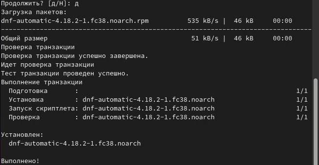
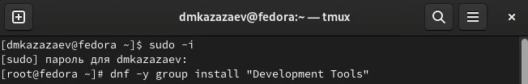
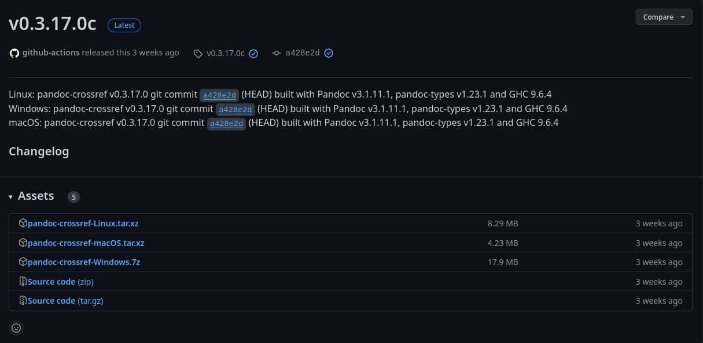
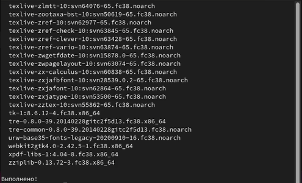
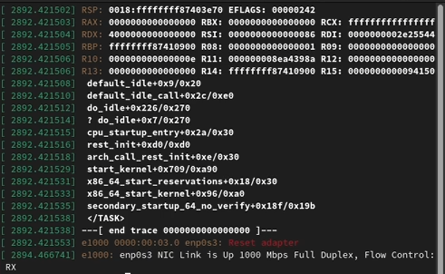

---
## Front matter
title: "Отчет по лабораторной работе № 1"
subtitle: "Дисциплина: операционные системы"
author: "Казазаев Даниил Михайлович"

## Generic otions
lang: ru-RU
toc-title: "Содержание"

## Bibliography
bibliography: bib/cite.bib
csl: pandoc/csl/gost-r-7-0-5-2008-numeric.csl

## Pdf output format
toc: true # Table of contents
toc-depth: 2
lof: true # List of figures
lot: false # List of tables
fontsize: 12pt
linestretch: 1.5
papersize: a4
documentclass: scrreprt
## I18n polyglossia
polyglossia-lang:
  name: russian
  options:
	- spelling=modern
	- babelshorthands=true
polyglossia-otherlangs:
  name: english
## I18n babel
babel-lang: russian
babel-otherlangs: english
## Fonts
mainfont: PT Serif
romanfont: PT Serif
sansfont: PT Sans
monofont: PT Mono
mainfontoptions: Ligatures=TeX
romanfontoptions: Ligatures=TeX
sansfontoptions: Ligatures=TeX,Scale=MatchLowercase
monofontoptions: Scale=MatchLowercase,Scale=0.9
## Biblatex
biblatex: true
biblio-style: "gost-numeric"
biblatexoptions:
  - parentracker=true
  - backend=biber
  - hyperref=auto
  - language=auto
  - autolang=other*
  - citestyle=gost-numeric
## Pandoc-crossref LaTeX customization
figureTitle: "Рис."
tableTitle: "Таблица"
listingTitle: "Листинг"
lofTitle: "Список иллюстраций"
lotTitle: "Список таблиц"
lolTitle: "Листинги"
## Misc options
indent: true
header-includes:
  - \usepackage{indentfirst}
  - \usepackage{float} # keep figures where there are in the text
  - \floatplacement{figure}{H} # keep figures where there are in the text
---

# Цель работы

Приобретение практических навыков установки операционной системы на виртуальную машину, натройка минимально необходимых для дальнейшей работы сервисов.

# Задание

1. Настройка ОП.
2. Установка необходимого ПО.

# Задание домашней работы

1. В окне треминала проанализировать последовательность загрузки операционной системы с помощью команды ```dmesg```.
2. Получить необходимую информацию с помощью команды ```dmesg | grep -i «»

# Выполнение лабораторной работы.

## Настройка операционной системы

После запуска виртуальной машины, открываю терминал и пишу команду ```sudo -i```, чтобы получить права суперпользователя. (рис. [-@fig:001])

{#fig:001 width=70%}

Обновляю пакеты командой ```dnf -y update```.(рис. [-@fig:002])

{#fig:002 width=70%}

Обновление не поторебовалось.

Устанавливаю программное обеспечение для автоматических обнавлений(рис. [-@fig:003])

{#fig:003 width=70%}

{#fig:004 width=70%}

Запускаю таймер для автоматических обновлений.(рис. [-@fig:005])

{#fig:005 width=70%}

Так как в этом курсе мы не будет проходить систему безопасности SELINUX, отключаю ее. Для этого прехожу в дерикторию с конфигом системы безопасности и открываю его.(рис. [-@fig:006])

{#fig:006 width=70%}

Меняю значение SELINUX=enforcing на SELINUX=permissive.(рис. [-@fig:007])

{#fig:007 width=70%}

Перезапускаю систему.(рис. [-@fig:008])

{#fig:008 width=70%}

После перезапуска системы снова получаю права суперпользователя и устанавливаю средства разработки командой ```dnf -y group install «Development Tools».(рис. [-@fig:009])

{#fig:009 width=70%}

{#fig:010 width=70%}

Устанавливаю пакет DKMS командой ```dnf -y install dkms```.(рис. [-@fig:011])

{#fig:011 width=70%}

{#fig:012 width=70%}

В интерфейсе виртуальной машины подключаю образ диска дополнительной гостевой ОС.(рис. [-@fig:013])

{#fig:013 width=70%}

Подтверждаю автоматический запуск приложения на диске.(рис. [-@fig:014])

{#fig:014 width=70%}

Подмонтирую диск командой ```mount /dev/sr0 /media```.(рис. [-@fig:015])

{#fig:015 width=70%}

Устанавливаю драйвера.(рис. [-@fig:016])

{#fig:016 width=70%}

{#fig:017 width=70%}

Так как имя пользователя уже соответсвует тому, имени пользователя в дисплейном классе, меняю только пароль для пользователя.(рис. [-@fig:018])

{#fig:018 width=70%}

Устанавливаю имя хоста командой ```hostnamectl set-hostname dmkazazaev``` и проверяю изменилось ли имя(рис. [-@fig:019])

{#fig:019 width=70%}

Захожу на страницу pandoc crossref, чтобы узнать, какакая версия pandoc совместима и скачать архив с ПО.(рис. [-@fig:020])

{#fig:020 width=70%}

Перехожу на официальный сайт pandoc, чтобы скачать средство pandoc.(рис. [-@fig:021])

{#fig:021 width=70%}

Перехожу на GitHub, где скачиваю архив pandoc-3.1.11.1-linux-amd64.tar.gz.(рис. [-@fig:022])

{#fig:022 width=70%}

Разархивирую файл pandoc.(рис. [-@fig:023])

{#fig:023 width=70%}

Разархивирую файлы pandoc crossref.(рис. [-@fig:024])

{#fig:024 width=70%}

Дальше перемещаю разархивированные файлы в нужную дерикторию.(рис. [-@fig:025])

{#fig:025 width=70%}

Устанавливаю первую часть файлов TexLive(рис. [-@fig:026])

{#fig:026 width=70%}

{#fig:027 width=70%}

Доустанавливаю оставшиеся файлы TexLive и проверяю,установились ли некоторые файлы.(рис. [-@fig:028])

{#fig:028 width=70%}

{#fig:029 width=70%}

## Выполнение домашней работы.

Прописываю необходимую команду, чтобы начать анализ порядка запуска операционной системы.(рис. [-@fig:030])

{#fig:030 width=70%}

Анализирую порядок запуска операционной системы.(рис. [-@fig:031])

{#fig:031 width=70%}

Далее ищу версию ядра Linux командой ```dmesg |grep -i «Linux version»```(рис. [-@fig:032])

{#fig:032 width=70%}

Ищу информацию о частоте процессора и о самом процессоре командами ```dmesg |grep -i «Detected Mhz processor»``` и ```dmesg |grep -i «CPU0»```, правда первая команда не сработала.(рис. [-@fig:033])

{#fig:033 width=70%}

Ищу гипервизор командой ```dmesg |grep -i «Hypervisor detected»```.(рис. [-@fig:034])

{#fig:034 width=70%}

# Вывод

В результате выполнения данной лабораторной работы я приобрёл практические навыки установки операционной системы на виртуальную машину, натройки минимально необходимых для дальнейшей работы сервисов.
