---
## Front matter
lang: ru-RU
title: Лабораторная работа № 2
subtitle: Операционные системы
author:
  - Казазаев Д. М.
institute:
  - Российский университет дружбы народов, Москва, Россия

## i18n babel
babel-lang: russian
babel-otherlangs: english

## Formatting pdf
toc: false
toc-title: Содержание
slide_level: 2
aspectratio: 169
section-titles: true
theme: metropolis
header-includes:
 - \metroset{progressbar=frametitle,sectionpage=progressbar,numbering=fraction}
 - '\makeatletter'
 - '\beamer@ignorenonframefalse'
 - '\makeatother'
---

# Информация

## Докладчик

:::::::::::::: {.columns align=center}
::: {.column width="70%"}

  * Казазаев Даниил Михайлович
  * Студент бакалавриата
  * Российский университет дружбы народов
  * [1132231427@rudn.ru]
  * <https://github.com/KazazaevDaniil/study_2022-2023_os-intro>

:::
::: {.column width="30%"}


:::
::::::::::::::

# Вводная часть

## Цели и задачи

Освоить умения по работе с git, изучить идеалогию и применение свредсв контроля версий.

## Задания

1. Установка необходимого ПО.
2. Базовая настройка Git.
3. Создание ssh-ключа и его добавление на GitHub.
4. Настройка gh.
5. Создание и настройка рабочего пространсва.

# Основная часть

## Выполнение лабораторной работы. Установка необходимого ПО.

После запуска виртуальной машины, открываю терминал и пишу команду ```sudo -i```, чтобы получить права суперпользователя. (рис. [-@fig:001])

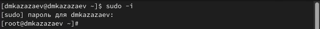{#fig:001 width=50%}

Устанавливаю git и gh командами ```dnf install git``` и ```dnf install gh```.(рис. [-@fig:002])

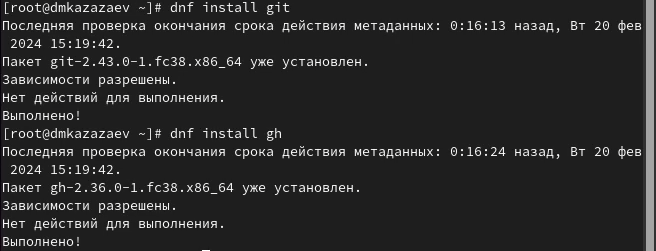{#fig:002 width=50%}

Установка не потребовалась, так как git и gh уже установлены.

## Выполнение лабораторной работы. Базовая настройка Git.

Задаю имя и почту владельца репозитория.(рис. [-@fig:003])

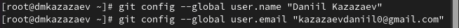{#fig:003 width=50%}

Натсроиваю utf-8 в выводе сообщений git.(рис. [-@fig:004])

{#fig:004 width=50%}

Задаю имя начальной ветки.(рис. [-@fig:005])

{#fig:005 width=50%}

Задаю параметры autocrlf и safecrlf.(рис. [-@fig:006])

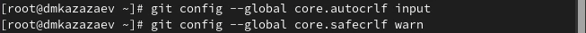{#fig:006 width=50%}

## Выполнение лабораторной работы. Создание ssh-ключа и его добавление на GitHub.

Генерирую ssh-ключ.(рис. [-@fig:007])

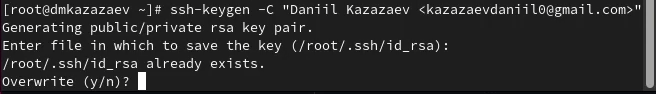{#fig:007 width=50%}

Копируб ssh-ключ командой ```cat ~/.ssh/id_rsa.pub | xclip -sel clip```.(рис. [-@fig:008])

{#fig:008 width=50%}

Перехожу на GitHub и в настройках добавляю новый ssh-ключ.(рис. [-@fig:009])

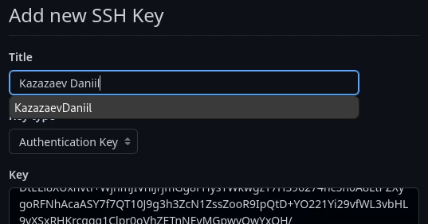{#fig:009 width=50%}

## Выполнение лабораторной работы. Настройка gh.

Для настрйоки gh необходимо авторизироваться. После ввода команды отвечаю на несколько наводящих вопросов и захожу под свой аккаунт GitHub.(рис. [-@fig:010])

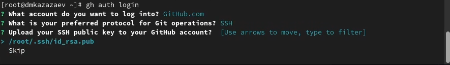{#fig:010 width=50%}

## Выполнение лабораторной работы. Создание и настройка рабочего пространсва.

Создаю дерикторию, после чего перехожу в нее и создаю репозиторий.(рис. [-@fig:011])

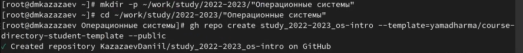{#fig:011 width=50%}

Клонирую репозиторий в только что созданную директорию(рис. [-@fig:012])

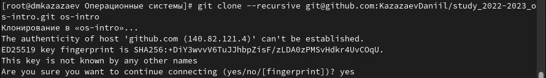{#fig:012 width=50%}

Перехожу в сам репозиторий и удаляю лишние файлы.(рис. [-@fig:013])

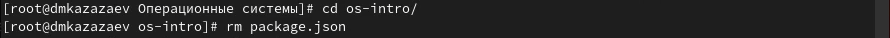{#fig:013 width=50%}

После удаления файлов создаю необходимые каталоги командой make.(рис. [-@fig:014])

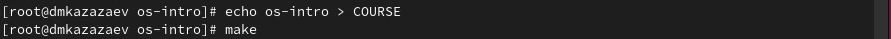{#fig:014 width=50%}

Добавляю файлы на сервер и подписываю их командой ```git commit```.(рис. [-@fig:015])

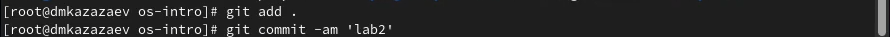{#fig:015 width=50%}

Отправляю файлы на сервер командой ```git push```.(рис. [-@fig:016])

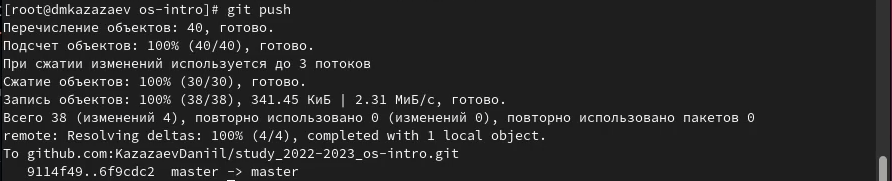{#fig:016 width=50%}


