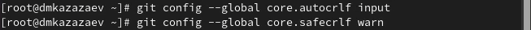

---
## Front matter
title: "Отчет по лабораторной работе № 2"
subtitle: "Дисциплина: операционные системы"
author: "Казазаев Даниил Михайлович"

## Generic otions
lang: ru-RU
toc-title: "Содержание"

## Bibliography
bibliography: bib/cite.bib
csl: pandoc/csl/gost-r-7-0-5-2008-numeric.csl

## Pdf output format
toc: true # Table of contents
toc-depth: 2
lof: true # List of figures
lot: false # List of tables
fontsize: 12pt
linestretch: 1.5
papersize: a4
documentclass: scrreprt
## I18n polyglossia
polyglossia-lang:
  name: russian
  options:
	- spelling=modern
	- babelshorthands=true
polyglossia-otherlangs:
  name: english
## I18n babel
babel-lang: russian
babel-otherlangs: english
## Fonts
mainfont: PT Serif
romanfont: PT Serif
sansfont: PT Sans
monofont: PT Mono
mainfontoptions: Ligatures=TeX
romanfontoptions: Ligatures=TeX
sansfontoptions: Ligatures=TeX,Scale=MatchLowercase
monofontoptions: Scale=MatchLowercase,Scale=0.9
## Biblatex
biblatex: true
biblio-style: "gost-numeric"
biblatexoptions:
  - parentracker=true
  - backend=biber
  - hyperref=auto
  - language=auto
  - autolang=other*
  - citestyle=gost-numeric
## Pandoc-crossref LaTeX customization
figureTitle: "Рис."
tableTitle: "Таблица"
listingTitle: "Листинг"
lofTitle: "Список иллюстраций"
lotTitle: "Список таблиц"
lolTitle: "Листинги"
## Misc options
indent: true
header-includes:
  - \usepackage{indentfirst}
  - \usepackage{float} # keep figures where there are in the text
  - \floatplacement{figure}{H} # keep figures where there are in the text
---

# Цель работы

Освоить умение по работе с Git, изучить идеалогию и применение средств контроля версий.

# Задание

1. Установка необходимого ПО.
2. Базовая настройка git.
3. Создание ssh-ключа и добавление eго на GitHub.
4. Настройка gh.
5. Создание репозитория курса на основе шаблона.

```
# Выполнение лабораторной работы.

## Установка необходимого ПО.

После запуска виртуальной машины, открываю терминал и пишу команду ```sudo -i```, чтобы получить права суперпользователя. (рис. [-@fig:001])

{#fig:001 width=70%}

Устанавливаю git и gh командами ```dnf install git``` и ```dnf install gh```.(рис. [-@fig:002])

{#fig:002 width=70%}

Так как необходимое ПО уже установлено, просто продолжаю выполнение лабораторной работы.

## Базовая настройка git.

Задаю имя пользователь и почту владельца репозитория.(рис. [-@fig:003])

{#fig:003 width=70%}

Настраиваю utf-8 в выводе сообщений git.(рис. [-@fig:004])

{#fig:004 width=70%}

Задаю имя начальной ветки.(рис. [-@fig:005])

{#fig:005 width=70%}

Указываю параметры autocrlf и safecrlf.(рис. [-@fig:006])

{#fig:006 width=70%}

## Создание ssh-ключа и добавление eго на GitHub.

Генерирую ssh-ключ.(рис. [-@fig:007])

{#fig:007 width=70%}

Копирую ssh-ключ.(рис. [-@fig:008])

{#fig:008 width=70%}

Перехожу на GitHub и добавляю ssh-ключ.(рис. [-@fig:009])

{#fig:009 width=70%}

## Настройка gh.

После ввода команды захожу в свой аккаунт GitHub и отвечаю на наводящие вопросы.

{#fig:010 width=70%}

## Создание репозитория курса на основе шаблона.

Создаю директорию, как указано в лабораторной работе и перехожу в нее, после чего создаю репозиторий.(рис. [-@fig:011])

{#fig:011 width=70%}

Клонирую репозиторий.(рис. [-@fig:012])

{#fig:012 width=70%}

После клонирвания переходу в репозиторию и удаляю файл package.json.(рис. [-@fig:013])

{#fig:013 width=70%}

Создаю необходимые каталоги.(рис. [-@fig:014])

{#fig:014 width=70%}

Добавляю файлы на сервер.(рис. [-@fig:015])

{#fig:015 width=70%}

Выгружаю созданные файлы.(рис. [-@fig:016])

{#fig:016 width=70%}

# Вывод

В результате выполнения данной лабораторной работы я освоил умение по работе с Git и изучил идеалогию и применение средств контроля версий.
