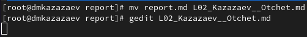
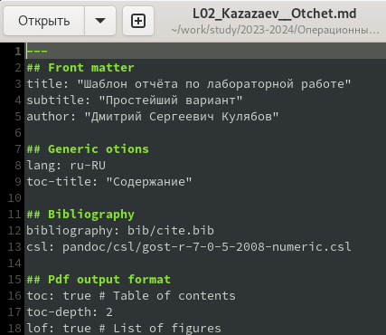
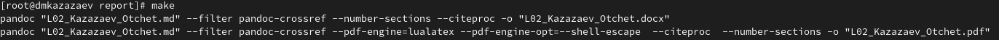
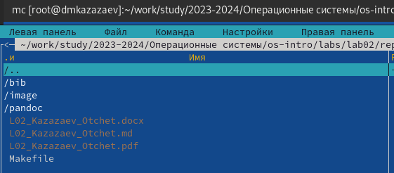
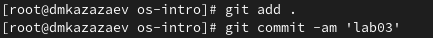
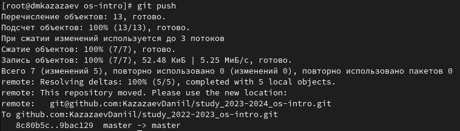

---
## Front matter
lang: ru-RU
title: Лабораторная работа № 3
subtitle: Операционные системы
author:
  - Казазаев Д. М.
institute:
  - Российский университет дружбы народов, Москва, Россия

## i18n babel
babel-lang: russian
babel-otherlangs: english

## Formatting pdf
toc: false
toc-title: Содержание
slide_level: 2
aspectratio: 169
section-titles: true
theme: metropolis
header-includes:
 - \metroset{progressbar=frametitle,sectionpage=progressbar,numbering=fraction}
 - '\makeatletter'
 - '\beamer@ignorenonframefalse'
 - '\makeatother'
---

# Информация

## Докладчик

:::::::::::::: {.columns align=center}
::: {.column width="70%"}

  * Казазаев Даниил Михайлович
  * Студент бакалавриата
  * Российский университет дружбы народов
  * [1132231427@rudn.ru]
  * <https://github.com/KazazaevDaniil/study_2023-2024_os-intro>

:::
::::::::::::::

# Вводная часть

## Цели и задачи

Научиться оформлять отчёты с помощью легковесного языка разметки Markdown.

## Задание

1. Сделать отчет по лабораторной работе № 2.

# Основная часть

## Выполнение лабораторной работы. Отчет по лабораторной работе № 2.

После перехода в дирексторию второй лабораторной работы, переназываю шаблон с помощью утилиты mv (рис. 1).



## Выполнение лабораторной работы. Отчет по лабораторной работе № 2.

Открываю Markdown файл в текстровом редакторе и начинаю оформлять отчёт. (рис. 2)

{width=45%}

## Выполнение лабораторной работы. Отчет по лабораторной работе № 2.

После редактирования файла, сохраняю его и компилирую комиандой make. Все настройки и фильтры указаны в Makefile. (рис. 3)

{width=100%}

## Выполнение лабораторной работы. Отчет по лабораторной работе № 2.

После завершения компиляции запускаю Midnight Commander, чтобы проверить наличее файлов другого формата. (рис. 4)

{width=70%}

## Выполнение лабораторной работы. Отчет по лабораторной работе № 2.

Перехожу в главный каталог репозитория и добавляю файлы на сервер, после чего комментирукю их. (рис. 5)



## Выполнение лабораторной работы. Отчет по лабораторной работе № 2.

Пишу команду ```git push```, чтобы отправить файлы на сервер GitHub. (рис. 6)



# Заключительная часть

## Результаты

- Отчет по лабораторной работе № 2 успешно создан и загружен на GitHub.

## Вывод

В результате выполнения лабораторной работы я научился оформлять отчеты с помощью легковесного языкаразметки Markdown.
