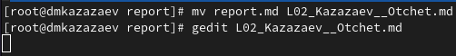
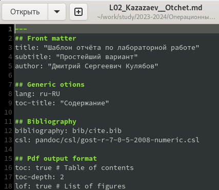
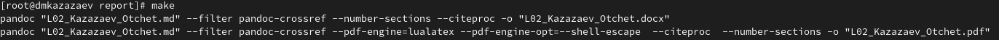
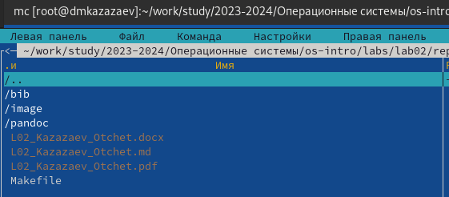
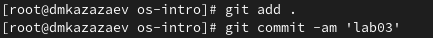
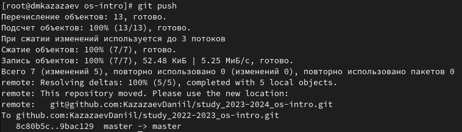

---
## Front matter
title: "Отчёт по лабораторной работе №3"
subtitle: "Дисциплина: операционные системы"
author: "Казаазев Даниил Михайлович"

## Generic otions
lang: ru-RU
toc-title: "Содержание"

## Bibliography
bibliography: bib/cite.bib
csl: pandoc/csl/gost-r-7-0-5-2008-numeric.csl

## Pdf output format
toc: true # Table of contents
toc-depth: 2
lof: true # List of figures
lot: true # List of tables
fontsize: 12pt
linestretch: 1.5
papersize: a4
documentclass: scrreprt
## I18n polyglossia
polyglossia-lang:
  name: russian
  options:
	- spelling=modern
	- babelshorthands=true
polyglossia-otherlangs:
  name: english
## I18n babel
babel-lang: russian
babel-otherlangs: english
## Fonts
mainfont: PT Serif
romanfont: PT Serif
sansfont: PT Sans
monofont: PT Mono
mainfontoptions: Ligatures=TeX
romanfontoptions: Ligatures=TeX
sansfontoptions: Ligatures=TeX,Scale=MatchLowercase
monofontoptions: Scale=MatchLowercase,Scale=0.9
## Biblatex
biblatex: true
biblio-style: "gost-numeric"
biblatexoptions:
  - parentracker=true
  - backend=biber
  - hyperref=auto
  - language=auto
  - autolang=other*
  - citestyle=gost-numeric
## Pandoc-crossref LaTeX customization
figureTitle: "Рис."
tableTitle: "Таблица"
listingTitle: "Листинг"
lofTitle: "Список иллюстраций"
lotTitle: "Список таблиц"
lolTitle: "Листинги"
## Misc options
indent: true
header-includes:
  - \usepackage{indentfirst}
  - \usepackage{float} # keep figures where there are in the text
  - \floatplacement{figure}{H} # keep figures where there are in the text
---

# Цель работы

Научиться оформлять отчёты с помощью легковесного языка разметки Markdown.

# Задание

1. Сделать отчет по лабораторной работе № 2.

# Выполнение лабораторной работы

После перехода в дирексторию второй лабораторной работы, переназываю шаблон с помощью утилиты mv (рис. [-@fig:001]).

{#fig:001 width=70%}

Открываю Markdown файл в текстровом редакторе и начинаю оформлять отчёт. (рис. [-@fig:002])

{#fig:002 width=70%}

После редактирования файла, сохраняю его и компилирую комиандой make. Все настройки и фильтры указаны в Makefile. (рис. [-@fig:003])

{#fig:003 width=100%}

После завершения компиляции запускаю Midnight Commander, чтобы проверить наличее файлов другого формата. (рис. [-@fig:004])

{#fig:004 width=70%}

Перехожу в главный каталог репозитория и добавляю файлы на сервер, после чего комментирукю их. (рис. [-@fig:005])

{#fig:005 width=70%}

Пишу команду ```git push```, чтобы отправить файлы на сервер GitHub. (рис. [-@fig:006])

{#fig:006 width=70%}

# Выводы

В результате выполнения лабораторной работы я научился оформлять отчеты с помощью легковесного языкаразметки Markdown.
