---
## Front matter
lang: ru-RU
title: Лабораторная работа № 4
subtitle: Операционные системы
author:
  - Казазаев Д. М.
institute:
  - Российский университет дружбы народов, Москва, Россия

## i18n babel
babel-lang: russian
babel-otherlangs: english

## Formatting pdf
toc: false
toc-title: Содержание
slide_level: 2
aspectratio: 169
section-titles: true
theme: metropolis
header-includes:
 - \metroset{progressbar=frametitle,sectionpage=progressbar,numbering=fraction}
 - '\makeatletter'
 - '\beamer@ignorenonframefalse'
 - '\makeatother'
---

# Информация

## Докладчик

:::::::::::::: {.columns align=center}
::: {.column width="70%"}

  * Казазаев Даниил Михайлович
  * Студент бакалавриата
  * Российский университет дружбы народов
  * [1132231427@rudn.ru]
  * <https://github.com/KazazaevDaniil/study_2023-2024_os-intro>

:::
::::::::::::::

# Вводная часть

## Цели и задачи

Получение навыков правильной работы с репозиториями git.

## Задание

1. Выполнить работу для тестового репозитория.
2. Преобразовать рабочий репозиторий в репозиторий с git-flow и conventional commits.

# Основная часть

## Выполнение лабораторной работы. Отчет по лабораторной работе № 2.

Устанавливаю git flow из коллекции репозиториев Copr (рис. 1).

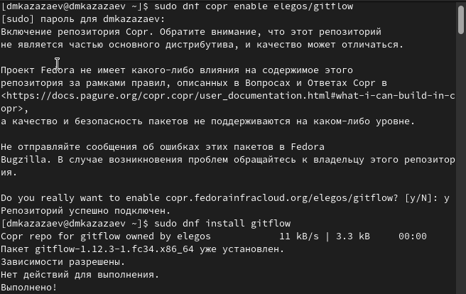

Устанавливаю Node.js и pnpm. (рис. 2)

Настраиваю Node.js. (рис. 3)

Устанавливаю программу для форматирования коммитов. (рис. 4)

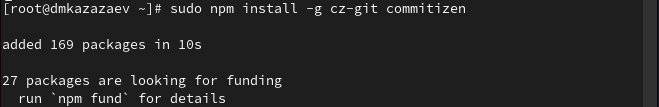

Устанавливаю программу для создания логов. (рис. 5)

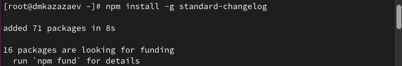

Создаю новый репозиторий на GitHub. (рис. 6)

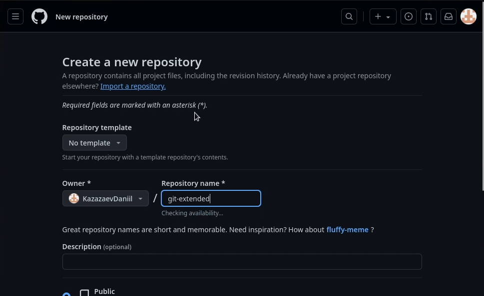

Создаю директорию для репозитория.(рис. 7)

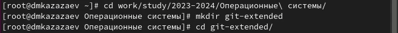

Создаю репозиторий по инструкции.(тут 2 скрина)(рис. 8, 9)

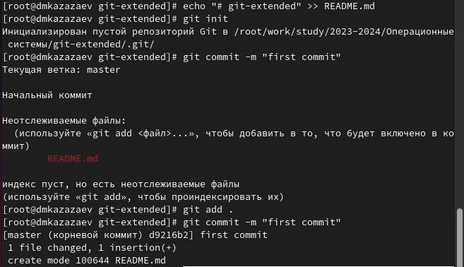

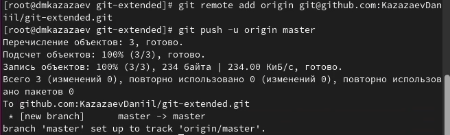

Созданный репозиторий.(рис. 10)

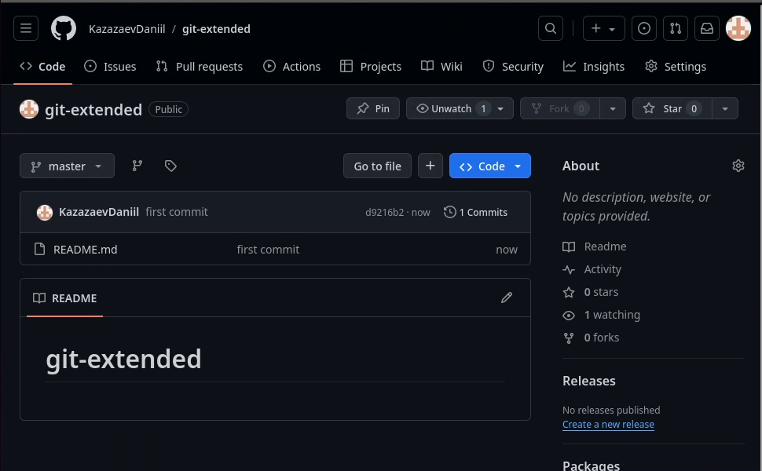

Конфигурация файла package.json до его настройки.(рис. 11)

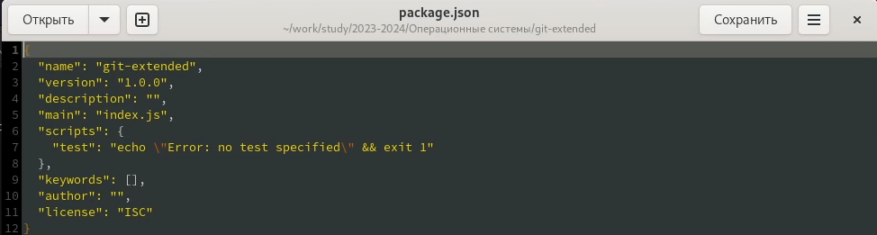

Конфигурация файла package.json после настройки.(рис. 12)

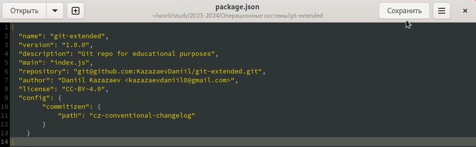

Добавляю изменения.(рис. 13)

Выполняю коммит командой gh cz.(рис. 14)

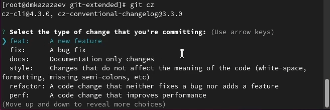

Отправляю файлы на GitHub.(рис. 15)

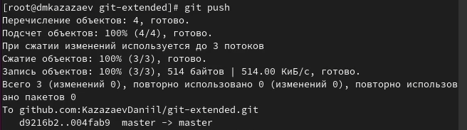

Инициализирую git flow и проверяю ветку develop.(рис. 16)

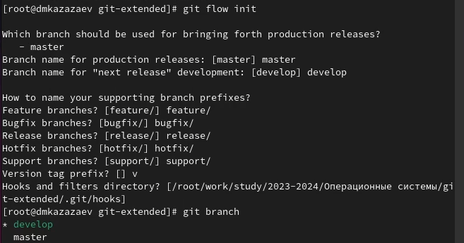

Загружаю весь репозиторий в хранилище и устанавливаю внешнюю ветку как вышестоящую.(рис. 17).

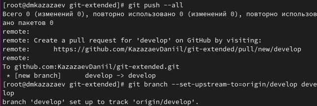

Создаю релиз 1.0.0.(рис. 18)

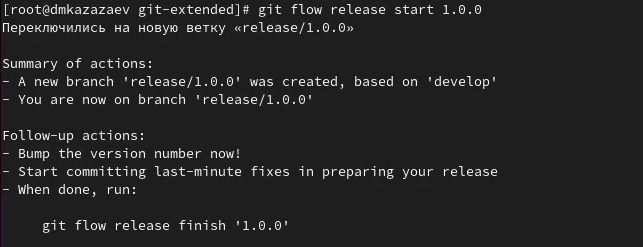

Создаю журнал изменений.(рис. 19)

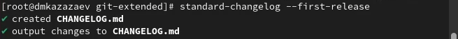

Добавляю журнал изменений в индекс.(рис. 20)

Заливаю основную ветку.(рис. 21)

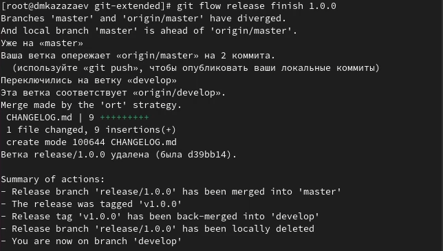

Отправляю данные на GitHub.(рис. 22)

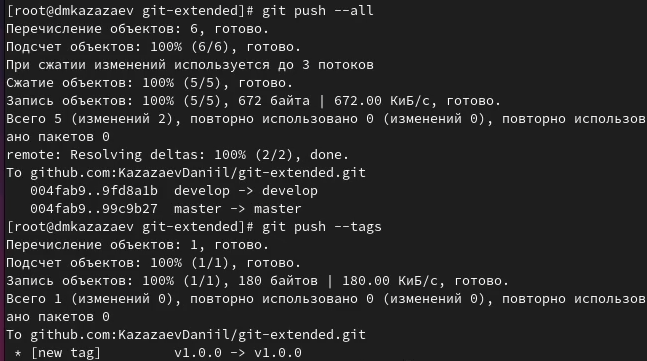

Создаю релиз на GitHub.(рис. 23)

Создаю новую ветку для функциональности.(рис. 24)

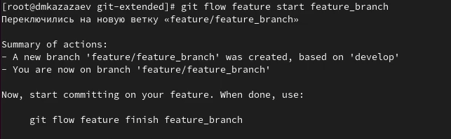

Окончание ветки для функциональности.(рис. 25)

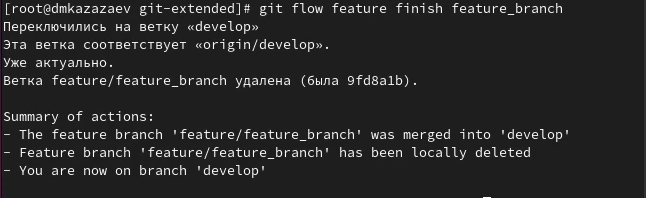

Заливаю ветку в основную ветку.(рис. 26)

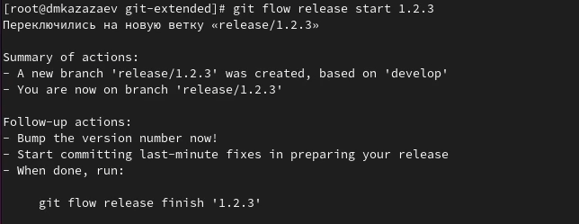

Отправляю все на GitHub.(рис. 27)

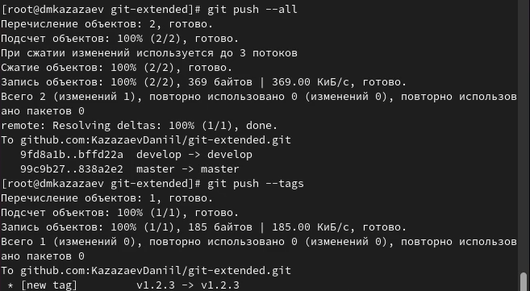

# Заключительная часть

## Вывод

В результате выполнения лабораторной работы я получил навыки правильной работы с репозиториями git.
