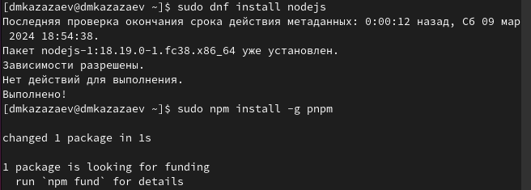

---
## Front matter
title: "Отчёт по лабораторной работе №4"
subtitle: "Дисциплина: операционные системы"
author: "Казаазев Даниил Михайлович"

## Generic otions
lang: ru-RU
toc-title: "Содержание"

## Bibliography
bibliography: bib/cite.bib
csl: pandoc/csl/gost-r-7-0-5-2008-numeric.csl

## Pdf output format
toc: true # Table of contents
toc-depth: 2
lof: true # List of figures
lot: true # List of tables
fontsize: 12pt
linestretch: 1.5
papersize: a4
documentclass: scrreprt
## I18n polyglossia
polyglossia-lang:
  name: russian
  options:
	- spelling=modern
	- babelshorthands=true
polyglossia-otherlangs:
  name: english
## I18n babel
babel-lang: russian
babel-otherlangs: english
## Fonts
mainfont: PT Serif
romanfont: PT Serif
sansfont: PT Sans
monofont: PT Mono
mainfontoptions: Ligatures=TeX
romanfontoptions: Ligatures=TeX
sansfontoptions: Ligatures=TeX,Scale=MatchLowercase
monofontoptions: Scale=MatchLowercase,Scale=0.9
## Biblatex
biblatex: true
biblio-style: "gost-numeric"
biblatexoptions:
  - parentracker=true
  - backend=biber
  - hyperref=auto
  - language=auto
  - autolang=other*
  - citestyle=gost-numeric
## Pandoc-crossref LaTeX customization
figureTitle: "Рис."
tableTitle: "Таблица"
listingTitle: "Листинг"
lofTitle: "Список иллюстраций"
lotTitle: "Список таблиц"
lolTitle: "Листинги"
## Misc options
indent: true
header-includes:
  - \usepackage{indentfirst}
  - \usepackage{float} # keep figures where there are in the text
  - \floatplacement{figure}{H} # keep figures where there are in the text
---

# Цель работы

Получение навыков правильной работы с репозиториями git.

# Задание

1. Выполнить работу для тестового репозитория.
2. Преобразовать рабочий репозиторий в репозиторий с git-flow и conventional commits.

# Выполнение лабораторной работы

Устанавливаю git flow из коллекции репозиториев Copr (рис. [-@fig:001]).

{#fig:001 width=70%}

Устанавливаю Node.js и pnpm. (рис. [-@fig:002])

{#fig:002 width=70%}

Настраиваю Node.js. (рис. [-@fig:003])

{#fig:003 width=100%}

Устанавливаю программу для форматирования коммитов. (рис. [-@fig:004])

{#fig:004 width=70%}

Устанавливаю программу для создания логов. (рис. [-@fig:005])

{#fig:005 width=70%}

Создаю новый репозиторий на GitHub. (рис. [-@fig:006])

{#fig:006 width=70%}

Создаю директорию для репозитория.(рис. [-@fig:007])

{#fig:007 width=70%}

Создаю репозиторий по инструкции.(тут 2 скрина)(рис. [-@fig:008])

{#fig:008 width=70%}

{#fig:009 width=70%}

Созданный репозиторий.(рис. [-@fig:010])

{#fig:010 width=70%}

Конфигурация файла package.json до его настройки.(рис. [-@fig:011])

{#fig:011 width=70%}

Конфигурация файла package.json после настройки.(рис. [-@fig:012])

{#fig:012 width=70%}

Добавляю изменения.(рис. [-@fig:013])

{#fig:013 width=70%}

Выполняю коммит командой gh cz.(рис. [-@fig:014])

{#fig:014 width=70%}

Отправляю файлы на GitHub.(рис. [-@fig:015])

{#fig:015 width=70%}

Инициализирую git flow и проверяю ветку develop.(рис. [-@fig:016])

{#fig:016 width=70%}

Загружаю весь репозиторий в хранилище и устанавливаю внешнюю ветку как вышестоящую.(рис. [-@fig:017]).

{#fig:017 width=70%}

Создаю релиз 1.0.0.(рис. [-@fig:018])

{#fig:018 width=70%}

Создаю журнал изменений.(рис. [-@fig:019])

{#fig:019 width=70%}

Добавляю журнал изменений в индекс.(рис. [-@fig:020])

{#fig:020 width=70%}

Заливаю основную ветку.(рис. [-@fig:021])

{#fig:021 width=70%}

Отправляю данные на GitHub.(рис. [-@fig:022])

{#fig:022 width=70%}

Создаю релиз на GitHub.(рис. [-@fig:023])

{#fig:023 width=70%}

Создаю новую ветку для функциональности.(рис. [-@fig:024])

{#fig:024 width=70%}

Окончание ветки для функциональности.(рис. [-@fig:025])

{#fig:025 width=70%}

Заливаю ветку в основную ветку.(рис. [-@fig:026])

{#fig:026 width=70%}

Отправляю все на GitHub.(рис. [-@fig:027])

{#fig:027 width=70%}

# Выводы

В результате выполнения лабораторной работы я получил навыки правильной работы с репозиториями git.
