---
## Front matter
lang: ru-RU
title: Лабораторная работа № 6
subtitle: Операционные системы
author:
  - Казазаев Д. М.
institute:
  - Российский университет дружбы народов, Москва, Россия

## i18n babel
babel-lang: russian
babel-otherlangs: english

## Formatting pdf
toc: false
toc-title: Содержание
slide_level: 2
aspectratio: 169
section-titles: true
theme: metropolis
header-includes:
 - \metroset{progressbar=frametitle,sectionpage=progressbar,numbering=fraction}
 - '\makeatletter'
 - '\beamer@ignorenonframefalse'
 - '\makeatother'
---

# Информация

## Докладчик

:::::::::::::: {.columns align=center}
::: {.column width="70%"}

  * Казазаев Даниил Михайлович
  * Студент бакалавриата
  * Российский университет дружбы народов
  * [1132231427@rudn.ru]
  * <https://github.com/KazazaevDaniil/study_2023-2024_os-intro>

:::
::::::::::::::

# Вводная часть

## Цели и задачи

Приобретение практических навыков взаимодействия пользователя с системой по-
средством командной строки.

## Задание

1. Определите полное имя вашего домашнего каталога. Далее относительно этого ката-
лога будут выполняться последующие упражнения.
2. Перейдите в каталог /tmp.
3.  Выведите на экран содержимое каталога /tmp. Для этого используйте команду ls с различными опциями. 
4. Определите, есть ли в каталоге /var/spool подкаталог с именем cron?
5. Перейдите в Ваш домашний каталог и выведите на экран его содержимое. Опре-
делите, кто является владельцем файлов и подкаталогов?
6. Выполните следующие действия:
7. В домашнем каталоге создайте новый каталог с именем newdir.
8. В каталоге ~/newdir создайте новый каталог с именем morefun.
9. В домашнем каталоге создайте одной командой три новых каталога с именами
letters, memos, misk. Затем удалите эти каталоги одной командой.

## Задание

10. Попробуйте удалить ранее созданный каталог ~/newdir командой rm. Проверьте,
был ли каталог удалён.
11. Удалите каталог ~/newdir/morefun из домашнего каталога. Проверьте, был ли
каталог удалён.
12. С помощью команды man определите, какую опцию команды ls нужно использо-
вать для просмотра содержимое не только указанного каталога, но и подкаталогов,
входящих в него.
13. С помощью команды man определите набор опций команды ls, позволяющий отсорти-
ровать по времени последнего изменения выводимый список содержимого каталога
с развёрнутым описанием файлов.
14. Используйте команду man для просмотра описания следующих команд: cd, pwd, mkdir,
rmdir, rm.
15. Используя информацию, полученную при помощи команды history, выполните модификацию и исполнение нескольких команд из буфера команд.

# Основная часть

## Выполнение лабораторной работы. Отчет по лабораторной работе № 6.

Определяюполное имя домашнего каталога командой ```pwd```. (рис. 1).

{width=70%}

## Выполнение лабораторной работы. Отчет по лабораторной работе № 6.

Перехожу в /tmp командой ```cd /tmp/```. (рис. 2)

{width=70%}

## Выполнение лабораторной работы. Отчет по лабораторной работе № 6.

Вывожу обычную информацию о содержимом каталога командой ```ls``` . (рис. 3)

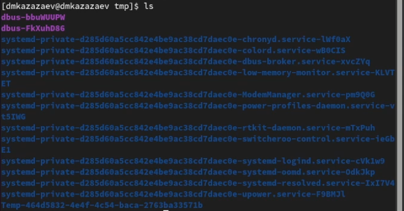{width=70%}

## Выполнение лабораторной работы. Отчет по лабораторной работе № 6.

Вывожу информацию о обычнном и скрытом содержимом командой ```ls -a```. (рис. 4)

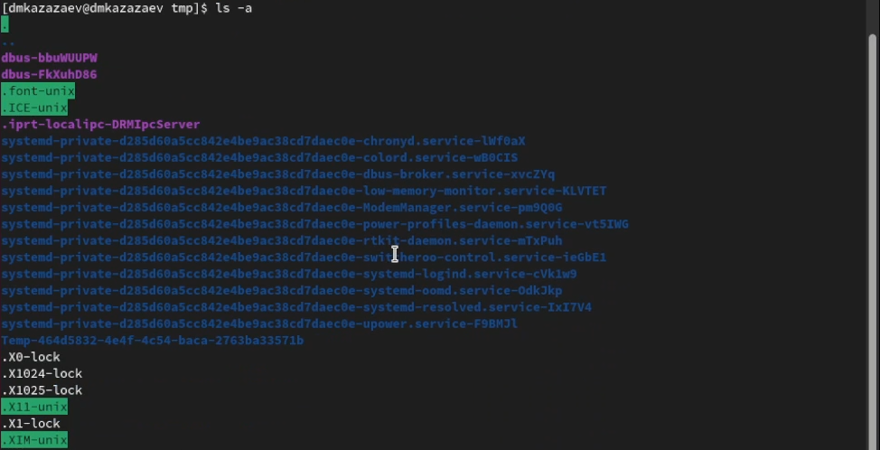{width=70%}

## Выполнение лабораторной работы. Отчет по лабораторной работе № 6.

Вывожу расширенную информацию о содержимом каталога командой ```ls -l```. (рис. 5)

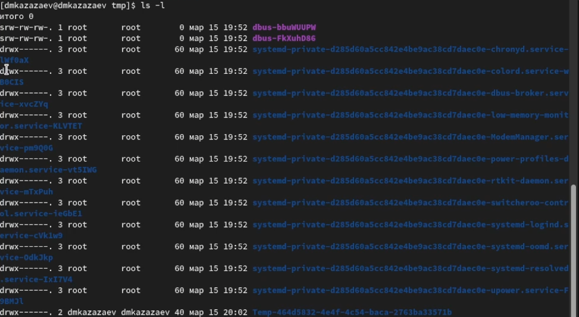{width=70%}

## Выполнение лабораторной работы. Отчет по лабораторной работе № 6.

Перехожу в каталог var/spool, чтобы найти каталог cron. (рис. 6)

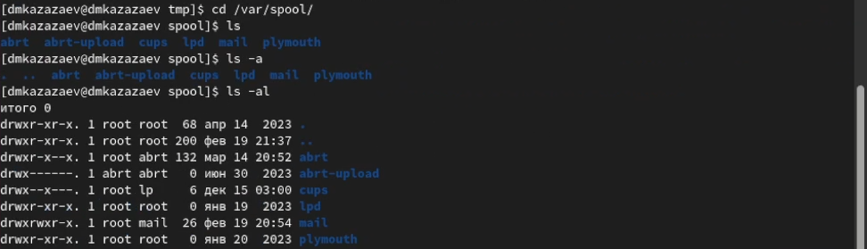

У меня в каталоге не оказалось подкаталога cron.

## Выполнение лабораторной работы. Отчет по лабораторной работе № 6.

Возвращаюсь в домашний каталоги и проверяю иммя владельца файлов в этом каталоге. (рис. 7)

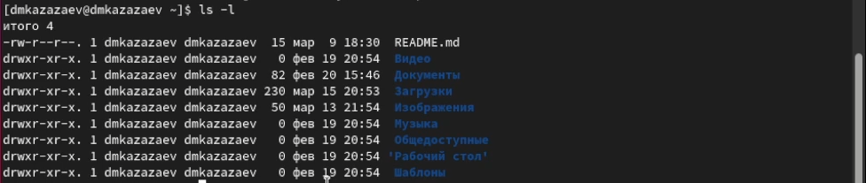

## Выполнение лабораторной работы. Отчет по лабораторной работе № 6.

Создаю каталог newdir, перехожу в него и создаю подкаталог morefun. (рис. 8)

{width=70%}

## Выполнение лабораторной работы. Отчет по лабораторной работе № 6.

Возвращаюсь в домашний каталог и создаю три каталога одной командой. (рис. 9)

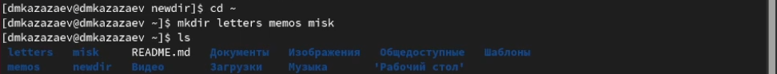{width=70%}

## Выполнение лабораторной работы. Отчет по лабораторной работе № 6.

Удаляю свежесозданные каталоги одной командой. (рис. 10)

{width=70%}

## Выполнение лабораторной работы. Отчет по лабораторной работе № 6.

Пытаюсь удалить каталог newdir командой ```rm```. (рис. 11)

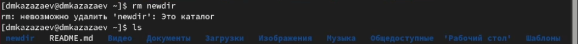{width=70%}

Каталог не удалился, потому что команда ```rm``` не может удалить каталог без определенной опции.

## Выполнение лабораторной работы. Отчет по лабораторной работе № 6.

Удаляю каталог morefun из домашнего каталога. (рис. 12)

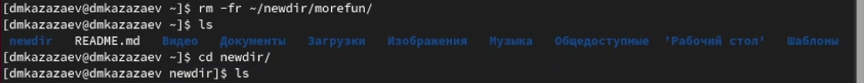{width=70%}

## Выполнение лабораторной работы. Отчет по лабораторной работе № 6.

После чтения о опциях команды ```ls``` проверяю опцию -R, которая служит для просмотра содержимого не только у каталога, но и у его подкаталогов. (рис. 13)

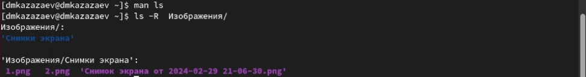{width=70%}

## Выполнение лабораторной работы. Отчет по лабораторной работе № 6.

Пишу команду ```man ls``` и ищу опцию, которая позволяет сортировать файлы при просмотре по времени. (рис. 14])

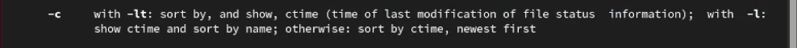{width=70%}

## Выполнение лабораторной работы. Отчет по лабораторной работе № 6.

Пишу команду ```man pwd``` и ищу список опций. (рис. 15)

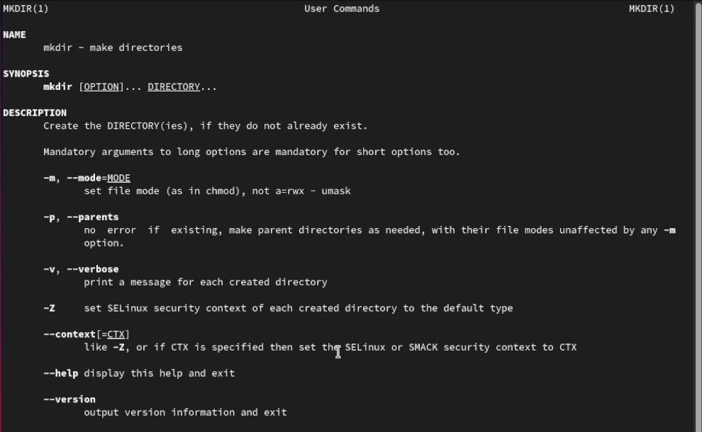{width=50%}

## Выполнение лабораторной работы. Отчет по лабораторной работе № 6.

Пишу команду ```man mkdir``` и ищу список опций.(рис. 16)

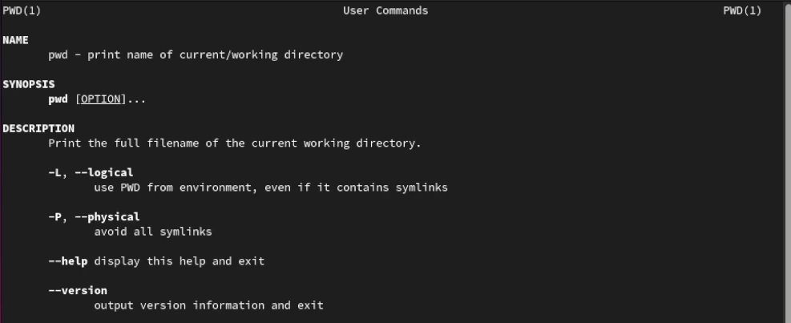{width=70%}

## Выполнение лабораторной работы. Отчет по лабораторной работе № 6.

Пишу команду ```man rm``` и ищу список опций.(рис. 17)

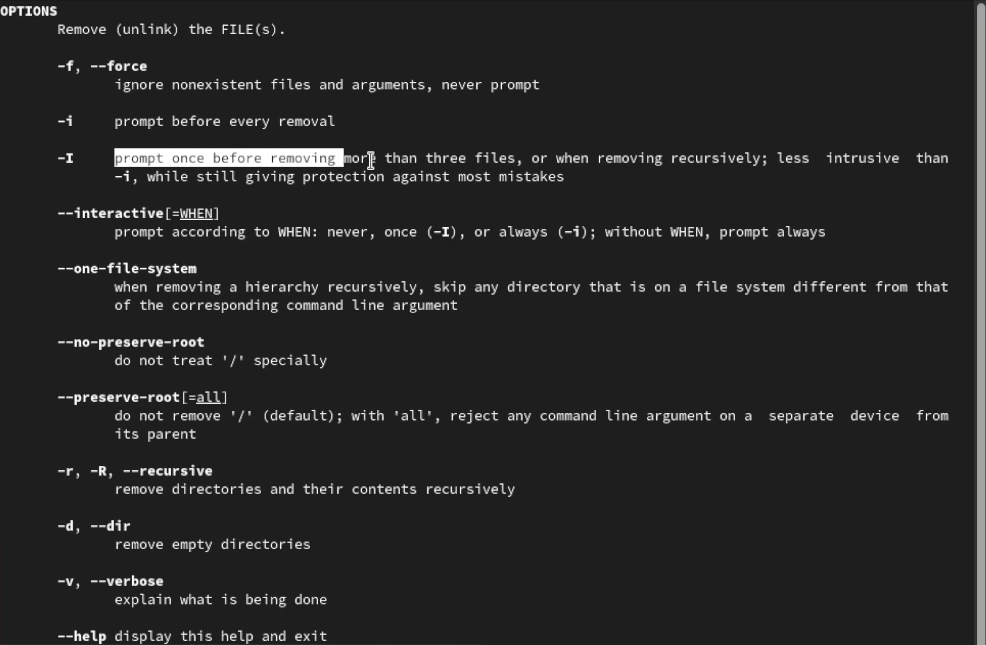{width=50%}

## Выполнение лабораторной работы. Отчет по лабораторной работе № 6.

Пишу команду ```man rmdir``` и ищу список опций.(рис. 18)

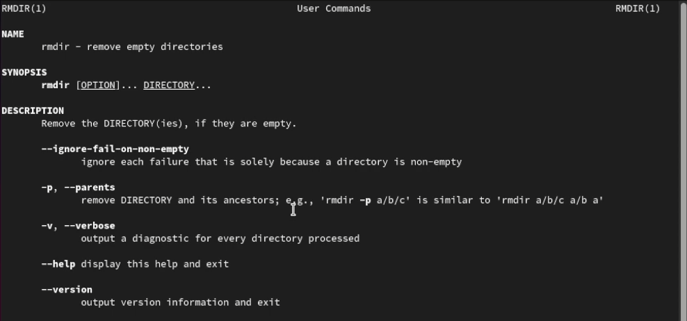{width=70%}

## Выполнение лабораторной работы. Отчет по лабораторной работе № 6.

Смотрю историю командой ```history```. (рис. 19)

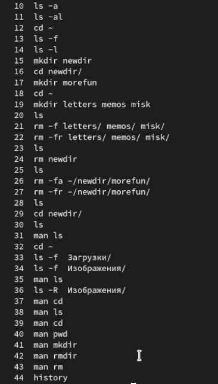{width=18%}

## Выполнение лабораторной работы. Отчет по лабораторной работе № 6.

Меняю команду ```mkdir letters memos misk``` на ```mkdir -p letters/memos/misk```. (рис. 20)

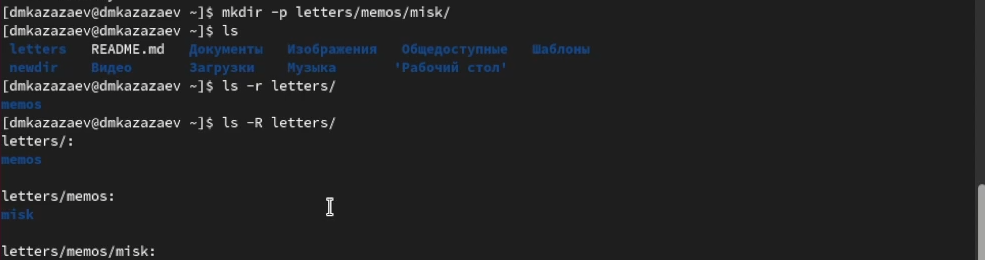{width=70%}

## Выполнение лабораторной работы. Отчет по лабораторной работе № 6.

Меняю команду ```rm -fr letters memos misk``` на ```rm -fr letters/```. (рис. 21)

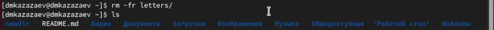{width=70%}

# Заключительная часть

## Результаты

- Приобретены практические навыки взаимодействия с командной строкой

## Вывод

В результате выполнения лабораторной работы я приобрел практические навыки взаимодействия пользователя с системой посредством командной строки.
