---
## Front matter
title: "Отчёт по лабораторной работе №6"
subtitle: "Дисциплина: операционные системы"
author: "Казаазев Даниил Михайлович"

## Generic otions
lang: ru-RU
toc-title: "Содержание"

## Bibliography
bibliography: bib/cite.bib
csl: pandoc/csl/gost-r-7-0-5-2008-numeric.csl

## Pdf output format
toc: true # Table of contents
toc-depth: 2
lof: true # List of figures
lot: true # List of tables
fontsize: 12pt
linestretch: 1.5
papersize: a4
documentclass: scrreprt
## I18n polyglossia
polyglossia-lang:
  name: russian
  options:
	- spelling=modern
	- babelshorthands=true
polyglossia-otherlangs:
  name: english
## I18n babel
babel-lang: russian
babel-otherlangs: english
## Fonts
mainfont: PT Serif
romanfont: PT Serif
sansfont: PT Sans
monofont: PT Mono
mainfontoptions: Ligatures=TeX
romanfontoptions: Ligatures=TeX
sansfontoptions: Ligatures=TeX,Scale=MatchLowercase
monofontoptions: Scale=MatchLowercase,Scale=0.9
## Biblatex
biblatex: true
biblio-style: "gost-numeric"
biblatexoptions:
  - parentracker=true
  - backend=biber
  - hyperref=auto
  - language=auto
  - autolang=other*
  - citestyle=gost-numeric
## Pandoc-crossref LaTeX customization
figureTitle: "Рис."
tableTitle: "Таблица"
listingTitle: "Листинг"
lofTitle: "Список иллюстраций"
lotTitle: "Список таблиц"
lolTitle: "Листинги"
## Misc options
indent: true
header-includes:
  - \usepackage{indentfirst}
  - \usepackage{float} # keep figures where there are in the text
  - \floatplacement{figure}{H} # keep figures where there are in the text
---

# Цель работы

Приобретение практических навыков взаимодействия пользователя с системой по-
средством командной строки.

# Задание

1. Определите полное имя вашего домашнего каталога. Далее относительно этого ката-
лога будут выполняться последующие упражнения.
2. Перейдите в каталог /tmp.
3.  Выведите на экран содержимое каталога /tmp. Для этого используйте команду ls с различными опциями. 
4. Определите, есть ли в каталоге /var/spool подкаталог с именем cron?
5. Перейдите в Ваш домашний каталог и выведите на экран его содержимое. Опре-
делите, кто является владельцем файлов и подкаталогов?
6. Выполните следующие действия:
7. В домашнем каталоге создайте новый каталог с именем newdir.
8. В каталоге ~/newdir создайте новый каталог с именем morefun.
9. В домашнем каталоге создайте одной командой три новых каталога с именами
letters, memos, misk. Затем удалите эти каталоги одной командой.
10. Попробуйте удалить ранее созданный каталог ~/newdir командой rm. Проверьте,
был ли каталог удалён.
11. Удалите каталог ~/newdir/morefun из домашнего каталога. Проверьте, был ли
каталог удалён.
12. С помощью команды man определите, какую опцию команды ls нужно использо-
вать для просмотра содержимое не только указанного каталога, но и подкаталогов,
входящих в него.
13. С помощью команды man определите набор опций команды ls, позволяющий отсорти-
ровать по времени последнего изменения выводимый список содержимого каталога
с развёрнутым описанием файлов.
14. Используйте команду man для просмотра описания следующих команд: cd, pwd, mkdir,
rmdir, rm.
15. Используя информацию, полученную при помощи команды history, выполните модификацию и исполнение нескольких команд из буфера команд.

# Выполнение лабораторной работы

Определяюполное имя домашнего каталога командой ```pwd```. (рис. [-@fig:001]).

{#fig:001 width=70%}

Перехожу в /tmp командой ```cd /tmp/```. (рис. [-@fig:002])

{#fig:002 width=70%}

Вывожу обычную информацию о содержимом каталога командой ```ls``` . (рис. [-@fig:003])

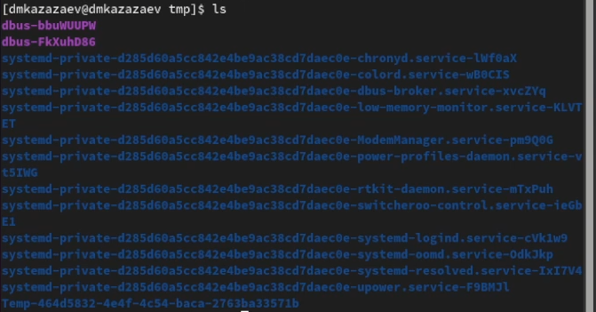{#fig:003 width=100%}

Вывожу информацию о обычнном и скрытом содержимом командой ```ls -a```. (рис. [-@fig:004])

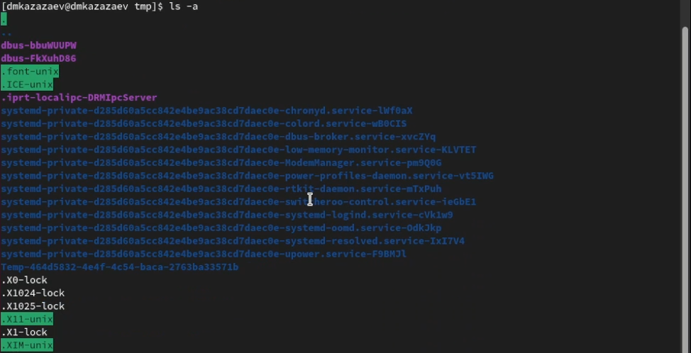{#fig:004 width=70%}

Вывожу расширенную информацию о содержимом каталога командой ```ls -l```. (рис. [-@fig:005])

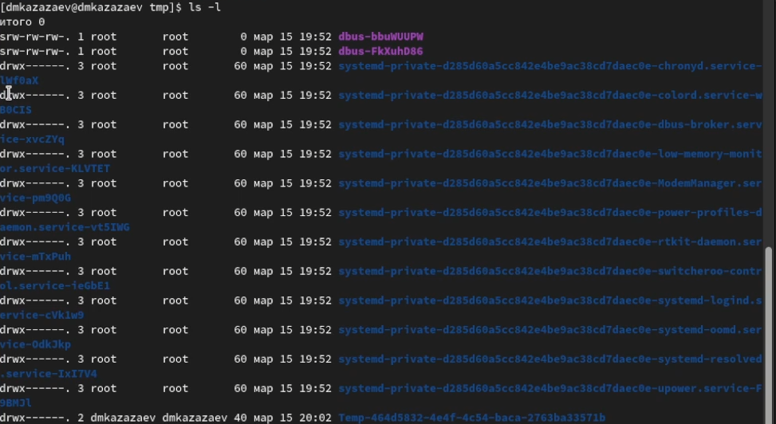{#fig:005 width=70%}

Перехожу в каталог var/spool, чтобы найти каталог cron. (рис. [-@fig:006])

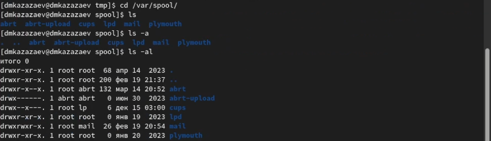{#fig:006 width=70%}

У меня в каталоге не оказалось подкаталога cron.

Возвращаюсь в домашний каталоги и проверяю иммя владельца файлов в этом каталоге. (рис. [-@fig:007])

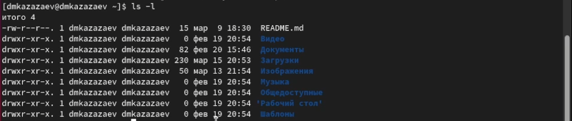{#fig:007 width=70%}

Создаю каталог newdir, перехожу в него и создаю подкаталог morefun. (рис. [-@fig:008])

{#fig:008 width=70%}

Возвращаюсь в домашний каталог и создаю три каталога одной командой. (рис. [-@fig:009])

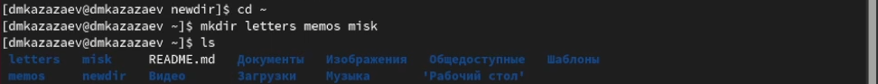{#fig:009 width=70%}

Удаляю свежесозданные каталоги одной командой. (рис. [-@fig:010])

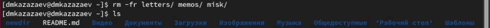{#fig:010 width=70%}

Пытаюсь удалить каталог newdir командой ```rm```. (рис. [-@fig:011])

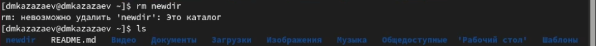{#fig:011 width=70%}

Каталог не удалился, потому что команда ```rm``` не может удалить каталог без определенной опции.

Удаляю каталог morefun из домашнего каталога. (рис. [-@fig:012])

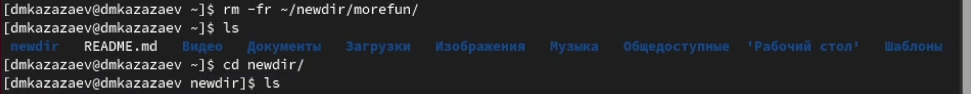{#fig:012 width=70%}

После чтения о опциях команды ```ls``` проверяю опцию -R, которая служит для просмотра содержимого не только у каталога, но и у его подкаталогов. (рис. [-@fig:013])

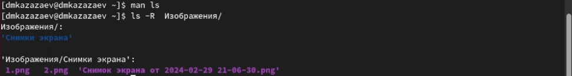{#fig:013 width=70%}

Пишу команду ```man ls``` и ищу опцию, которая позволяет сортировать файлы при просмотре по времени. (рис. [-@fig:014])

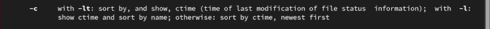{#fig:014 width=70%}

Пишу команду ```man pwd``` и ищу список опций. ([-@fig:016])

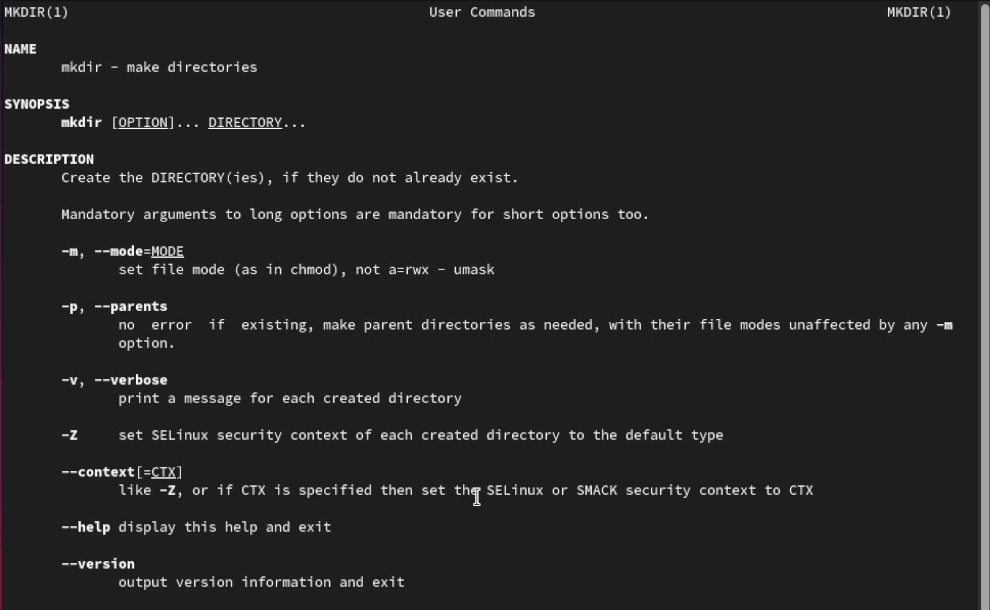{#fig:016 width=70%}

Пишу команду ```man mkdir``` и ищу список опций.([-@fig:017])

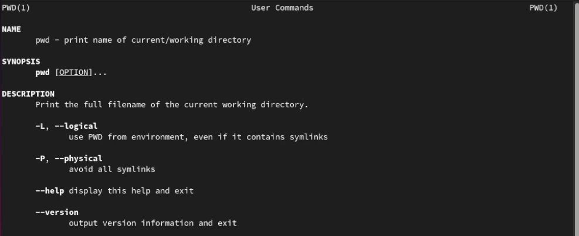{#fig:017 width=70%}

Пишу команду ```man rm``` и ищу список опций.([-@fig:018])

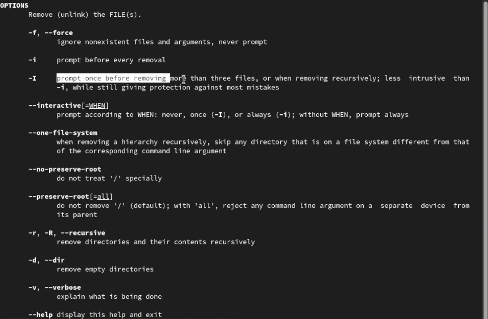{#fig:018 width=70%}

Пишу команду ```man rmdir``` и ищу список опций.([-@fig:019])

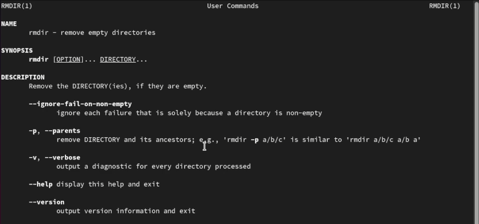{#fig:019 width=70%}

Смотрю историю командой ```history```. ([-@fig:020])

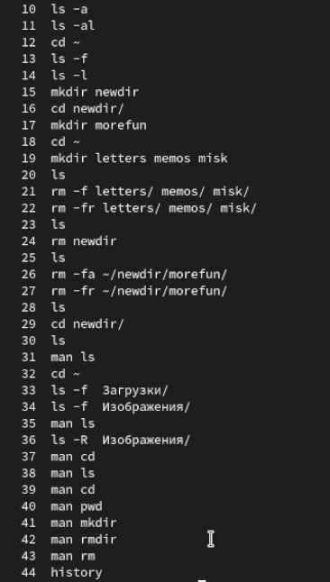{#fig:020 width=70%}

Меняю команду ```mkdir letters memos misk``` на ```mkdir -p letters/memos/misk```. ([-@fig:021])

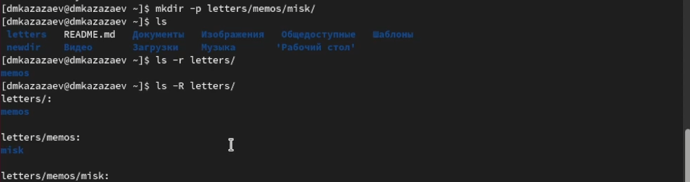{#fig:021 width=70%}

Меняю команду ```rm -fr letters memos misk``` на ```rm -fr letters/```. ([-@fig:022])

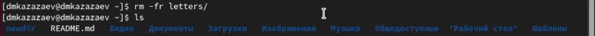{#fig:022 width=70%}

# Выводы

В результате выполнения лабораторной работы я приобрел практические навыки взаимодействия пользователя с системой посредством командной строки.
