---
## Front matter
lang: ru-RU
title: Лабораторная работа № 7
subtitle: Операционные системы
author:
  - Казазаев Д. М.
institute:
  - Российский университет дружбы народов, Москва, Россия

## i18n babel
babel-lang: russian
babel-otherlangs: english

## Formatting pdf
toc: false
toc-title: Содержание
slide_level: 2
aspectratio: 169
section-titles: true
theme: metropolis
header-includes:
 - \metroset{progressbar=frametitle,sectionpage=progressbar,numbering=fraction}
 - '\makeatletter'
 - '\beamer@ignorenonframefalse'
 - '\makeatother'
---

# Информация

## Докладчик

:::::::::::::: {.columns align=center}
::: {.column width="70%"}

  * Казазаев Даниил Михайлович
  * Студент бакалавриата
  * Российский университет дружбы народов
  * [1132231427@rudn.ru]
  * <https://github.com/KazazaevDaniil/study_2023-2024_os-intro>

:::
::::::::::::::

# Вводная часть

## Цели и задачи

Ознакомление с файловой системой Linux, её структурой, именами и содержанием
каталогов. Приобретение практических навыков по применению команд для работы
с файлами и каталогами, по управлению процессами (и работами), по проверке исполь-
зования диска и обслуживанию файловой системы.

## Задание

1. Выполнить команды из примеров первой части лабораторной работы.
2. Выполнить список действий, описанный в лабораторной работе.

# Основная часть

## Выполнение лабораторной работы. Отчет по лабораторной работе № 7.

### Задание 1

Создаю и копирую созданный файл, меня ему название. (рис. 1).

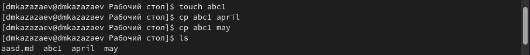

## Выполнение лабораторной работы. Отчет по лабораторной работе № 7.

Создаю директория и копирую в нее файлы одной командой. (рис. 2)

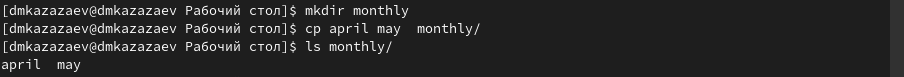

## Выполнение лабораторной работы. Отчет по лабораторной работе № 7.

Создаю еще одну директорию и рекурисивно окопирую в нее директорию, созданную в прошлом пункте. (рис. 3)

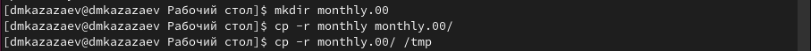

## Выполнение лабораторной работы. Отчет по лабораторной работе № 7.

Меняю название файла, после чего перемещаю его в диреткорию. (рис. 4)

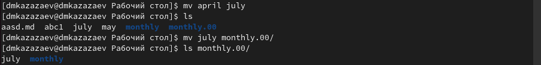

## Выполнение лабораторной работы. Отчет по лабораторной работе № 7.

Меняю название директории. (рис. 5)

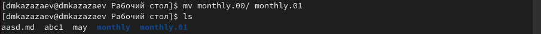

## Выполнение лабораторной работы. Отчет по лабораторной работе № 7.

Создаю еще одну директорию и переношу в нее директорию из прошлого пункта. (рис. 6)

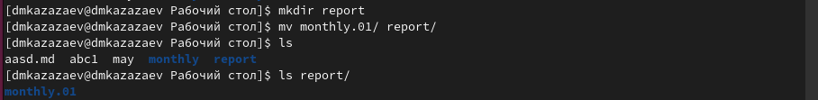

## Выполнение лабораторной работы. Отчет по лабораторной работе № 7.

Меняю название внутренней директории. (рис. 7)

## Выполнение лабораторной работы. Отчет по лабораторной работе № 7.

Добавляю и удаляю права выполнения для владельца диреткории. (рис. 8)

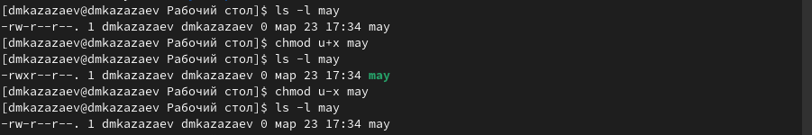

## Выполнение лабораторной работы. Отчет по лабораторной работе № 7.

Удаляю права чтения для группы и других полльзователей. (рис. 9)

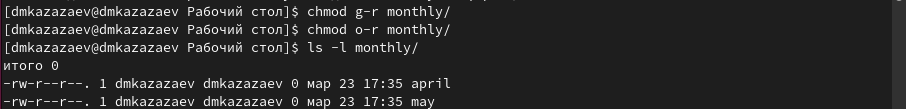

## Выполнение лабораторной работы. Отчет по лабораторной работе № 7.

Добавляю права редактирования для группы. (рис. 10)

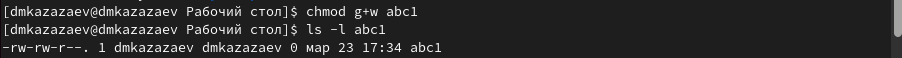

## Выполнение лабораторной работы. Отчет по лабораторной работе № 7.

Проверяю целостность файловой системы. (рис. 11)

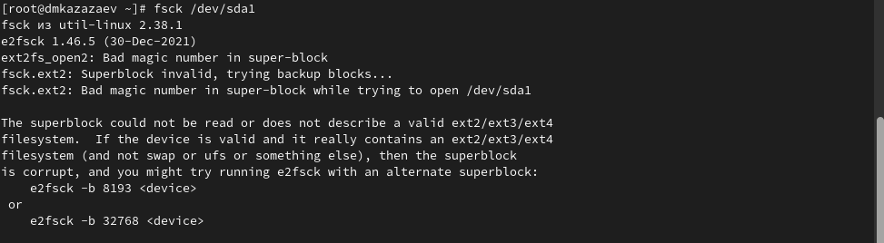

## Выполнение лабораторной работы. Отчет по лабораторной работе № 7.

### Задание 2

Копирую файл в домашний каталог и меняю его название. (рис. 12)

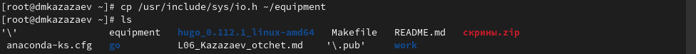

## Выполнение лабораторной работы. Отчет по лабораторной работе № 7.

Создаю диреткорию. (рис. 13)

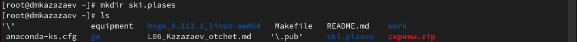

## Выполнение лабораторной работы. Отчет по лабораторной работе № 7.

Переношу переименованный файл в созданную директорию, меняя его название. (рис. 14)

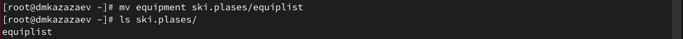

## Выполнение лабораторной работы. Отчет по лабораторной работе № 7.

Создаю новый файл, после чего переношу его, меняя его название. (рис. 15)

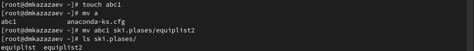

## Выполнение лабораторной работы. Отчет по лабораторной работе № 7.

Создаю подкаталог из домашней директории.(рис. 16)

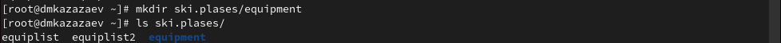

## Выполнение лабораторной работы. Отчет по лабораторной работе № 7.

Переношу файлы в новый каталог.(рис. 17)

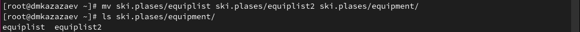

## Выполнение лабораторной работы. Отчет по лабораторной работе № 7.

Создаю новый каталог и переношу его, меняя название.(рис. 18)

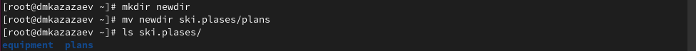

## Выполнение лабораторной работы. Отчет по лабораторной работе № 7.

Создаю две директории и два файла. (рис. 19)

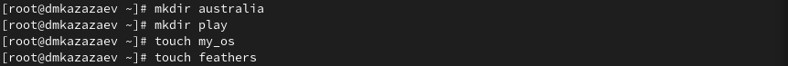

## Выполнение лабораторной работы. Отчет по лабораторной работе № 7.

Проверяю права доступа. (рис. 20)

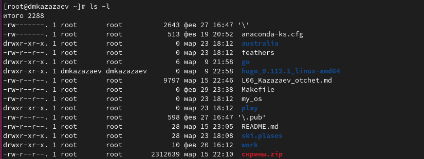

## Выполнение лабораторной работы. Отчет по лабораторной работе № 7.

После всех изменений прав доступа, вывожу историю команд. (рис. 21)

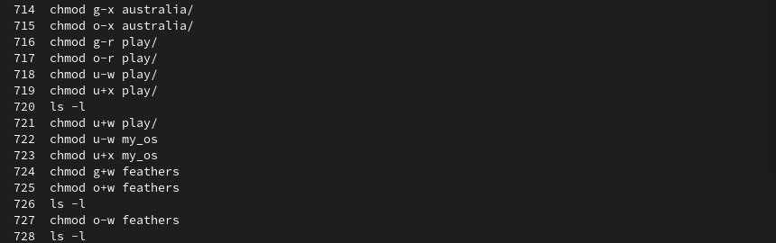{width=50%}

## Выполнение лабораторной работы. Отчет по лабораторной работе № 7.

Смотрю содержимое файла. (рис. 22)

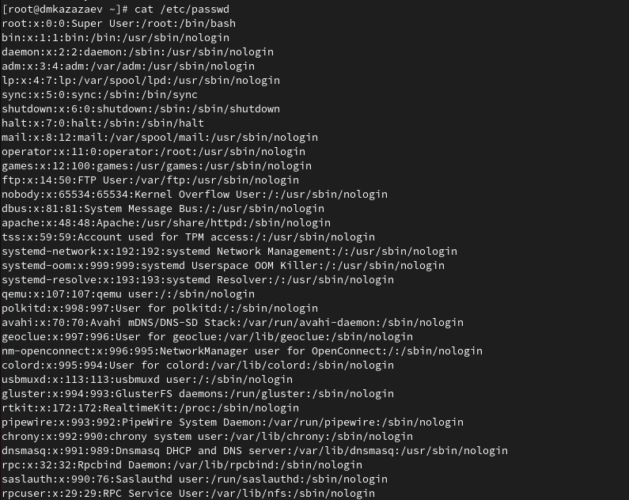{width=50%}

## Выполнение лабораторной работы. Отчет по лабораторной работе № 7.

Копирую файл, меняя ему название. (рис. 23)

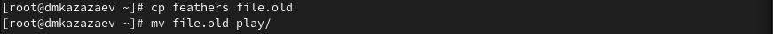

## Выполнение лабораторной работы. Отчет по лабораторной работе № 7.

Копирую каталог. (рис. 24)

## Выполнение лабораторной работы. Отчет по лабораторной работе № 7.

Переношу каталог, меняя его название. (рис. 25)

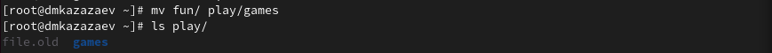

## Выполнение лабораторной работы. Отчет по лабораторной работе № 7.

Удаляю права чтения для владельца. (рис. 26)

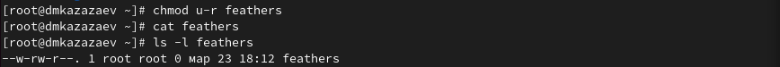

## Выполнение лабораторной работы. Отчет по лабораторной работе № 7.

Возвращаю права чтения. (рис. 27)

## Выполнение лабораторной работы. Отчет по лабораторной работе № 7.

Удаляю для владельца права выполнения у каталога. (рис. 28)

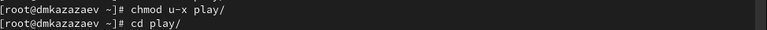

## Выполнение лабораторной работы. Отчет по лабораторной работе № 7.

Возвращаю права выполнения. (рис. 29)

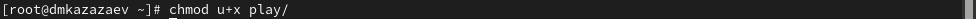

# Заключительная часть

## Результаты

- Приобретены практические навыки по применению команд для работы с файлами и каталогами, по управлению процессами (и работами), по проверке испольования диска и обслуживанию файловой системы.

## Вывод

В результате выполнения лабораторной работы я ознакомился с файловой системой Linux, её структурой, именами и содержанием каталогов. Приобрел практические навыки по применению команд для работы с файлами и каталогами, по управлению процессами (и работами), по проверке испольования диска и обслуживанию файловой системы.
