---
## Front matter
title: "Отчёт по лабораторной работе №7"
subtitle: "Дисциплина: операционные системы"
author: "Казаазев Даниил Михайлович"

## Generic otions
lang: ru-RU
toc-title: "Содержание"

## Bibliography
bibliography: bib/cite.bib
csl: pandoc/csl/gost-r-7-0-5-2008-numeric.csl

## Pdf output format
toc: true # Table of contents
toc-depth: 2
lof: true # List of figures
lot: true # List of tables
fontsize: 12pt
linestretch: 1.5
papersize: a4
documentclass: scrreprt
## I18n polyglossia
polyglossia-lang:
  name: russian
  options:
	- spelling=modern
	- babelshorthands=true
polyglossia-otherlangs:
  name: english
## I18n babel
babel-lang: russian
babel-otherlangs: english
## Fonts
mainfont: PT Serif
romanfont: PT Serif
sansfont: PT Sans
monofont: PT Mono
mainfontoptions: Ligatures=TeX
romanfontoptions: Ligatures=TeX
sansfontoptions: Ligatures=TeX,Scale=MatchLowercase
monofontoptions: Scale=MatchLowercase,Scale=0.9
## Biblatex
biblatex: true
biblio-style: "gost-numeric"
biblatexoptions:
  - parentracker=true
  - backend=biber
  - hyperref=auto
  - language=auto
  - autolang=other*
  - citestyle=gost-numeric
## Pandoc-crossref LaTeX customization
figureTitle: "Рис."
tableTitle: "Таблица"
listingTitle: "Листинг"
lofTitle: "Список иллюстраций"
lotTitle: "Список таблиц"
lolTitle: "Листинги"
## Misc options
indent: true
header-includes:
  - \usepackage{indentfirst}
  - \usepackage{float} # keep figures where there are in the text
  - \floatplacement{figure}{H} # keep figures where there are in the text
---

# Цель работы

Ознакомление с файловой системой Linux, её структурой, именами и содержанием
каталогов. Приобретение практических навыков по применению команд для работы
с файлами и каталогами, по управлению процессами (и работами), по проверке исполь-
зования диска и обслуживанию файловой системы.

# Задание

1. Выполнить команды из примеров первой части лабораторной работы.
2. Выполнить список действий, описанный в лабораторной работе.

# Выполнение лабораторной работы

## Задание 1

Создаю и копирую созданный файл, меня ему название. (рис. [-@fig:001]).

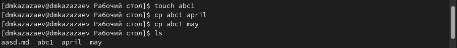{#fig:001 width=70%}

Создаю директория и копирую в нее файлы одной командой. (рис. [-@fig:002])

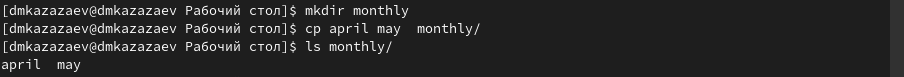{#fig:002 width=70%}

Создаю еще одну директорию и рекурисивно окопирую в нее директорию, созданную в прошлом пункте. (рис. [-@fig:003])

{#fig:003 width=100%}

Меняю название файла, после чего перемещаю его в диреткорию. (рис. [-@fig:004])

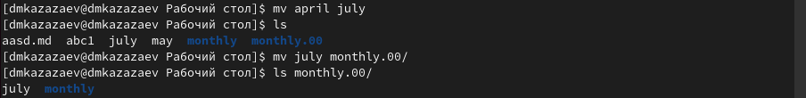{#fig:004 width=70%}

Меняю название директории. (рис. [-@fig:005])

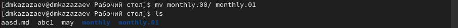{#fig:005 width=70%}

Создаю еще одну директорию и переношу в нее директорию из прошлого пункта. (рис. [-@fig:006])

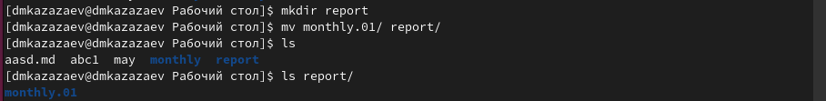{#fig:006 width=70%}

Меняю название внутренней директории. (рис. [-@fig:007])

{#fig:007 width=70%}

Добавляю и удаляю права выполнения для владельца диреткории. (рис. [-@fig:008])

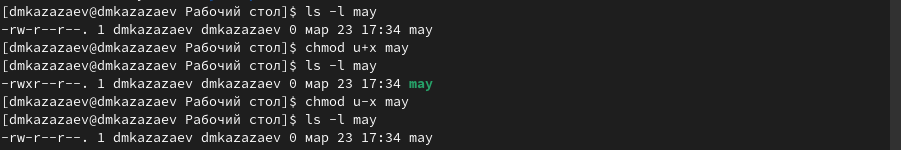{#fig:008 width=70%}

Удаляю права чтения для группы и других полльзователей. (рис. [-@fig:009])

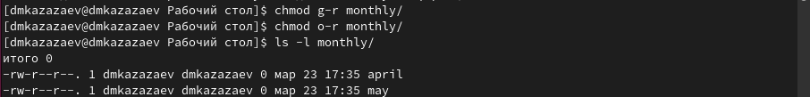{#fig:009 width=70%}

Добавляю права редактирования для группы. (рис. [-@fig:010])

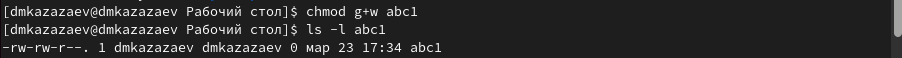{#fig:010 width=70%}

Проверяю целостность файловой системы. (рис. [-@fig:011])

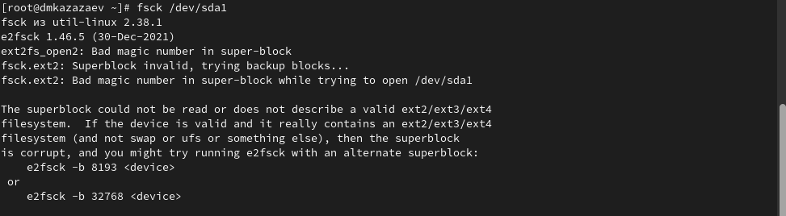{#fig:011 width=70%}

## Задание 2

Копирую файл в домашний каталог и меняю его название. (рис. [-@fig:012])

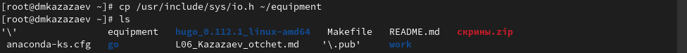{#fig:012 width=70%}

Создаю диреткорию. (рис. [-@fig:013])

{#fig:013 width=70%}

Переношу переименованный файл в созданную директорию, меняя его название. (рис. [-@fig:014])

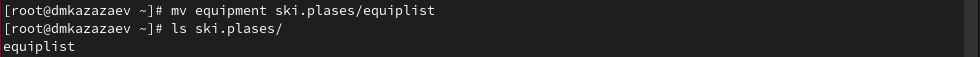{#fig:014 width=70%}

Создаю новый файл, после чего переношу его, меняя его название. ([-@fig:015])

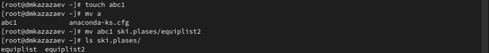{#fig:015 width=70%}

Создаю подкаталог из домашней директории.([-@fig:016])

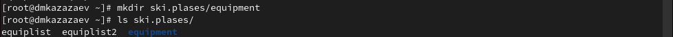{#fig:016 width=70%}

Переношу файлы в новый каталог.([-@fig:017])

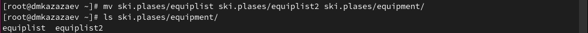{#fig:017 width=70%}

Создаю новый каталог и переношу его, меняя название.([-@fig:018])

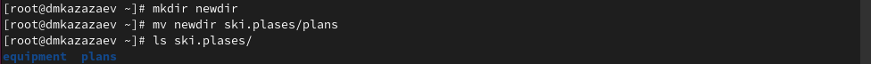{#fig:018 width=70%}

Создаю две директории и два файла. ([-@fig:019])

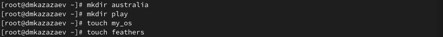{#fig:019 width=70%}

Проверяю права доступа. ([-@fig:020])

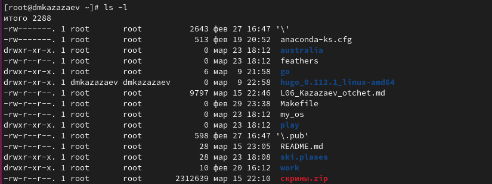{#fig:020 width=70%}

После всех изменений прав доступа, вывожу историю команд. ([-@fig:021])

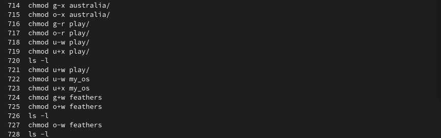{#fig:021 width=70%}

Смотрю содержимое файла. ([-@fig:022])

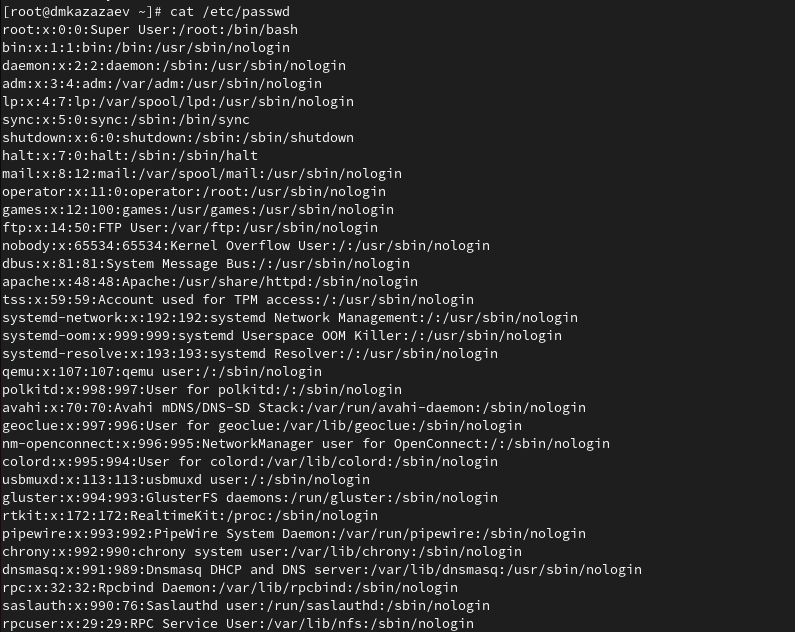{#fig:022 width=70%}

Копирую файл, меняя ему название. ([-@fig:023])

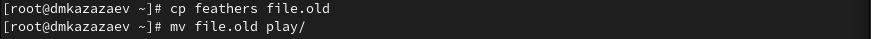{#fig:023 width=70%}

Копирую каталог. ([-@fig:024])

{#fig:024 width=70%}

Переношу каталог, меняя его название. ([-@fig:025])

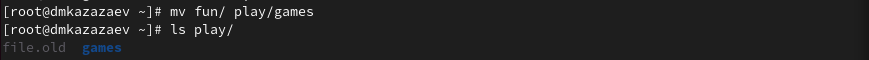{#fig:025 width=70%}

Удаляю права чтения для владельца. ([-@fig:026])

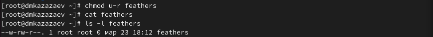{#fig:026 width=70%}

Возвращаю права чтения. ([-@fig:027])

{#fig:027 width=70%}

Удаляю для владельца права выполнения у каталога. ([-@fig:028])

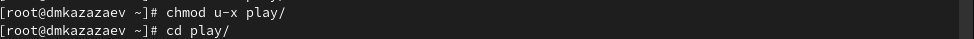{#fig:028 width=70%}

Возвращаю права выполнения. ([-@fig:029])

{#fig:029 width=70%}

# Выводы

В результате выполнения лабораторной работы я ознакомился с файловой системой Linux, её структурой, именами и содержанием каталогов. Приобрел практические навыки по применению команд для работы с файлами и каталогами, по управлению процессами (и работами), по проверке испольования диска и обслуживанию файловой системы.
