---
## Front matter
lang: ru-RU
title: Лабораторная работа № 8
subtitle: Операционные системы
author:
  - Казазаев Д. М.
institute:
  - Российский университет дружбы народов, Москва, Россия

## i18n babel
babel-lang: russian
babel-otherlangs: english

## Formatting pdf
toc: false
toc-title: Содержание
slide_level: 2
aspectratio: 169
section-titles: true
theme: metropolis
header-includes:
 - \metroset{progressbar=frametitle,sectionpage=progressbar,numbering=fraction}
 - '\makeatletter'
 - '\beamer@ignorenonframefalse'
 - '\makeatother'
---

# Информация

## Докладчик

:::::::::::::: {.columns align=center}
::: {.column width="70%"}

  * Казазаев Даниил Михайлович
  * Студент бакалавриата
  * Российский университет дружбы народов
  * [1132231427@rudn.ru]
  * <https://github.com/KazazaevDaniil/study_2023-2024_os-intro>

:::
::::::::::::::

# Вводная часть

## Цели и задачи

Ознакомление с инструментами поиска файлов и фильтрации текстовых данных.
Приобретение практических навыков: по управлению процессами (и заданиями), по
проверке использования диска и обслуживанию файловых систем.

## Задание

1. Выполнить список действий, описанный в лабораторной работе.

# Основная часть

## Выполнение лабораторной работы. Отчет по лабораторной работе № 8.

Записываю название файлов из каталога etc/ в файл file.txt командой ```sudo ls -lR /etc > file.txt```. (рис. 1).

{width=70%}

## Выполнение лабораторной работы. Отчет по лабораторной работе № 8.

Проверяю, перенеслись ли вайлы. (рис. 2).

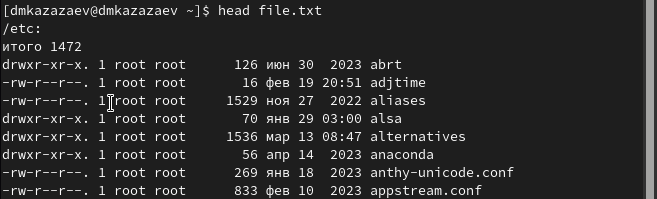{width=70%}

## Выполнение лабораторной работы. Отчет по лабораторной работе № 8.

Пере6ношу название файлов из домашнего каталога. (рис. 3).

{ width=100%}

## Выполнение лабораторной работы. Отчет по лабораторной работе № 8.

Вывожу название файлов, которые имеют расширение .conf командой ```grep .conf file.txt```. (рис. (рис. 4).

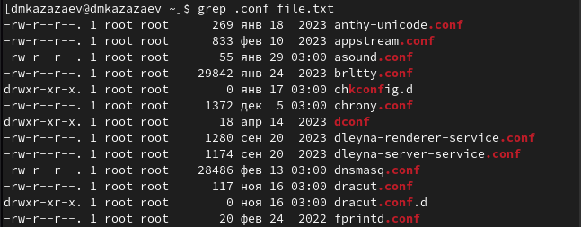{width=70%}

## Выполнение лабораторной работы. Отчет по лабораторной работе № 8.

Переношу названия файлов с расширением .conf в файл conf.txt командой ```grep .conf file.txt > file.txt```. (рис. 5).

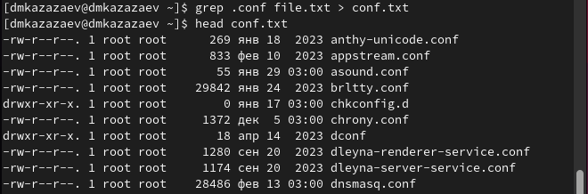{width=70%}

## Выполнение лабораторной работы. Отчет по лабораторной работе № 8.

Ищу файлы, название которых начинается с буквы с, командой ```find ~ -name "c*"```. (рис. 6, 7).

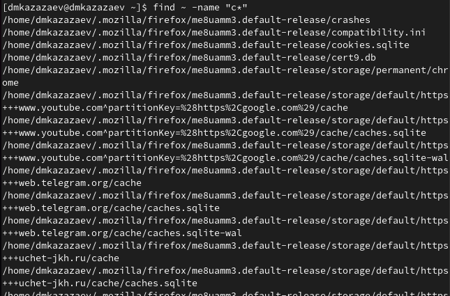{width=40%}

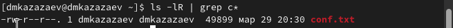{width=50%}

## Выполнение лабораторной работы. Отчет по лабораторной работе № 8.

Ищу файлы, название которых начинается с буквы h, командой ```sudo find /etc -name "h*"```. (рис. 8).

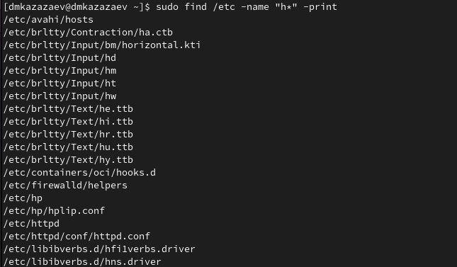{width=40%}

## Выполнение лабораторной работы. Отчет по лабораторной работе № 8.

Запускаю файл logfile в фоновом режиме и записываю в его, название которых начинается с log, командой ```find ~ -name "log*" -print > logfile &```. (рис. 9).

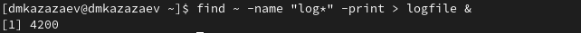{width=70%}

## Выполнение лабораторной работы. Отчет по лабораторной работе № 8.

Удаляю файл logfile. (рис. 10).

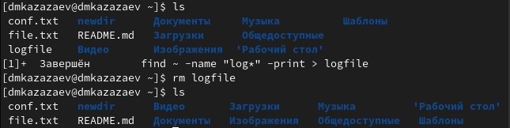{width=70%}

## Выполнение лабораторной работы. Отчет по лабораторной работе № 8.

Открываю текстовый редактор gedit в фоновом режиме. (рис. 11).

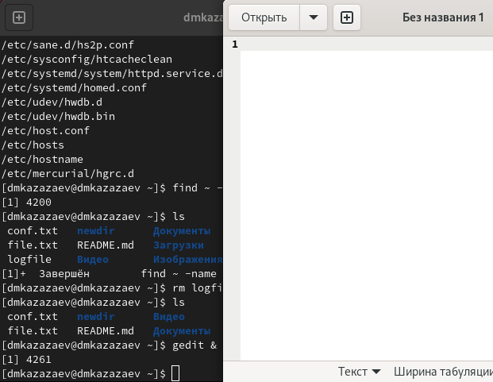{width=40%}

## Выполнение лабораторной работы. Отчет по лабораторной работе № 8.

Определяю идентификатор процесса gedit командой ```ps aux | grep gedit```. (рис. 12, 13).

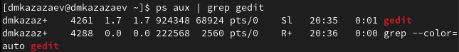{width=70%}

{width=70%}

## Выполнение лабораторной работы. Отчет по лабораторной работе № 8.

Читаю справку о команде kill. (рис. 14).

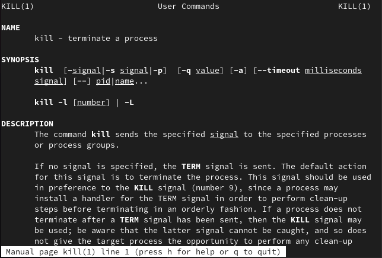{width=40%}

## Выполнение лабораторной работы. Отчет по лабораторной работе № 8.

Завершаю процесс программы командой gedit ```kill 4261```. (рис. 15).

{width=70%}

## Выполнение лабораторной работы. Отчет по лабораторной работе № 8.

Читаю справку о команде df. (рис. 16).

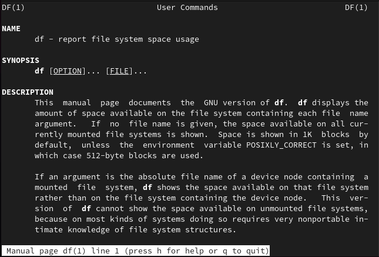{width=40%}

## Выполнение лабораторной работы. Отчет по лабораторной работе № 8.

Читаю справку о команде du. (рис. 17).

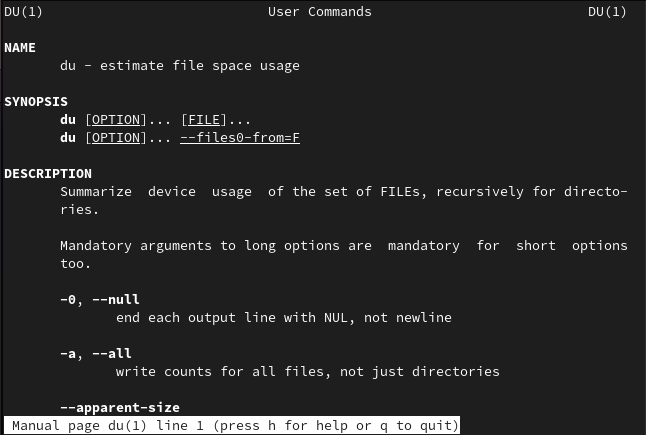{width=40%}

## Выполнение лабораторной работы. Отчет по лабораторной работе № 8.

Выполняю команду ```df```.(рис. 18).

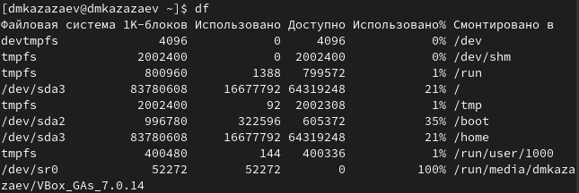{width=70%}

## Выполнение лабораторной работы. Отчет по лабораторной работе № 8.

Выполняю команду ```du```. (рис. 19).

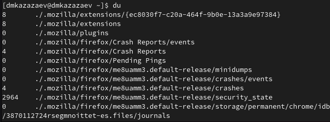{width=70%}

## Выполнение лабораторной работы. Отчет по лабораторной работе № 8.

Читаю справку о команде find. (рис. 20).

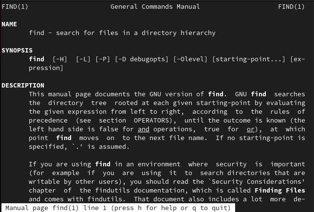{width=40%}

## Выполнение лабораторной работы. Отчет по лабораторной работе № 8.

Вывожу имена всех директорий из домажнего каталога командой ```find -type d```. (рис. 21).

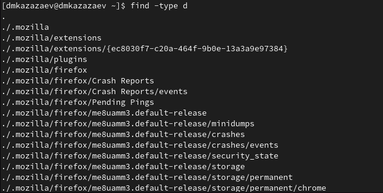{width=70%}

# Заключительная часть

## Результаты

- Приобретены практические навыки по управлению процессами (и заданиями), по
проверке использования диска и обслуживанию файловых систем.

## Вывод

В результате выполнения лабораторной работы я ознакомился с инструментами поиска файлов и фильтрации текстовых данных. Приобрел практические навыки: по управлению процессами (и заданиями), по проверке использования диска и обслуживанию файловых систем.
