---
## Front matter
title: "Отчёт по лабораторной работе №8"
subtitle: "Дисциплина: операционные системы"
author: "Казаазев Даниил Михайлович"

## Generic otions
lang: ru-RU
toc-title: "Содержание"

## Bibliography
bibliography: bib/cite.bib
csl: pandoc/csl/gost-r-7-0-5-2008-numeric.csl

## Pdf output format
toc: true # Table of contents
toc-depth: 2
lof: true # List of figures
lot: true # List of tables
fontsize: 12pt
linestretch: 1.5
papersize: a4
documentclass: scrreprt
## I18n polyglossia
polyglossia-lang:
  name: russian
  options:
	- spelling=modern
	- babelshorthands=true
polyglossia-otherlangs:
  name: english
## I18n babel
babel-lang: russian
babel-otherlangs: english
## Fonts
mainfont: PT Serif
romanfont: PT Serif
sansfont: PT Sans
monofont: PT Mono
mainfontoptions: Ligatures=TeX
romanfontoptions: Ligatures=TeX
sansfontoptions: Ligatures=TeX,Scale=MatchLowercase
monofontoptions: Scale=MatchLowercase,Scale=0.9
## Biblatex
biblatex: true
biblio-style: "gost-numeric"
biblatexoptions:
  - parentracker=true
  - backend=biber
  - hyperref=auto
  - language=auto
  - autolang=other*
  - citestyle=gost-numeric
## Pandoc-crossref LaTeX customization
figureTitle: "Рис."
tableTitle: "Таблица"
listingTitle: "Листинг"
lofTitle: "Список иллюстраций"
lotTitle: "Список таблиц"
lolTitle: "Листинги"
## Misc options
indent: true
header-includes:
  - \usepackage{indentfirst}
  - \usepackage{float} # keep figures where there are in the text
  - \floatplacement{figure}{H} # keep figures where there are in the text
---

# Цель работы

Ознакомление с инструментами поиска файлов и фильтрации текстовых данных.
Приобретение практических навыков: по управлению процессами (и заданиями), по
проверке использования диска и обслуживанию файловых систем.

# Задание

1. Выполнить список действий, описанный в лабораторной работе.

# Выполнение лабораторной работы

Записываю название файлов из каталога etc/ в файл file.txt командой ```sudo ls -lR /etc > file.txt```. (рис. [-@fig:001]).

{#fig:001 width=70%}

Проверяю, перенеслись ли вайлы. (рис. [-@fig:002])

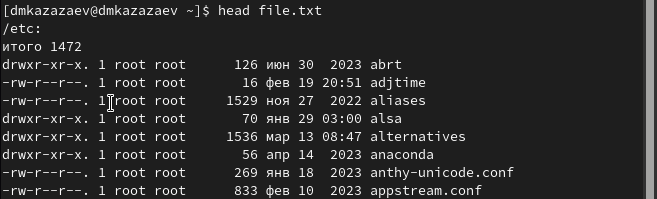{#fig:002 width=70%}

Пере6ношу название файлов из домашнего каталога. (рис. [-@fig:003])

{#fig:003 width=100%}

Вывожу название файлов, которые имеют расширение .conf командой ```grep .conf file.txt```. (рис. [-@fig:004])

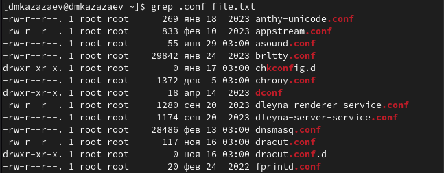{#fig:004 width=70%}

Переношу названия файлов с расширением .conf в файл conf.txt командой ```grep .conf file.txt > file.txt```. (рис. [-@fig:005])

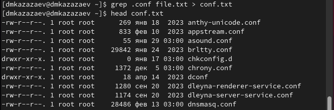{#fig:005 width=70%}

Ищу файлы, название которых начинается с буквы с, командой ```find ~ -name "c*"```. (рис. [-@fig:006])

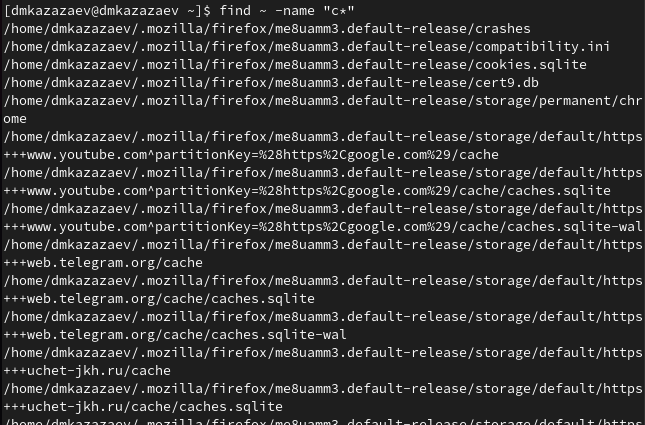{#fig:006 width=70%}

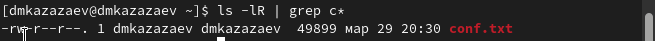{#fig:007 width=70%}

Ищу файлы, название которых начинается с буквы h, командой ```sudo find /etc -name "h*"```. (рис. [-@fig:008])

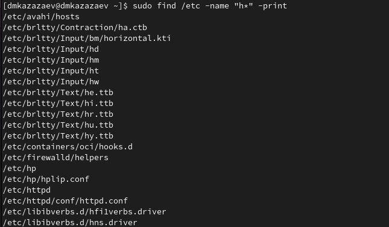{#fig:008 width=70%}

Запускаю файл logfile в фоновом режиме и записываю в его, название которых начинается с log, командой ```find ~ -name "log*" -print > logfile &```. (рис. [-@fig:009])

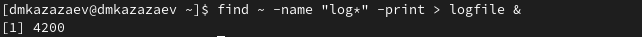{#fig:009 width=70%}

Удаляю файл logfile. (рис. [-@fig:010])

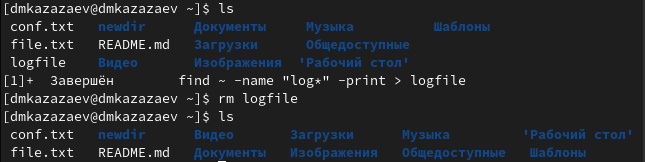{#fig:010 width=70%}

Открываю текстовый редактор gedit в фоновом режиме. (рис. [-@fig:011])

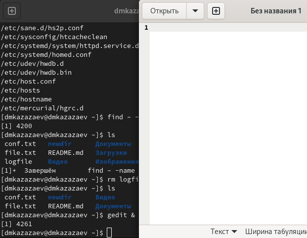{#fig:011 width=70%}

Определяю идентификатор процесса gedit командой ```ps aux | grep gedit```. (рис. [-@fig:012])

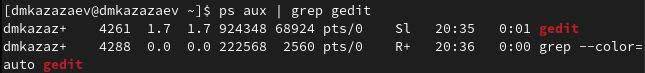{#fig:012 width=70%}

{#fig:013 width=70%}

Читаю справку о команде kill. (рис. [-@fig:014])

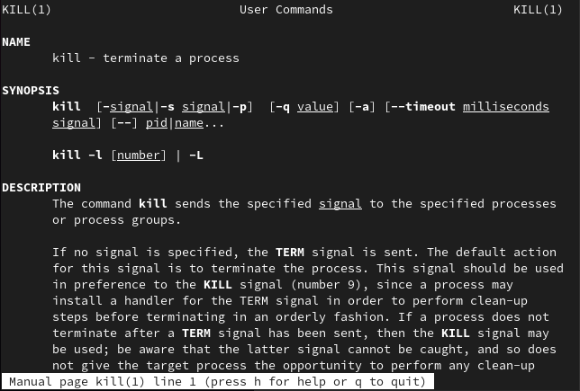{#fig:014 width=70%}

Завершаю процесс программы командой gedit ```kill 4261```. ([-@fig:015])

{#fig:015 width=70%}

Читаю справку о команде df. ([-@fig:016])

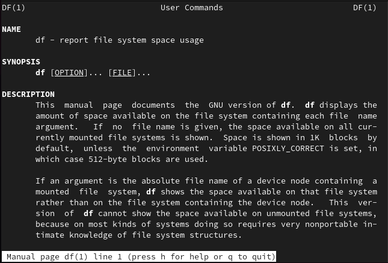{#fig:016 width=70%}

Читаю справку о команде du. ([-@fig:017])

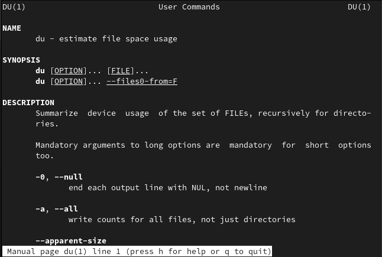{#fig:017 width=70%}

Выполняю команду ```df```.([-@fig:018])

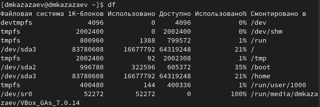{#fig:018 width=70%}

Выполняю команду ```du```. ([-@fig:019])

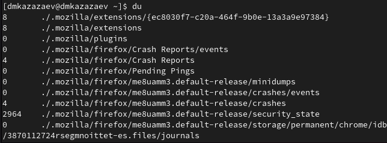{#fig:019 width=70%}

Читаю справку о команде find. ([-@fig:020])

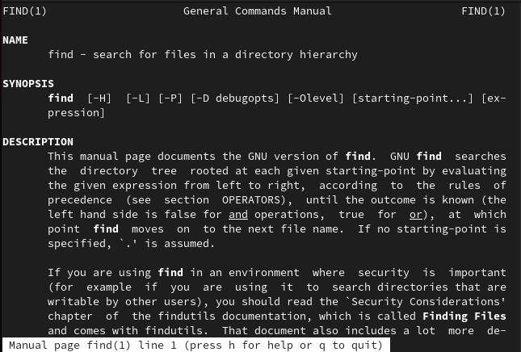{#fig:020 width=70%}

Вывожу имена всех директорий из домажнего каталога командой ```find -type d```. ([-@fig:021])

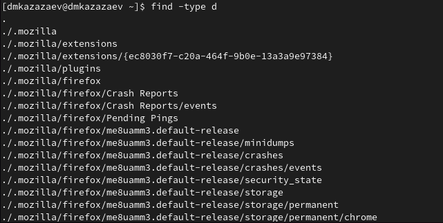{#fig:021 width=70%}

# Выводы

В результате выполнения лабораторной работы я ознакомился с инструментами поиска файлов и фильтрации текстовых данных. Приобрел практические навыки: по управлению процессами (и заданиями), по проверке использования диска и обслуживанию файловых систем.
