---
## Front matter
lang: ru-RU
title: Лабораторная работа № 9
subtitle: Операционные системы
author:
  - Казазаев Д. М.
institute:
  - Российский университет дружбы народов, Москва, Россия

## i18n babel
babel-lang: russian
babel-otherlangs: english

## Formatting pdf
toc: false
toc-title: Содержание
slide_level: 2
aspectratio: 169
section-titles: true
theme: metropolis
header-includes:
 - \metroset{progressbar=frametitle,sectionpage=progressbar,numbering=fraction}
 - '\makeatletter'
 - '\beamer@ignorenonframefalse'
 - '\makeatother'
---

# Информация

## Докладчик

:::::::::::::: {.columns align=center}
::: {.column width="70%"}

  * Казазаев Даниил Михайлович
  * Студент бакалавриата
  * Российский университет дружбы народов
  * [1132231427@rudn.ru]
  * <https://github.com/KazazaevDaniil/study_2023-2024_os-intro>

:::
::::::::::::::

# Вводная часть

## Цели и задачи

Овсоение основных возможностей командной оболочки Midnight Commander. Приобретение навыков практической работы по просмотру каталогов и файлов; манипулиции с ними.

## Задание

1. Выполнить список действий, описанный в лабораторной работе.

# Основная часть

## Выполнение лабораторной работы. Отчет по лабораторной работе № 9.

Изучаю информацию о mc с помощью команды mand mc. (рис. 1).

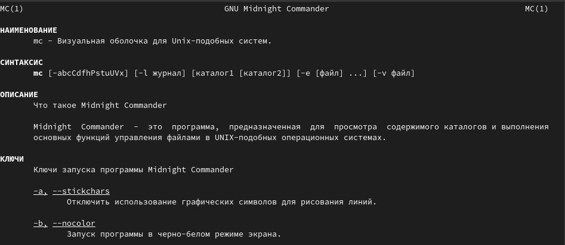{width=70%}

## Выполнение лабораторной работы. Отчет по лабораторной работе № 9.

Запускаю mc и начинаю изучать основные операции, начиная с копирования. (рис. 2).

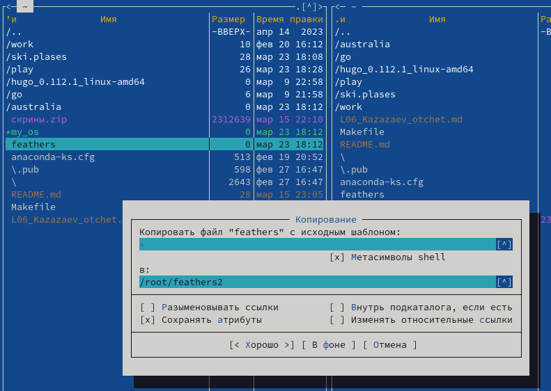{width=50%}

## Выполнение лабораторной работы. Отчет по лабораторной работе № 9.

Смотрю права доступа файла с помощью сочетания клавиш ctrl-x + o. (рис. 3).

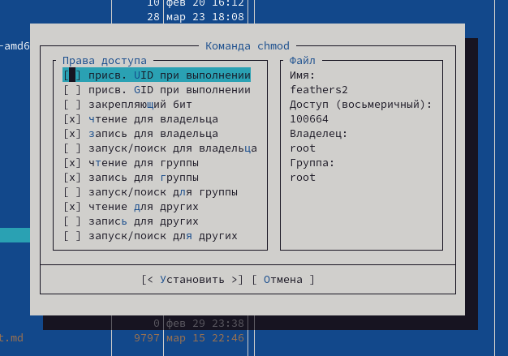{width=50%}

## Выполнение лабораторной работы. Отчет по лабораторной работе № 9.

Перемещаю файл, меняя его название. (рис. 4).

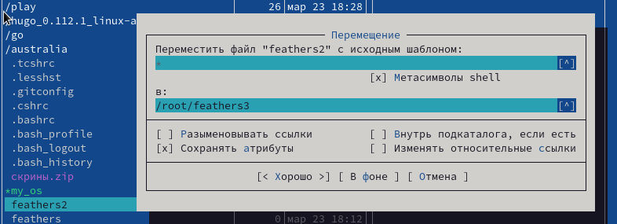{width=70%}

## Выполнение лабораторной работы. Отчет по лабораторной работе № 9.

Создаю новый каталог, называя его feathers4/ (рис. 5).

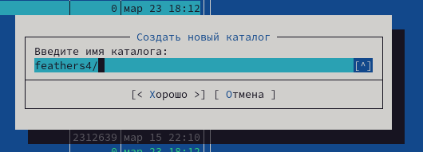{width=70%}

## Выполнение лабораторной работы. Отчет по лабораторной работе № 9.

Удаляю созданный каталог. (рис. 6).

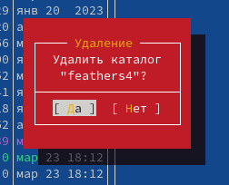{width=40%}

## Выполнение лабораторной работы. Отчет по лабораторной работе № 9.

В подменю "Файл" выбираю пункт просмотр, чтобы увидеть то, что находится в файле. (рис. 7)

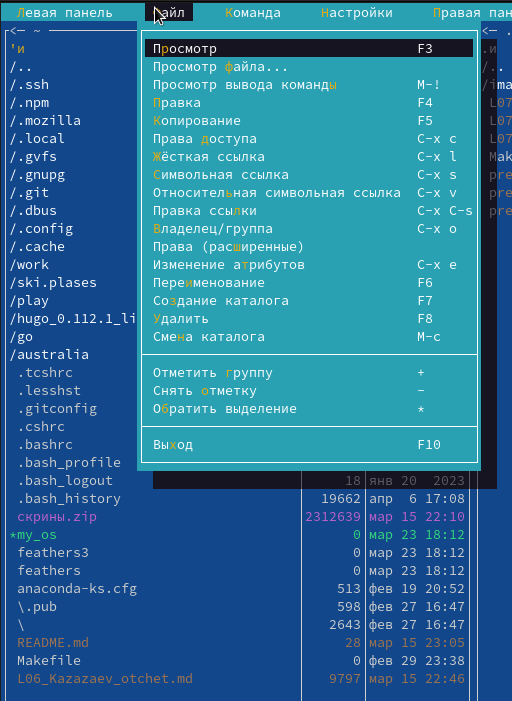{width=30%}

## Выполнение лабораторной работы. Отчет по лабораторной работе № 9.

Для просмотра я взял файл отчета по одной из прошлых лабораторных. (рис. 8).

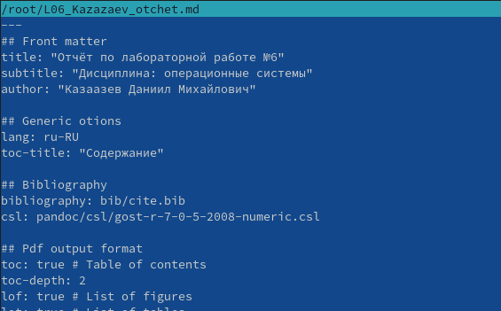{width=50%}

## Выполнение лабораторной работы. Отчет по лабораторной работе № 9.

В подменю "Файл" выбираю пункт правка, чтобы открыть файл в режиме редактирования. (рис. 9).

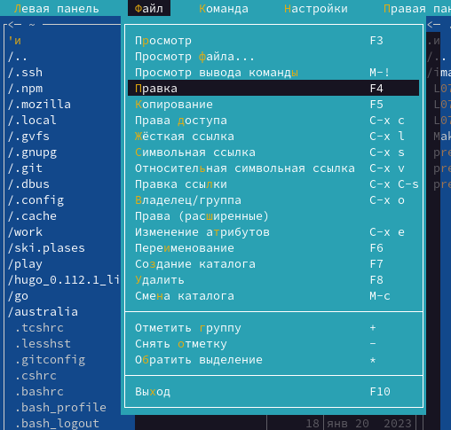{width=30%}

## Выполнение лабораторной работы. Отчет по лабораторной работе № 9.

Открываю тот же файл, но уже в режиме редактирования.

{width=50%}

## Выполнение лабораторной работы. Отчет по лабораторной работе № 9.

В подменю "Файл" выбираю пункт создание каталога. (рис. 10).

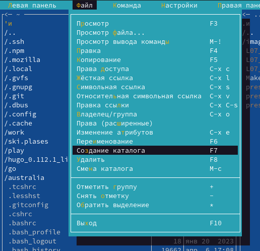{width=30%}

## Выполнение лабораторной работы. Отчет по лабораторной работе № 9.

Создаю каталог katalog/. (рис. 11).

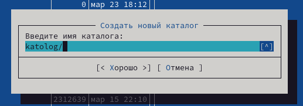{width=40%}

## Выполнение лабораторной работы. Отчет по лабораторной работе № 9.

В подменю "Команда" выбираю пункт поиск файлов. Чтобы найти файлы с расширением .cpp и словом main указываю соответсвующие фильры. (рис. 12)

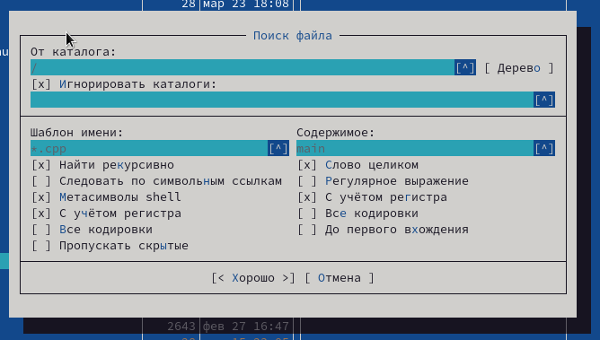{width=50%}

## Выполнение лабораторной работы. Отчет по лабораторной работе № 9.

В окне вывелся список файлов, которые соответсвуют фильтрам. (рис. 13)

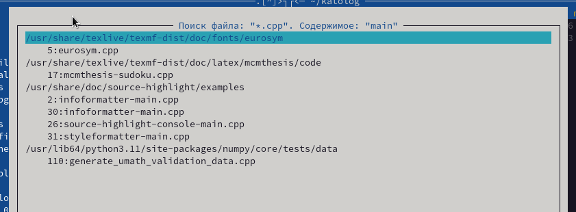{width=70%}

## Выполнение лабораторной работы. Отчет по лабораторной работе № 9.

В подменю "Команда" выбираю пункт дерево каталогов и перехожу в домашний каталог. (рис. 14).

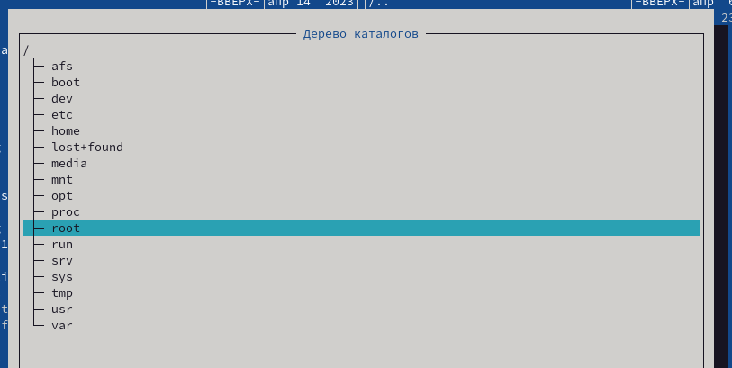{width=40%}

## Выполнение лабораторной работы. Отчет по лабораторной работе № 9.

Создаю текстовый фал для выполнения задания с текстовым редактором mc. (рис. 15).

{width=70%}

## Выполнение лабораторной работы. Отчет по лабораторной работе № 9.

Открываю файл в текстовом редакторе. (рис. 16).

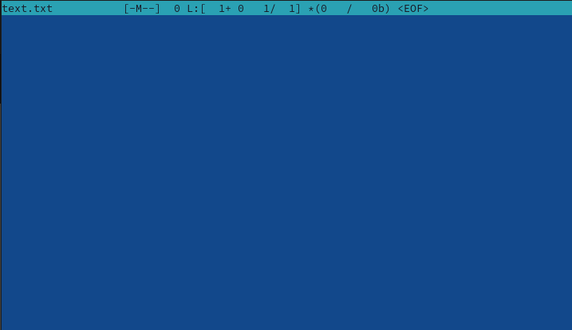{width=40%}

## Выполнение лабораторной работы. Отчет по лабораторной работе № 9.

Переношу в него текст стихотворения А. С. Пушкина, который понадобится при выполнении задания. (рис. 17).

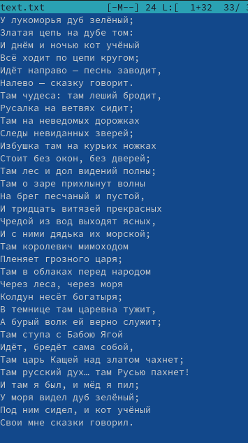{width=20%}

## Выполнение лабораторной работы. Отчет по лабораторной работе № 9.

Выделив часть текста, удаляю ее клавишей F8.(рис. 18).

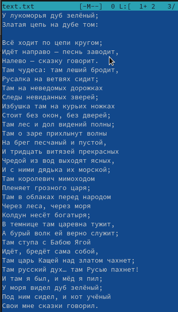{width=20%}

## Выполнение лабораторной работы. Отчет по лабораторной работе № 9.

Выделяю еще одну часть текста и копирую ее на другую строчку. (рис. 19).

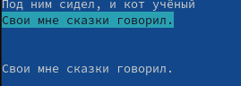{width=70%}

## Выполнение лабораторной работы. Отчет по лабораторной работе № 9.

Отменяю прошлое действие сочетанием клавиш ctrl + u. (рис. 20).

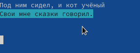{width=40%}

## Выполнение лабораторной работы. Отчет по лабораторной работе № 9.

Сохраняю текст. (рис. 21).

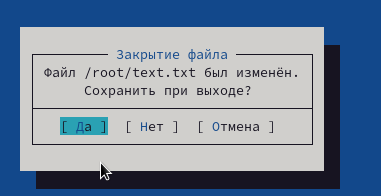{width=70%}

## Выполнение лабораторной работы. Отчет по лабораторной работе № 9.

Создаю файл с расширением .cpp для выполнения задания. (рис. 22)

{width=70%}

## Выполнение лабораторной работы. Отчет по лабораторной работе № 9.

Открываю его в текстовом редакторе. (рис. 23)

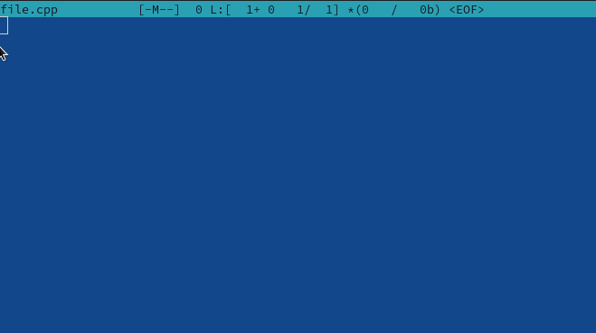{width=70%}

## Выполнение лабораторной работы. Отчет по лабораторной работе № 9.

Пишу небольшую программу для вывода культовой фразы. (рис. 24)

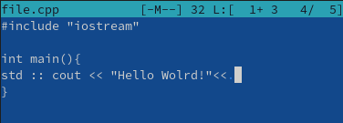{width=70%}

## Выполнение лабораторной работы. Отчет по лабораторной работе № 9.

Включаю подстветку синтаксиса сочетанием клавиш ctrl + s. (рис. 25)

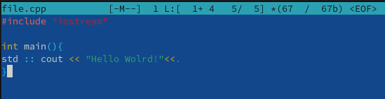{width=70%}

# Заключительная часть

## Результаты

- Освоены основные возможности командной оболочки Midnight Commander и приобретены навыки практической работы по просмотру каталогов и файлов; манипулиции с ними.

## Вывод

В результате выполнения лабораторной работы я освоил основные возможности командной оболочки Midnight Commander и приобрел навыки практической работы по просмотру каталогов и файлов; манипулиции с ними.
