---
## Front matter
title: "Отчёт по лабораторной работе №9"
subtitle: "Дисциплина: операционные системы"
author: "Казаазев Даниил Михайлович"

## Generic otions
lang: ru-RU
toc-title: "Содержание"

## Bibliography
bibliography: bib/cite.bib
csl: pandoc/csl/gost-r-7-0-5-2008-numeric.csl

## Pdf output format
toc: true # Table of contents
toc-depth: 2
lof: true # List of figures
lot: true # List of tables
fontsize: 12pt
linestretch: 1.5
papersize: a4
documentclass: scrreprt
## I18n polyglossia
polyglossia-lang:
  name: russian
  options:
	- spelling=modern
	- babelshorthands=true
polyglossia-otherlangs:
  name: english
## I18n babel
babel-lang: russian
babel-otherlangs: english
## Fonts
mainfont: PT Serif
romanfont: PT Serif
sansfont: PT Sans
monofont: PT Mono
mainfontoptions: Ligatures=TeX
romanfontoptions: Ligatures=TeX
sansfontoptions: Ligatures=TeX,Scale=MatchLowercase
monofontoptions: Scale=MatchLowercase,Scale=0.9
## Biblatex
biblatex: true
biblio-style: "gost-numeric"
biblatexoptions:
  - parentracker=true
  - backend=biber
  - hyperref=auto
  - language=auto
  - autolang=other*
  - citestyle=gost-numeric
## Pandoc-crossref LaTeX customization
figureTitle: "Рис."
tableTitle: "Таблица"
listingTitle: "Листинг"
lofTitle: "Список иллюстраций"
lotTitle: "Список таблиц"
lolTitle: "Листинги"
## Misc options
indent: true
header-includes:
  - \usepackage{indentfirst}
  - \usepackage{float} # keep figures where there are in the text
  - \floatplacement{figure}{H} # keep figures where there are in the text
---

# Цель работы

Ознакомление с инструментами поиска файлов и фильтрации текстовых данных.
Приобретение практических навыков: по управлению процессами (и заданиями), по
проверке использования диска и обслуживанию файловых систем.

# Задание

1. Выполнить список действий, описанный в лабораторной работе.

# Выполнение лабораторной работы

Изучаю информацию о mc с помощью команды mand mc. (рис. [-@fig:001]).

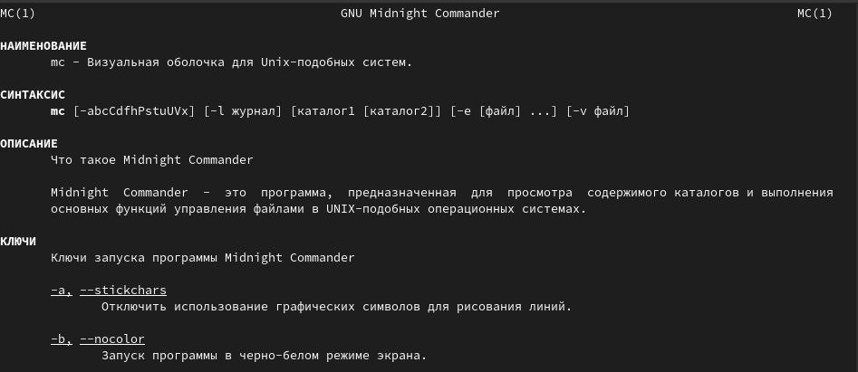{#fig:001 width=70%}

Запускаю mc и начинаю изучать основные операции, начиная с копирования. (рис. [-@fig:002]).

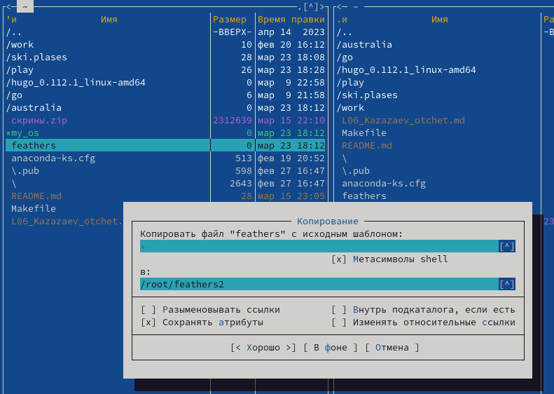{#fig:002 width=50%}

Смотрю права доступа файла с помощью сочетания клавиш ctrl-x + o. (рис. [-@fig:003]).

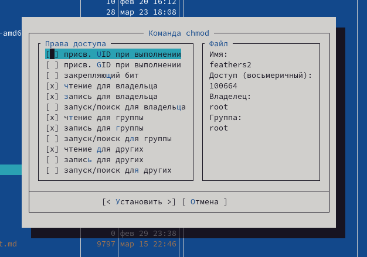{#fig:003 width=50%}

Перемещаю файл, меняя его название. (рис. [-@fig:004]).

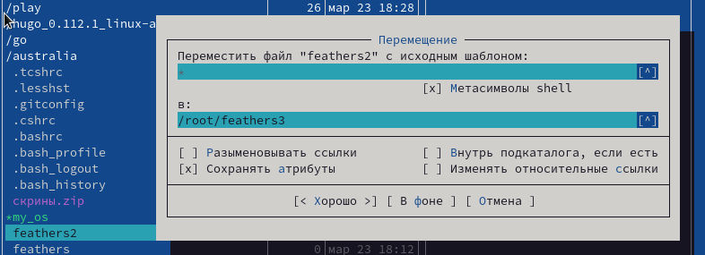{#fig:004 width=70%}

Создаю новый каталог, называя его feathers4/ (рис. [-@fig:005]).

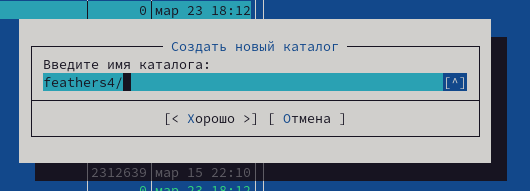{#fig:005 width=70%}

Удаляю созданный каталог. (рис. [-@fig:006]).

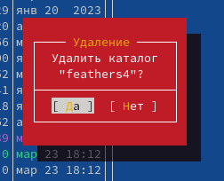{#fig:006 width=40%}

В подменю "Файл" выбираю пункт просмотр, чтобы увидеть то, что находится в файле. (рис. [-@fig:007]).

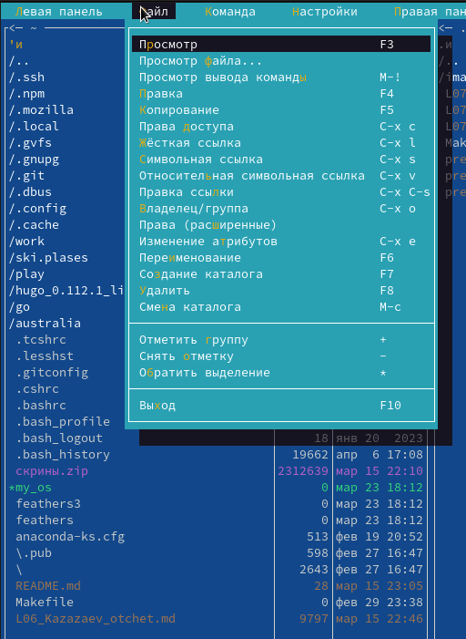{#fig:007 width=30%}

Для просмотра я взял файл отчета по одной из прошлых лабораторных. (рис. [-@fig:008]).

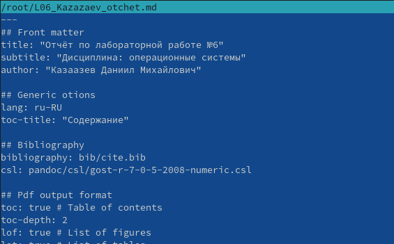{#fig:008 width=50%}

В подменю "Файл" выбираю пункт правка, чтобы открыть файл в режиме редактирования. (рис. [-@fig:009]).

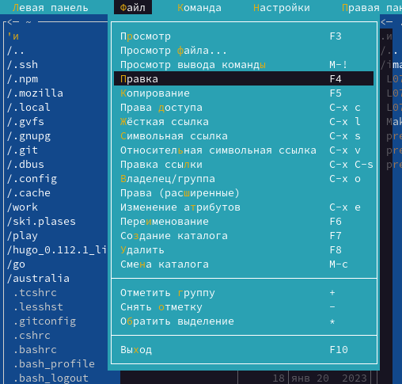{#fig:009 width=30%}

Открываю тот же файл, но уже в режиме редактирования.

В подменю "Файл" выбираю пункт создание каталога. (рис. [-@fig:010]).

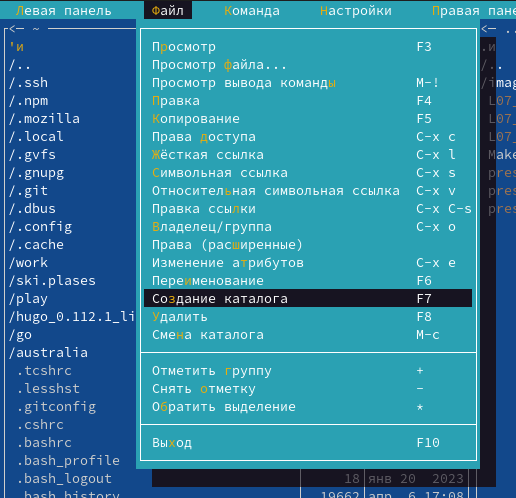{#fig:010 width=30%}

Создаю каталог katalog/. (рис. [-@fig:011]).

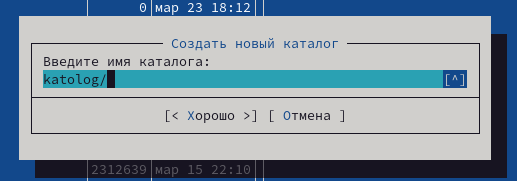{#fig:011 width=40%}

В подменю "Команда" выбираю пункт поиск файлов. Чтобы найти файлы с расширением .cpp и словом main указываю соответсвующие фильры. (рис. [-@fig:012])

{#fig:012 width=50%}

В окне вывелся список файлов, которые соответсвуют фильтрам. (рис. [-@fig:013])

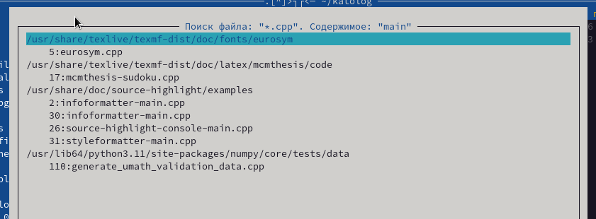{#fig:013 width=70%}

В подменю "Команда" выбираю пункт дерево каталогов и перехожу в домашний каталог. (рис. [-@fig:014]).

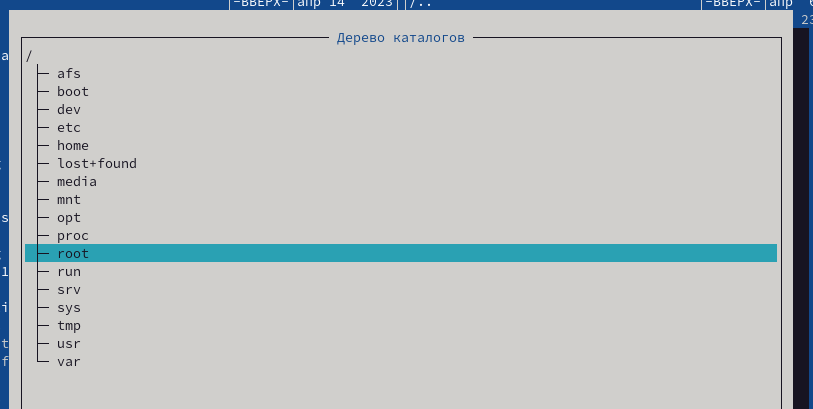{#fig:014 width=40%}

Создаю текстовый фал для выполнения задания с текстовым редактором mc. (рис. [-@fig:015]).

{#fig:015 width=70%}

Открываю файл в текстовом редакторе. (рис. [-@fig:016]).

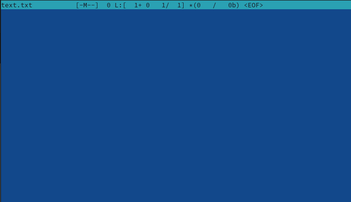{#fig:016 width=40%}

Переношу в него текст стихотворения А. С. Пушкина, который понадобится при выполнении задания. (рис. [-@fig:017]).

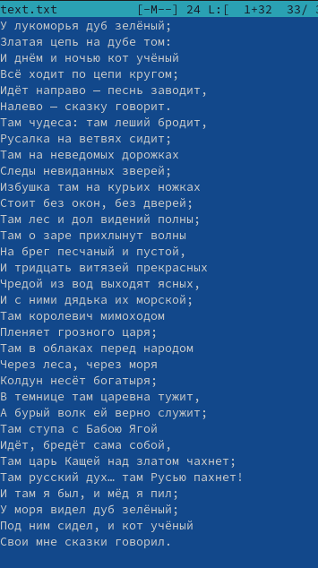{#fig:017 width=20%}

Выделив часть текста, удаляю ее клавишей F8. (рис. [-@fig:018]).

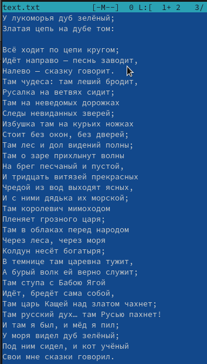{#fig:018 width=20%}

Выделяю еще одну часть текста и копирую ее на другую строчку. (рис. [-@fig:019]).

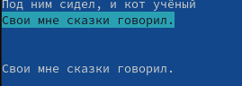{#fig:019 width=70%}

Отменяю прошлое действие сочетанием клавиш ctrl + u. (рис. [-@fig:020]).

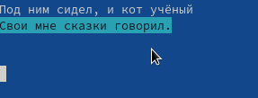{#fig:020 width=40%}

Сохраняю текст. (рис. [-@fig:021]).

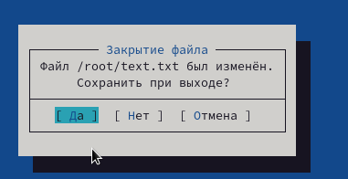{#fig:021 width=70%}

Создаю файл с расширением .cpp для выполнения задания. (рис. [-@fig:022])

{#fig:022 width=70%}

Открываю его в текстовом редакторе. (рис. [-@fig:023])

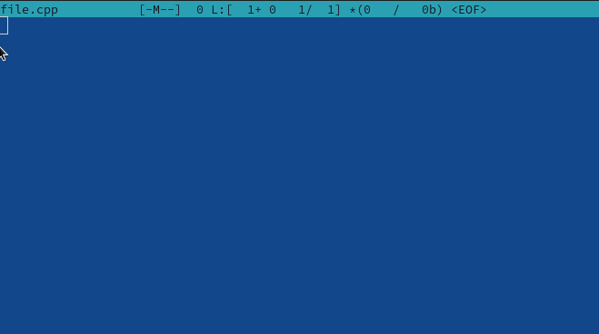{#fig:023 width=70%}

Пишу небольшую программу для вывода культовой фразы. (рис. [-@fig:024])

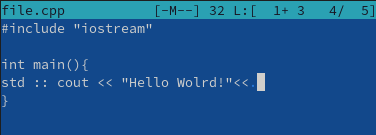{#fig:024 width=70%}

Включаю подстветку синтаксиса сочетанием клавиш ctrl + s. (рис. [-@fig:025])

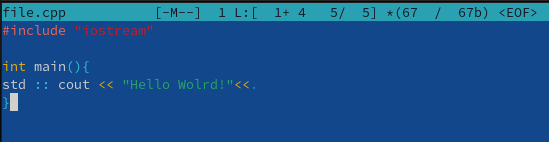{#fig:025 width=70%}

# Выводы

В результате выполнения лабораторной работы я освоил основные возможности командной оболочки Midnight Commander и приобрел навыки практической работы по просмотру каталогов и файлов; манипулиции с ними.
