---
## Front matter
lang: ru-RU
title: Лабораторная работа № 10
subtitle: Операционные системы
author:
  - Казазаев Д. М.
institute:
  - Российский университет дружбы народов, Москва, Россия

## i18n babel
babel-lang: russian
babel-otherlangs: english

## Formatting pdf
toc: false
toc-title: Содержание
slide_level: 2
aspectratio: 169
section-titles: true
theme: metropolis
header-includes:
 - \metroset{progressbar=frametitle,sectionpage=progressbar,numbering=fraction}
 - '\makeatletter'
 - '\beamer@ignorenonframefalse'
 - '\makeatother'
---

# Информация

## Докладчик

:::::::::::::: {.columns align=center}
::: {.column width="70%"}

  * Казазаев Даниил Михайлович
  * Студент бакалавриата
  * Российский университет дружбы народов
  * [1132231427@rudn.ru]
  * <https://github.com/KazazaevDaniil/study_2023-2024_os-intro>

:::
::::::::::::::

# Вводная часть

## Цели и задачи

Познакомится с операционной системой Linux. Получить практические навыки работы с редактором vi, установленным по умолчанию практически во всех дистрибутивах.

## Задание

1. Выполнить задание 1
2. Выполнить задание 2

# Основная часть

## Выполнение лабораторной работы. Отчет по лабораторной работе № 10.

### Задание 1

Создаю каталог, в котором буду выполнять задание, и перехожу в него. (рис. 1).

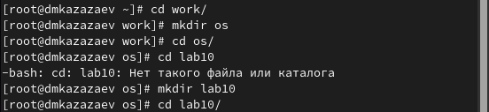{width=40%}

## Выполнение лабораторной работы. Отчет по лабораторной работе № 10.

Вызываю vi и создаю файл hello.sh. (рис. 2).

{width=40%}

## Выполнение лабораторной работы. Отчет по лабораторной работе № 10.

После запуска текстового редактора нажимаю i, чтобы войти в режим вставки, и переписываю листинг из лабораторной работы. (рис. 3).

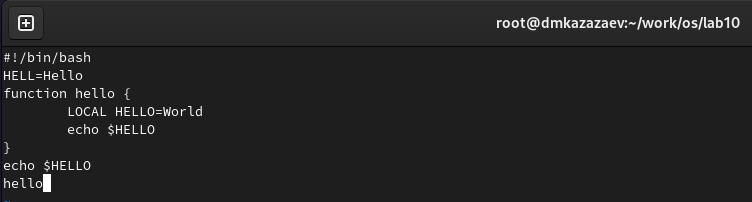{width=40%}

## Выполнение лабораторной работы. Отчет по лабораторной работе № 10.

После переноса нажимаю клавишу : и пишу wq, что значит "сохранить изменения и выйти". (рис. 4).

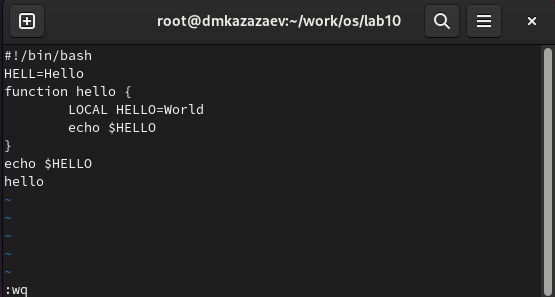{width=40%}

## Выполнение лабораторной работы. Отчет по лабораторной работе № 10.

Делаю файл исполняемым командой ```chmod +x hello.sh```. (рис. 5).

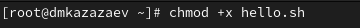{width=40%}

## Выполнение лабораторной работы. Отчет по лабораторной работе № 10.

### Задание 2

Еще раз открываю файл в режиме редактирования. (рис. 6).

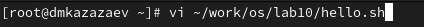{width=40%}

## Выполнение лабораторной работы. Отчет по лабораторной работе № 10.

Меняю слово HELL на HELLO. (рис. 7)

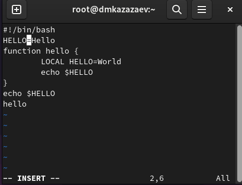{width=40%}

## Выполнение лабораторной работы. Отчет по лабораторной работе № 10.

Перехожу на 4-ю строку и удаляю слово LOCAL. (рис. 8).

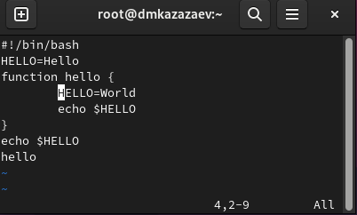{width=40%}

## Выполнение лабораторной работы. Отчет по лабораторной работе № 10.

Дописываю local на место удаленного слова. (рис. 9).

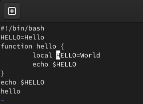{width=40%}

## Выполнение лабораторной работы. Отчет по лабораторной работе № 10.

Перехожу на последнюю строчку и в строку после нее дописываю $HELLO, жму esc, чтобы подтвердить изменения. (рис. 10).

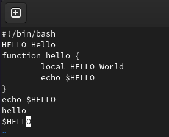{width=40%}

## Выполнение лабораторной работы. Отчет по лабораторной работе № 10.

Удаляю только что написанное $HELLO кнопками dw. (рис. 11).

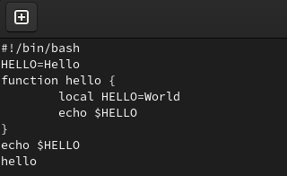{width=40%}

## Выполнение лабораторной работы. Отчет по лабораторной работе № 10.

Возвращаю $HELLO кнопкой u. (рис. 12)

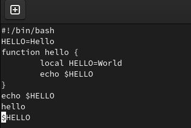{width=40%}

## Выполнение лабораторной работы. Отчет по лабораторной работе № 10.

Сохраняю изменения и выхожу. (рис. 13)

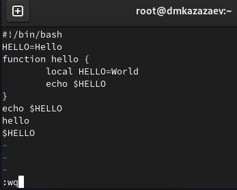{width=40%}

# Заключительная часть

## Результаты

- Получены практические навыки работы с редактором vi.

## Вывод
В результате выполнения лабораторной работы я чуть больше познакомился с операционной системой Linux и получил практические навыки работы с редактором vi.
