---
## Front matter
title: "Отчёт по лабораторной работе №10"
subtitle: "Дисциплина: операционные системы"
author: "Казаазев Даниил Михайлович"

## Generic otions
lang: ru-RU
toc-title: "Содержание"

## Bibliography
bibliography: bib/cite.bib
csl: pandoc/csl/gost-r-7-0-5-2008-numeric.csl

## Pdf output format
toc: true # Table of contents
toc-depth: 2
lof: true # List of figures
lot: true # List of tables
fontsize: 12pt
linestretch: 1.5
papersize: a4
documentclass: scrreprt
## I18n polyglossia
polyglossia-lang:
  name: russian
  options:
	- spelling=modern
	- babelshorthands=true
polyglossia-otherlangs:
  name: english
## I18n babel
babel-lang: russian
babel-otherlangs: english
## Fonts
mainfont: PT Serif
romanfont: PT Serif
sansfont: PT Sans
monofont: PT Mono
mainfontoptions: Ligatures=TeX
romanfontoptions: Ligatures=TeX
sansfontoptions: Ligatures=TeX,Scale=MatchLowercase
monofontoptions: Scale=MatchLowercase,Scale=0.9
## Biblatex
biblatex: true
biblio-style: "gost-numeric"
biblatexoptions:
  - parentracker=true
  - backend=biber
  - hyperref=auto
  - language=auto
  - autolang=other*
  - citestyle=gost-numeric
## Pandoc-crossref LaTeX customization
figureTitle: "Рис."
tableTitle: "Таблица"
listingTitle: "Листинг"
lofTitle: "Список иллюстраций"
lotTitle: "Список таблиц"
lolTitle: "Листинги"
## Misc options
indent: true
header-includes:
  - \usepackage{indentfirst}
  - \usepackage{float} # keep figures where there are in the text
  - \floatplacement{figure}{H} # keep figures where there are in the text
---

# Цель работы

Познакомится с операционной системой Linux. Получить практические навыки работы с редактором vi, установленным по умолчанию практически во всех дистрибутивах.

# Задание

1. Выполнить задание 1
2. Выполнить задание 2

# Выполнение лабораторной работы

## Задание 1

Создаю каталог, в котором буду выполнять задание, и перехожу в него. (рис. [-@fig:001]).

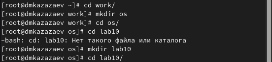{#fig:001 width=70%}

Вызываю vi и создаю файл hello.sh. (рис. [-@fig:002]).

{#fig:002 width=50%}

После запуска текстового редактора нажимаю ##i##, чтобы войти в режим вставки, и переписываю листинг из лабораторной работы. (рис. [-@fig:003]).

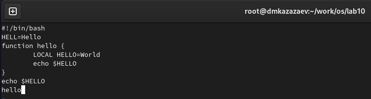{#fig:003 width=50%}

После переноса нажимаю клавишу : и пишу wq, что значит "сохранить изменения и выйти" . (рис. [-@fig:004]).

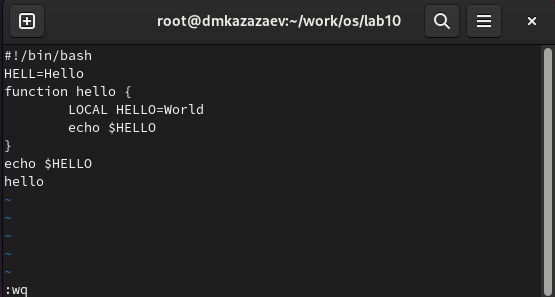{#fig:004 width=70%}

Делаю файл исполняемым командой ```chmod +x hello.sh``` (рис. [-@fig:005]).

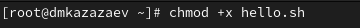{#fig:005 width=70%}

## Задание 2

Еще раз открываю файл в режиме редактирования. (рис. [-@fig:006]).

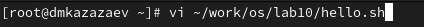{#fig:006 width=40%}

Меняю слово HELL на HELLO. (рис. [-@fig:007]).

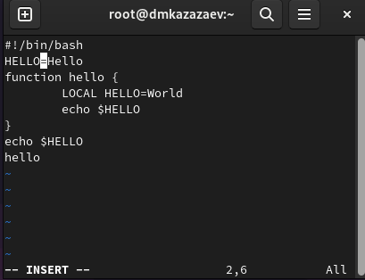{#fig:007 width=30%}

Перехожу на 4-ю строку и удаляю слово LOCAL. (рис. [-@fig:008]).

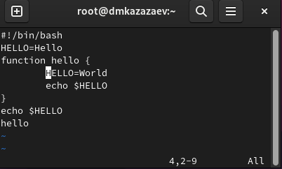{#fig:008 width=50%}

Дописываю local на место удаленного слова. (рис. [-@fig:009]).

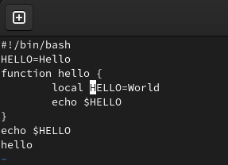{#fig:009 width=30%}

Перехожу на последнюю строчку и в строку после нее дописываю $HELLO, жму esc, чтобы подтвердить изменения. (рис. [-@fig:010]).

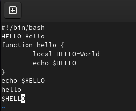{#fig:010 width=30%}

Удаляю только что написанное $HELLO кнопками dw. (рис. [-@fig:011]).

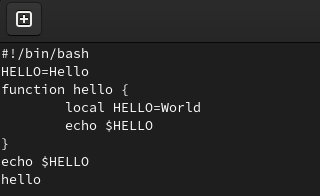{#fig:011 width=40%}

Возвращаю $HELLO кнопкой u. (рис. [-@fig:012])

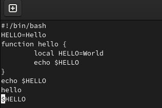{#fig:012 width=50%}

Сохраняю изменения и выхожу. (рис. [-@fig:013])

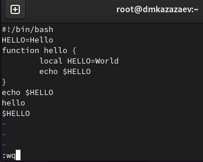{#fig:013 width=70%}

# Выводы

В результате выполнения лабораторной работы я чуть больше познакомился с операционной системой Linux и получил практические навыки работы с редактором vi.
