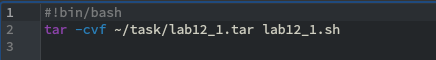
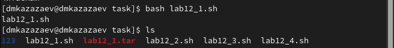
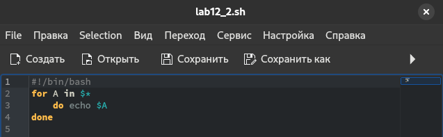
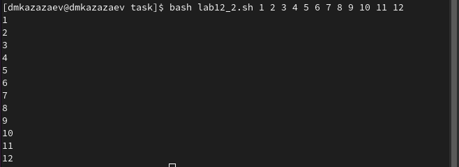
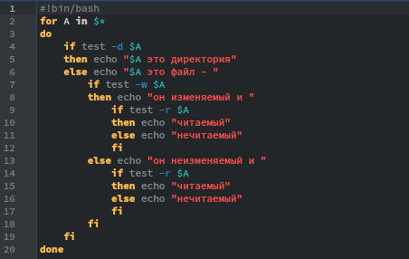
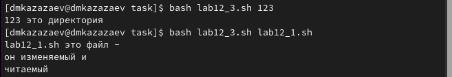
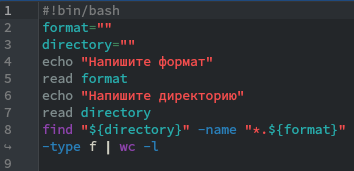
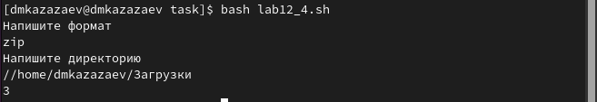

---
## Front matter
lang: ru-RU
title: Лабораторная работа № 12
subtitle: Операционные системы
author:
  - Казазаев Д. М.
institute:
  - Российский университет дружбы народов, Москва, Россия

## i18n babel
babel-lang: russian
babel-otherlangs: english

## Formatting pdf
toc: false
toc-title: Содержание
slide_level: 2
aspectratio: 169
section-titles: true
theme: metropolis
header-includes:
 - \metroset{progressbar=frametitle,sectionpage=progressbar,numbering=fraction}
 - '\makeatletter'
 - '\beamer@ignorenonframefalse'
 - '\makeatother'
---

# Информация

## Докладчик

:::::::::::::: {.columns align=center}
::: {.column width="70%"}

  * Казазаев Даниил Михайлович
  * Студент бакалавриата
  * Российский университет дружбы народов
  * [1132231427@rudn.ru]
  * <https://github.com/KazazaevDaniil/study_2023-2024_os-intro>

:::
::::::::::::::

# Вводная часть

## Цели и задачи

Изучить основы программирования в оболочке ОС UNIX/Linux. Научиться писать небольшие командные файлы.

## Задание

1. Выполнить задания лабораторной работы

# Основная часть

## Выполнение лабораторной работы. Отчет по лабораторной работе № 12.

### Задание 1

После создания фала lab12_1.sh пишу программу для создания архива из самого фала. (рис. 1).

{width=70%}

## Выполнение лабораторной работы. Отчет по лабораторной работе № 12.

Проверяю выполнение программы. (рис. 2).

{width=70%}

## Выполнение лабораторной работы. Отчет по лабораторной работе № 12.

Листинг первой программы:

```
#!bin/bash
tar -cvf ~/task/lab12_1.tar lab12_1.sh
```

## Выполнение лабораторной работы. Отчет по лабораторной работе № 12.

В другом фале пишу программу для вывода на экрн записи. Количесво выводимых файлов должно получится больше 10. (рис. 3).

{width=70%}

## Выполнение лабораторной работы. Отчет по лабораторной работе № 12.

Запускаю программу для проверки. (рис. 4).

{width=70%}

## Выполнение лабораторной работы. Отчет по лабораторной работе № 12.

Листинг второй программы:

```
#!/bin/bash
for A in $*
    do echo $A
done
```

## Выполнение лабораторной работы. Отчет по лабораторной работе № 12.

В третьей програме пишу код, который реализует коианду ls. (рис. 5).

{width=50%}

## Выполнение лабораторной работы. Отчет по лабораторной работе № 12.

Запускаю программу, чтобы проверить результат. (рис. 6).

{width=70%}

## Выполнение лабораторной работы. Отчет по лабораторной работе № 12.

Листинг третьей программы:

```
#!bin/bash
for A in $*
do
    if test -d $A
    then echo "$A это директория"
    else echo "$A это файл - "
        if test -w $A
        then echo "он изменяемый и "
            if test -r $A
```

## Выполнение лабораторной работы. Отчет по лабораторной работе № 12.

```
            then echo "читаемый"
            else echo "нечитаемый"
            fi
        else echo "он неизменяемый и "
            if test -r $A
            then echo "читаемый"
            else echo "нечитаемый"
            fi
        fi
    fi
done
```

## Выполнение лабораторной работы. Отчет по лабораторной работе № 12.

Для четвертого задания пишу код, чтобы искать количество файлов заданного формата в указанной директории. (рис. 7)

{width=70%}

## Выполнение лабораторной работы. Отчет по лабораторной работе № 12.

Запускаю парограмму и ищу в папке загрузок файлы с форматов zip. (рис. 8).

{width=70%}

## Выполнение лабораторной работы. Отчет по лабораторной работе № 12.

Листинг четвертой программы:

```
#!bin/bash
format=""
directory=""
echo "Напишите формат"
read format
echo "Напишите директорию"
read directory
find "${directory}" -name "*.${format}" -type f | wc -l
```

# Заключительная часть

## Результаты

- Получены практические программирования небольших командных файлов в оболочке ОС UNIX/Linux.

## Вывод
В результате выполнения лабораторной работы я изучил основы программирования в оболочке ОС UNIX/Linux. Научился писать небольшие командные файлы.
