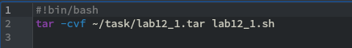
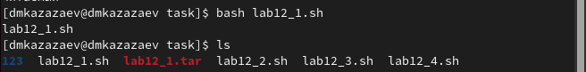
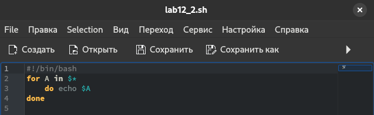
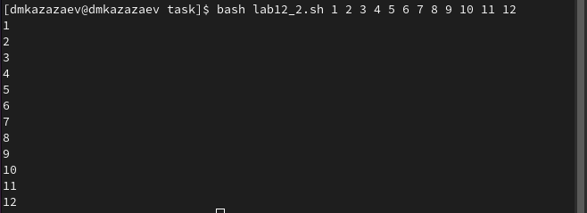
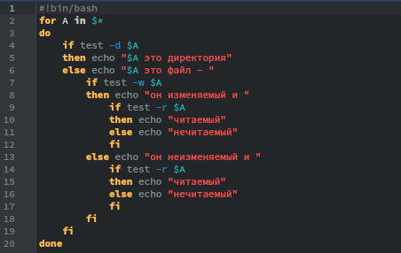
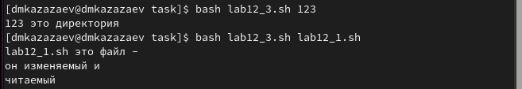
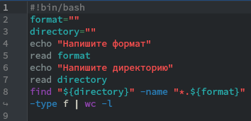
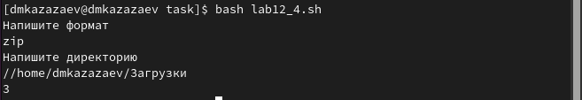

---
## Front matter
title: "Отчёт по лабораторной работе №12"
subtitle: "Дисциплина: операционные системы"
author: "Казаазев Даниил Михайлович"

## Generic otions
lang: ru-RU
toc-title: "Содержание"

## Bibliography
bibliography: bib/cite.bib
csl: pandoc/csl/gost-r-7-0-5-2008-numeric.csl

## Pdf output format
toc: true # Table of contents
toc-depth: 2
lof: true # List of figures
lot: true # List of tables
fontsize: 12pt
linestretch: 1.5
papersize: a4
documentclass: scrreprt
## I18n polyglossia
polyglossia-lang:
  name: russian
  options:
	- spelling=modern
	- babelshorthands=true
polyglossia-otherlangs:
  name: english
## I18n babel
babel-lang: russian
babel-otherlangs: english
## Fonts
mainfont: PT Serif
romanfont: PT Serif
sansfont: PT Sans
monofont: PT Mono
mainfontoptions: Ligatures=TeX
romanfontoptions: Ligatures=TeX
sansfontoptions: Ligatures=TeX,Scale=MatchLowercase
monofontoptions: Scale=MatchLowercase,Scale=0.9
## Biblatex
biblatex: true
biblio-style: "gost-numeric"
biblatexoptions:
  - parentracker=true
  - backend=biber
  - hyperref=auto
  - language=auto
  - autolang=other*
  - citestyle=gost-numeric
## Pandoc-crossref LaTeX customization
figureTitle: "Рис."
tableTitle: "Таблица"
listingTitle: "Листинг"
lofTitle: "Список иллюстраций"
lotTitle: "Список таблиц"
lolTitle: "Листинги"
## Misc options
indent: true
header-includes:
  - \usepackage{indentfirst}
  - \usepackage{float} # keep figures where there are in the text
  - \floatplacement{figure}{H} # keep figures where there are in the text
---

# Цель работы

Изучить основы программирования в оболочке ОС UNIX/Linux. Научиться писать небольшие командные файлы.

# Задание

1. Выполнить задания лабораторной работы

# Выполнение лабораторной работы

## Задание 1

После создания фала lab12_1.sh пишу программу для создания архива из самого фала. (рис. [-@fig:001]).

{#fig:001 width=70%}

Проверяю выполнение программы. (рис. [-@fig:002]).

{#fig:002 width=70%}

Листинг первой программы:

```
#!bin/bash
tar -cvf ~/task/lab12_1.tar lab12_1.sh
```

В другом фале пишу программу для вывода на экрн записи. Количесво выводимых файлов должно получится больше 10. (рис. [-@fig:003]).

{#fig:003 width=70%}

Запускаю программу для проверки. (рис. [-@fig:004]).

{#fig:004 width=70%}

Листинг второй программы:

```
#!/bin/bash
for A in $*
    do echo $A
done
```

В третьей програме пишу код, который реализует коианду ls. (рис. [-@fig:005]).

{#fig:005 width=70%}

Запускаю программу, чтобы проверить результат. (рис. [-@fig:006]).

{#fig:006 width=70%}

Листинг третьей программы:

```
#!bin/bash
for A in $*
do
    if test -d $A
    then echo "$A это директория"
    else echo "$A это файл - "
        if test -w $A
        then echo "он изменяемый и "
            if test -r $A
            then echo "читаемый"
            else echo "нечитаемый"
            fi
        else echo "он неизменяемый и "
            if test -r $A
            then echo "читаемый"
            else echo "нечитаемый"
            fi
        fi
    fi
done
```

Для четвертого задания пишу код, чтобы искать количество файлов заданного формата в указанной директории. (рис. [-@fig:007]).

{#fig:007 width=70%}

Запускаю парограмму и ищу в папке загрузок файлы с форматов zip. (рис. [-@fig:008]).

{#fig:008 width=70%}

Листинг четвертой программы:

```
#!bin/bash
format=""
directory=""
echo "Напишите формат"
read format
echo "Напишите директорию"
read directory
find "${directory}" -name "*.${format}" -type f | wc -l
```

# Выводы

В результате выполнения лабораторной работы я изучил основы программирования в оболочке ОС UNIX/Linux. Научился писать небольшие командные файлы.
