---
## Front matter
lang: ru-RU
title: Лабораторная работа № 13
subtitle: Операционные системы
author:
  - Казазаев Д. М.
institute:
  - Российский университет дружбы народов, Москва, Россия

## i18n babel
babel-lang: russian
babel-otherlangs: english

## Formatting pdf
toc: false
toc-title: Содержание
slide_level: 2
aspectratio: 169
section-titles: true
theme: metropolis
header-includes:
 - \metroset{progressbar=frametitle,sectionpage=progressbar,numbering=fraction}
 - '\makeatletter'
 - '\beamer@ignorenonframefalse'
 - '\makeatother'
---

# Информация

## Докладчик

:::::::::::::: {.columns align=center}
::: {.column width="70%"}

  * Казазаев Даниил Михайлович
  * Студент бакалавриата
  * Российский университет дружбы народов
  * [1132231427@rudn.ru]
  * <https://github.com/KazazaevDaniil/study_2023-2024_os-intro>

:::
::::::::::::::

# Вводная часть

## Цели и задачи

Изучить основы программирования в оболочке ОС UNIX, научиться писать более сложные командные файлы с использованием логических управляющих конструкций и циклов.

## Задание

1. Выполнить задания лабораторной работы

# Основная часть

## Выполнение лабораторной работы. Отчет по лабораторной работе № 13.

### Задание 1

Создаю каталог и файлы для заданий. (рис. 1)

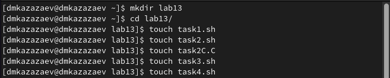{width=70%}

## Выполнение лабораторной работы. Отчет по лабораторной работе № 13.

оздаю еще два файла для первого задания и переношу в один из них текст. (рис. 2)

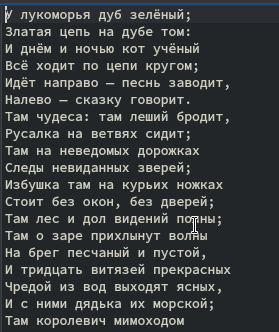{width=20%}

## Выполнение лабораторной работы. Отчет по лабораторной работе № 13.

После переноса текста перехожу в файл с расширением .sh и пишу программу, которая соответсвует заданию. (рис. 3)

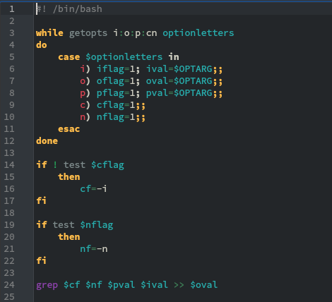{width=20%}

## Выполнение лабораторной работы. Отчет по лабораторной работе № 13.

Листинг первой программы:

```
#! /bin/bash

while getopts i:o:p:cn optionletters
do
    case $optionletters in
        i) iflag=1; ival=$OPTARG;;
        o) oflag=1; oval=$OPTARG;;
        p) pflag=1; pval=$OPTARG;;
        c) cflag=1;;
        n) nflag=1;;
    esac
done
```

## Выполнение лабораторной работы. Отчет по лабораторной работе № 13.

```
if ! test $cflag
    then
        cf=-i
fi

if test $nflag
    then
        nf=-n
fi

grep $cf $nf $pval $ival >> $oval
```

## Выполнение лабораторной работы. Отчет по лабораторной работе № 13.

После чего запускаю программу. (рис. 4)

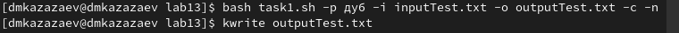{width=70%}

## Выполнение лабораторной работы. Отчет по лабораторной работе № 13.

Открываю второй фалй, чтобы проверить выполнение программы. (рис. 5)

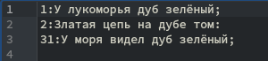{width=70%}

## Выполнение лабораторной работы. Отчет по лабораторной работе № 13.

### Задание 2

В файле с расширением .c пишу программу, которая сравнивает число с нулем. (рис. 6)

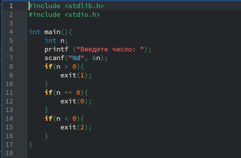{width=50%}

## Выполнение лабораторной работы. Отчет по лабораторной работе № 13.

Листинг программы на языке С:

```
#include <stdlib.h>
#include <stdio.h>

int main(){
    int n;
    printf ("Введите число: ");
    scanf("%d", &n);
    if(n > 0){
        exit(1);
    }
```
    
## Выполнение лабораторной работы. Отчет по лабораторной работе № 13.

```
    if(n == 0){
        exit(0);
    }
    if(n < 0){
        exit(2);
    }
}
```

## Выполнение лабораторной работы. Отчет по лабораторной работе № 13.

После чего перехожу в файл с расширением .sh и пишу программу, которая будет вызывать программу на языке С и, проанализировав с помощью $?, выводить на экран результат сравнения. (рис. 7)

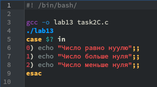{width=50%}

## Выполнение лабораторной работы. Отчет по лабораторной работе № 13.

Листинг программы на языке Bash:

```
#! /bin/bash/

gcc -o lab13 task2C.c
./lab13
case $? in
0) echo "Число равно нуулю";;
1) echo "Число больше нуля";;
2) echo "Число меньше нуля";;
esac
```

## Выполнение лабораторной работы. Отчет по лабораторной работе № 13.

Проверяю работу программы. (рис. 8)

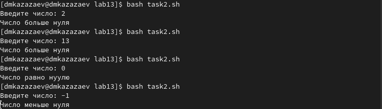{width=70%}

## Выполнение лабораторной работы. Отчет по лабораторной работе № 13.

### Задание 3

Перехожу в третий файл и пишу программу, которая будет создавать n-ное число временных файлов, а если они уже существуют, что удалять их. (рис. 9)

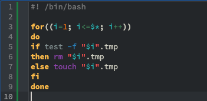{width=60%}

## Выполнение лабораторной работы. Отчет по лабораторной работе № 13.

Листинг тертьей программы:

```
#! /bin/bash

for((i=1; i<=$*; i++))
do
if test -f "$i".tmp
then rm "$i".tmp
else touch "$i".tmp
fi
done
```

## Выполнение лабораторной работы. Отчет по лабораторной работе № 13.

Запускаю парограмму и проверяю, создались ли файлы. (рис. 10)

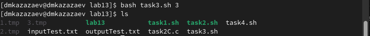{width=70%}

## Выполнение лабораторной работы. Отчет по лабораторной работе № 13.

Запускаю парограмму еще раз и проверяю, удалились ли файлы. (рис. 11)

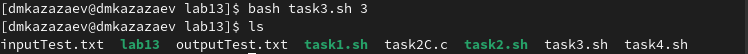{width=70%}

## Выполнение лабораторной работы. Отчет по лабораторной работе № 13.

### Задание 4

Перехожу в четвертый файл и пишу программу, которая будет архивировать файлы, которые были изменены менее недели назад. (рис. 12)

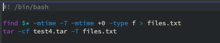{width=70%}

## Выполнение лабораторной работы. Отчет по лабораторной работе № 13.

Листинг четвертой программы:

```
#! /bin/bash

find $* -mtime -7 -mtime +0 -type f > files.txt
tar -cf test4.tar -T files.txt
```

## Выполнение лабораторной работы. Отчет по лабораторной работе № 13.

Запускаю программу и проверяю результат выполнения. (рис. 13)

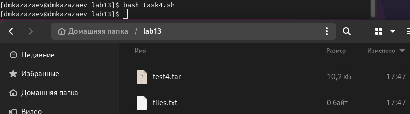{width=70%}

# Заключительная часть

## Результаты

- Получены практические программирования более сложных командных файлов с использованием логических управляющих конструкций и циклов.

## Вывод
В результате выполнения лабораторной работы я изучил основы программирования в оболочке ОС UNIX, научился писать более сложные командные файлы с использованием логических управляющих конструкций и циклов.
