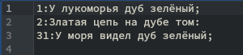

---
## Front matter
title: "Отчёт по лабораторной работе №13"
subtitle: "Дисциплина: операционные системы"
author: "Казаазев Даниил Михайлович"

## Generic otions
lang: ru-RU
toc-title: "Содержание"

## Bibliography
bibliography: bib/cite.bib
csl: pandoc/csl/gost-r-7-0-5-2008-numeric.csl

## Pdf output format
toc: true # Table of contents
toc-depth: 2
lof: true # List of figures
lot: true # List of tables
fontsize: 12pt
linestretch: 1.5
papersize: a4
documentclass: scrreprt
## I18n polyglossia
polyglossia-lang:
  name: russian
  options:
	- spelling=modern
	- babelshorthands=true
polyglossia-otherlangs:
  name: english
## I18n babel
babel-lang: russian
babel-otherlangs: english
## Fonts
mainfont: PT Serif
romanfont: PT Serif
sansfont: PT Sans
monofont: PT Mono
mainfontoptions: Ligatures=TeX
romanfontoptions: Ligatures=TeX
sansfontoptions: Ligatures=TeX,Scale=MatchLowercase
monofontoptions: Scale=MatchLowercase,Scale=0.9
## Biblatex
biblatex: true
biblio-style: "gost-numeric"
biblatexoptions:
  - parentracker=true
  - backend=biber
  - hyperref=auto
  - language=auto
  - autolang=other*
  - citestyle=gost-numeric
## Pandoc-crossref LaTeX customization
figureTitle: "Рис."
tableTitle: "Таблица"
listingTitle: "Листинг"
lofTitle: "Список иллюстраций"
lotTitle: "Список таблиц"
lolTitle: "Листинги"
## Misc options
indent: true
header-includes:
  - \usepackage{indentfirst}
  - \usepackage{float} # keep figures where there are in the text
  - \floatplacement{figure}{H} # keep figures where there are in the text
---

# Цель работы

Изучить основы программирования в оболочке ОС UNIX, научиться писать более сложные командные файлы с использованием логических управляющих конструкций и циклов.

# Задание

1. Выполнить задания лабораторной работы

# Выполнение лабораторной работы

Создаю каталог и файлы для заданий. (рис. [-@fig:001])

{#fig:001 width=70%}

## Задание 1

Создаю еще два файла для первого задания и переношу в один из них текст. (рис. [-@fig:002])

{#fig:002 width=70%}

После переноса текста перехожу в файл с расширением .sh и пишу программу, которая соответсвует заданию. (рис. [-@fig:003])

{#fig:003 width=70%}

Листинг первой программы:

```
#! /bin/bash

while getopts i:o:p:cn optionletters
do
    case $optionletters in
        i) iflag=1; ival=$OPTARG;;
        o) oflag=1; oval=$OPTARG;;
        p) pflag=1; pval=$OPTARG;;
        c) cflag=1;;
        n) nflag=1;;
    esac
done

if ! test $cflag
    then
        cf=-i
fi

if test $nflag
    then
        nf=-n
fi

grep $cf $nf $pval $ival >> $oval
```

После чего запускаю программу. (рис. [-@fig:004])

{#fig:004 width=70%}

Открываю второй фалй, чтобы проверить выполнение программы. (рис. [-@fig:005])

{#fig:005 width=70%}

# Задание 2

В файле с расширением .c пишу программу, которая сравнивает число с нулем. (рис. [-@fig:006])

{#fig:006 width=70%}

Листинг программы на языке С:

```
#include <stdlib.h>
#include <stdio.h>

int main(){
    int n;
    printf ("Введите число: ");
    scanf("%d", &n);
    if(n > 0){
        exit(1);
    }
    if(n == 0){
        exit(0);
    }
    if(n < 0){
        exit(2);
    }
}
```

После чего перехожу в файл с расширением .sh и пишу программу, которая будет вызывать программу на языке С и, проанализировав с помощью $?, выводить на экран результат сравнения. (рис. [-@fig:007])

{#fig:007 width=70%}

Листинг программы на языке Bash:

```
#! /bin/bash/

gcc -o lab13 task2C.c
./lab13
case $? in
0) echo "Число равно нуулю";;
1) echo "Число больше нуля";;
2) echo "Число меньше нуля";;
esac
```

Проверяю работу программы. (рис. [-@fig:008])

{#fig:008 width=70%}

# Задание 3

Перехожу в третий файл и пишу программу, которая будет создавать n-ное число временных файлов, а если они уже существуют, что удалять их. (рис. [-@fig:009])

{#fig:009 width=70%}

Листинг тертьей программы:

```
#! /bin/bash

for((i=1; i<=$*; i++))
do
if test -f "$i".tmp
then rm "$i".tmp
else touch "$i".tmp
fi
done
```

Запускаю парограмму и проверяю, создались ли файлы. (рис. [-@fig:010])

{#fig:010 width=70%}

Запускаю парограмму еще раз и проверяю, удалились ли файлы. (рис. [-@fig:011])

{#fig:011 width=70%}

# Задание 4

Перехожу в четвертый файл и пишу программу, которая будет архивировать файлы, которые были изменены менее недели назад. (рис. [-@fig:012])

{#fig:012 width=70%}

Листинг четвертой программы:

```
#! /bin/bash

find $* -mtime -7 -mtime +0 -type f > files.txt
tar -cf test4.tar -T files.txt
```

Запускаю программу и проверяю результат выполнения. (рис. [-@fig:013])

{#fig:013 width=70%}

# Выводы

В результате выполнения лабораторной работы я изучил основы программирования в оболочке ОС UNIX, научился писать более сложные командные файлы с использованием логических управляющих конструкций и циклов.
