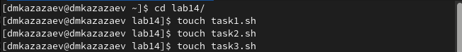
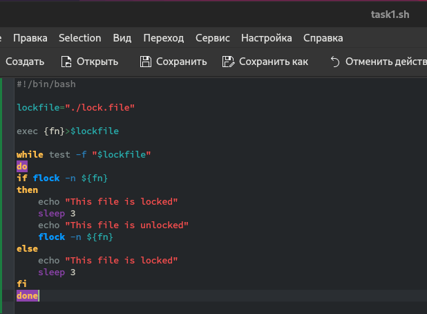
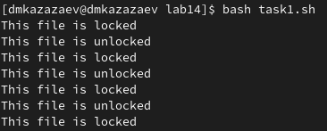
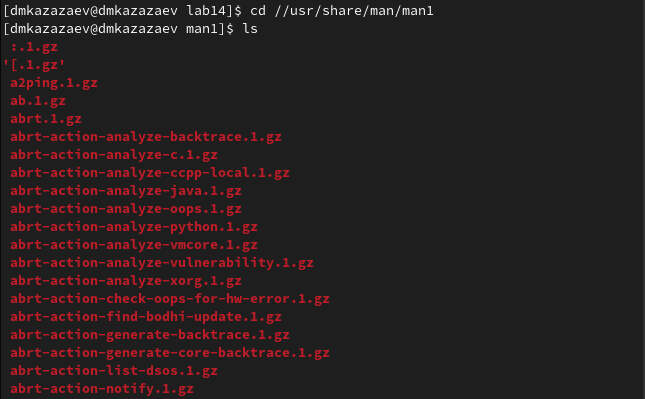
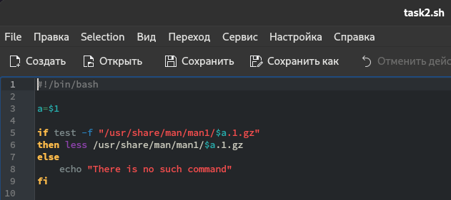
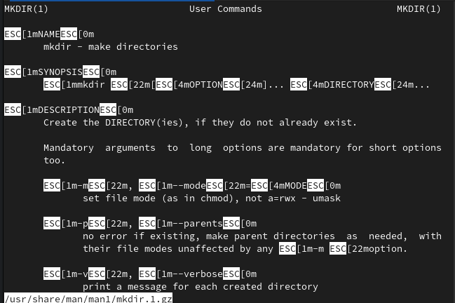
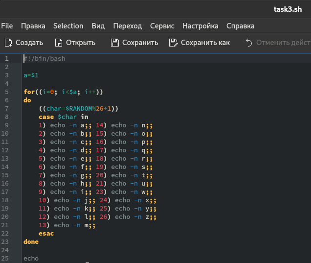
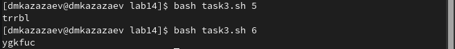

---
## Front matter
lang: ru-RU
title: Лабораторная работа № 14
subtitle: Операционные системы
author:
  - Казазаев Д. М.
institute:
  - Российский университет дружбы народов, Москва, Россия

## i18n babel
babel-lang: russian
babel-otherlangs: english

## Formatting pdf
toc: false
toc-title: Содержание
slide_level: 2
aspectratio: 169
section-titles: true
theme: metropolis
header-includes:
 - \metroset{progressbar=frametitle,sectionpage=progressbar,numbering=fraction}
 - '\makeatletter'
 - '\beamer@ignorenonframefalse'
 - '\makeatother'
---

# Информация

## Докладчик

:::::::::::::: {.columns align=center}
::: {.column width="70%"}

  * Казазаев Даниил Михайлович
  * Студент бакалавриата
  * Российский университет дружбы народов
  * [1132231427@rudn.ru]
  * <https://github.com/KazazaevDaniil/study_2023-2024_os-intro>

:::
::::::::::::::

# Вводная часть

## Цели и задачи

Изучить основы программирования в оболочке ОС UNIX, научиться писать более сложные командные файлы с использованием логических управляющих конструкций и циклов.

## Задание

1. Выполнить задания лабораторной работы

# Основная часть

## Выполнение лабораторной работы. Отчет по лабораторной работе № 14.

### Задание 1

Создаю файлы для заданий. (рис. 1)

{width=70%}

## Выполнение лабораторной работы. Отчет по лабораторной работе № 14.

Пишу программу, которая реализует упрощенный механизм семафоров. (рис. 2)

{width=40%}

## Выполнение лабораторной работы. Отчет по лабораторной работе № 14.

После нкаписания кода сохраняю файл и запускаю его. (рис. 3)

{width=70%}

## Выполнение лабораторной работы. Отчет по лабораторной работе № 14.

Листинг первой программы:

```
#!/bin/bash

lockfile="./lock.file"

exec {fn}>$lockfile

while test -f "$lockfile"
do
if flock -n ${fn}
then
    echo "This file is locked"
    sleep 3
```

## Выполнение лабораторной работы. Отчет по лабораторной работе № 14.

```
    echo "This file is unlocked"
    flock -n ${fn}
else
    echo "This file is locked"
    sleep 3
fi
done
```

## Выполнение лабораторной работы. Отчет по лабораторной работе № 14.

### Задание 2

Перехожу в каталог /usr/share/man/man1, чтобы изучить архивы для успешного выполнения задания. (рис. 4)

{width=50%}

## Выполнение лабораторной работы. Отчет по лабораторной работе № 14.

Открываю второй фалй и начинаю писать код, который реализует команду man. (рис. 5)

{width=70%}

## Выполнение лабораторной работы. Отчет по лабораторной работе № 14.

Сохраняю файл и запускаю его и смотрю справку к команде mkdir. (рис. 6)

{width=50%}

## Выполнение лабораторной работы. Отчет по лабораторной работе № 14.

Листинг второй программы:

```
#!/bin/bash

a=$1

if test -f "/usr/share/man/man1/$a.1.gz"
then less /usr/share/man/man1/$a.1.gz
else
    echo "There is no such command"
fi
```

## Выполнение лабораторной работы. Отчет по лабораторной работе № 14.

### Задание 3

Открываю последний файл и пишу код, коотрый будет выводить в консоль случайную последовательность латинский букв. (рис. 7)

{width=30%}

## Выполнение лабораторной работы. Отчет по лабораторной работе № 14.

Проверяю работу программы. (рис. 8)

{width=70%}

## Выполнение лабораторной работы. Отчет по лабораторной работе № 14.

Листинг тертьей программы:

```
#!/bin/bash

a=$1

for((i=0; i<$a; i++))
do
    ((char=$RANDOM%26+1))
    case $char in
    1) echo -n a;; 14) echo -n n;;
    2) echo -n b;; 15) echo -n o;;
    3) echo -n c;; 16) echo -n p;;
    4) echo -n d;; 17) echo -n q;;
    5) echo -n e;; 18) echo -n r;;
    6) echo -n f;; 19) echo -n s;;
    7) echo -n g;; 20) echo -n t;;
```

## Выполнение лабораторной работы. Отчет по лабораторной работе № 14.

``` 
    8) echo -n h;; 21) echo -n u;;
    9) echo -n i;; 23) echo -n w;;
    10) echo -n j;; 24) echo -n x;;
    11) echo -n k;; 25) echo -n y;;
    12) echo -n l;; 26) echo -n z;;
    13) echo -n m;;
    esac
done

echo
```

# Заключительная часть

## Результаты

- Получены практические программирования более сложных командных файлов с использованием логических управляющих конструкций и циклов.

## Вывод
В результате выполнения лабораторной работы я изучил основы программирования в оболочке ОС UNIX, научился писать более сложные командные файлы с использованием логических управляющих конструкций и циклов.
