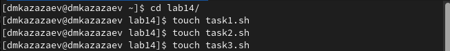
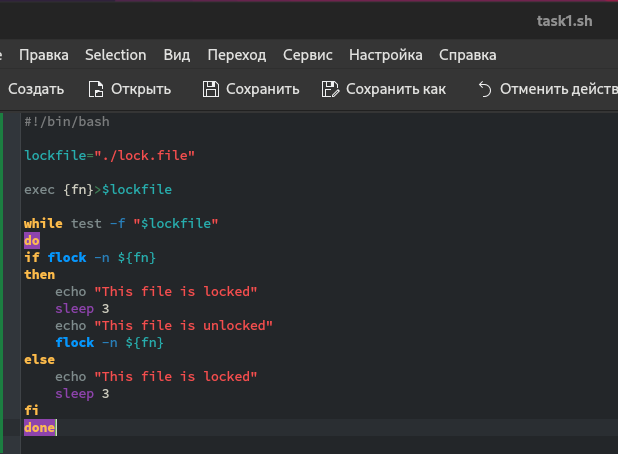
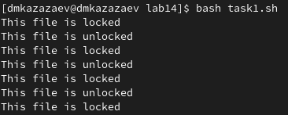
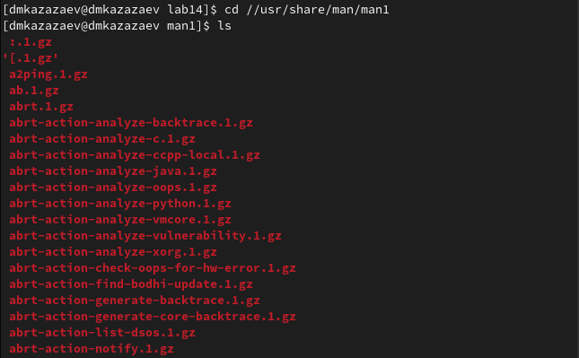
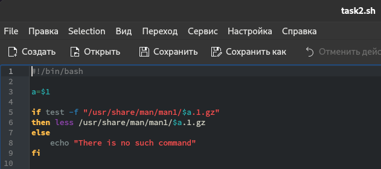
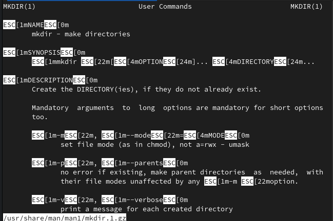
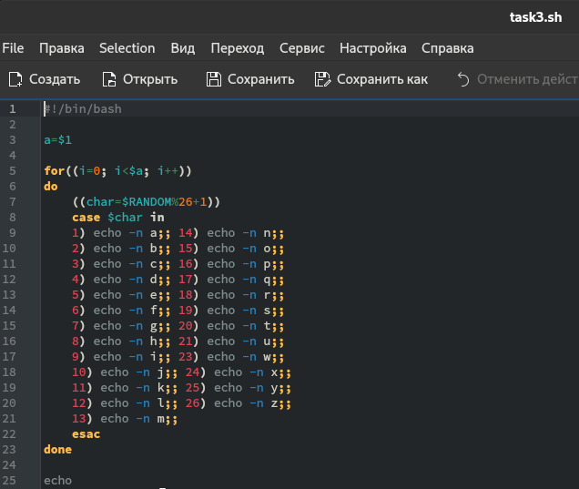
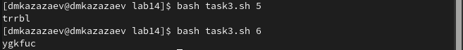

---
## Front matter
title: "Отчёт по лабораторной работе №14"
subtitle: "Дисциплина: операционные системы"
author: "Казаазев Даниил Михайлович"

## Generic otions
lang: ru-RU
toc-title: "Содержание"

## Bibliography
bibliography: bib/cite.bib
csl: pandoc/csl/gost-r-7-0-5-2008-numeric.csl

## Pdf output format
toc: true # Table of contents
toc-depth: 2
lof: true # List of figures
lot: true # List of tables
fontsize: 12pt
linestretch: 1.5
papersize: a4
documentclass: scrreprt
## I18n polyglossia
polyglossia-lang:
  name: russian
  options:
	- spelling=modern
	- babelshorthands=true
polyglossia-otherlangs:
  name: english
## I18n babel
babel-lang: russian
babel-otherlangs: english
## Fonts
mainfont: PT Serif
romanfont: PT Serif
sansfont: PT Sans
monofont: PT Mono
mainfontoptions: Ligatures=TeX
romanfontoptions: Ligatures=TeX
sansfontoptions: Ligatures=TeX,Scale=MatchLowercase
monofontoptions: Scale=MatchLowercase,Scale=0.9
## Biblatex
biblatex: true
biblio-style: "gost-numeric"
biblatexoptions:
  - parentracker=true
  - backend=biber
  - hyperref=auto
  - language=auto
  - autolang=other*
  - citestyle=gost-numeric
## Pandoc-crossref LaTeX customization
figureTitle: "Рис."
tableTitle: "Таблица"
listingTitle: "Листинг"
lofTitle: "Список иллюстраций"
lotTitle: "Список таблиц"
lolTitle: "Листинги"
## Misc options
indent: true
header-includes:
  - \usepackage{indentfirst}
  - \usepackage{float} # keep figures where there are in the text
  - \floatplacement{figure}{H} # keep figures where there are in the text
---

# Цель работы

Изучить основы программирования в оболочке ОС UNIX, научиться писать более сложные командные файлы с использованием логических управляющих конструкций и циклов.

# Задание

1. Выполнить задания лабораторной работы

# Выполнение лабораторной работы

Создаю файлы для заданий. (рис. [-@fig:001])

{#fig:001 width=70%}

## Задание 1

Пишу программу, которая реализует упрощенный механизм семафоров. (рис. [-@fig:002])

{#fig:002 width=70%}

После нкаписания кода сохраняю файл и запускаю его. (рис. [-@fig:003])

{#fig:003 width=70%}

Листинг первой программы:

```
#!/bin/bash

lockfile="./lock.file"

exec {fn}>$lockfile

while test -f "$lockfile"
do
if flock -n ${fn}
then
    echo "This file is locked"
    sleep 3
    echo "This file is unlocked"
    flock -n ${fn}
else
    echo "This file is locked"
    sleep 3
fi
done
```

# Задание 2

Перехожу в каталог /usr/share/man/man1, чтобы изучить архивы для успешного выполнения задания. (рис. [-@fig:004])

{#fig:004 width=70%}

Открываю второй фалй и начинаю писать код, который реализует команду man. (рис. [-@fig:005])

{#fig:005 width=70%}

Сохраняю файл и запускаю его и смотрю справку к команде mkdir. (рис. [-@fig:006])

{#fig:006 width=70%}

Листинг второй программы:

```
#!/bin/bash

a=$1

if test -f "/usr/share/man/man1/$a.1.gz"
then less /usr/share/man/man1/$a.1.gz
else
    echo "There is no such command"
fi
```

# Задание 3

Открываю последний файл и пишу код, коотрый будет выводить в консоль случайную последовательность латинский букв. (рис. [-@fig:007])

{#fig:007 width=70%}

Проверяю работу программы. (рис. [-@fig:008])

{#fig:008 width=70%}

Листинг третьей программы:

```
#!/bin/bash

a=$1

for((i=0; i<$a; i++))
do
    ((char=$RANDOM%26+1))
    case $char in
    1) echo -n a;; 14) echo -n n;;
    2) echo -n b;; 15) echo -n o;;
    3) echo -n c;; 16) echo -n p;;
    4) echo -n d;; 17) echo -n q;;
    5) echo -n e;; 18) echo -n r;;
    6) echo -n f;; 19) echo -n s;;
    7) echo -n g;; 20) echo -n t;;
    8) echo -n h;; 21) echo -n u;;
    9) echo -n i;; 23) echo -n w;;
    10) echo -n j;; 24) echo -n x;;
    11) echo -n k;; 25) echo -n y;;
    12) echo -n l;; 26) echo -n z;;
    13) echo -n m;;
    esac
done

echo
```

# Выводы

В результате выполнения лабораторной работы я изучил основы программирования в оболочке ОС UNIX, научился писать более сложные командные файлы с использованием логических управляющих конструкций и циклов.
