---
## Front matter
lang: ru-RU
title: Первый этап индивидуального проекта
subtitle: Операционные системы
author:
  - Казазаев Д. М.
institute:
  - Российский университет дружбы народов, Москва, Россия

## i18n babel
babel-lang: russian
babel-otherlangs: english

## Formatting pdf
toc: false
toc-title: Содержание
slide_level: 2
aspectratio: 169
section-titles: true
theme: metropolis
header-includes:
 - \metroset{progressbar=frametitle,sectionpage=progressbar,numbering=fraction}
 - '\makeatletter'
 - '\beamer@ignorenonframefalse'
 - '\makeatother'
---

# Информация

## Докладчик

:::::::::::::: {.columns align=center}
::: {.column width="70%"}

  * Казазаев Даниил Михайлович
  * Студент бакалавриата
  * Российский университет дружбы народов
  * [1132231427@rudn.ru]
  * <https://github.com/KazazaevDaniil/study_2023-2024_os-intro>

:::
::::::::::::::

# Вводная часть

## Задание

1. Установить ПО.
2. Скачать шаблон.
3. Разместить на хостинге git.
4. Установить параметри для URLS сайта
5. Разместить заготовку сайта на Github pages

# Основная часть

## Выполнение первого этапа индивидуальнго проекта. 

Скачиваю hugo с сайта релизов. (рис. 1).

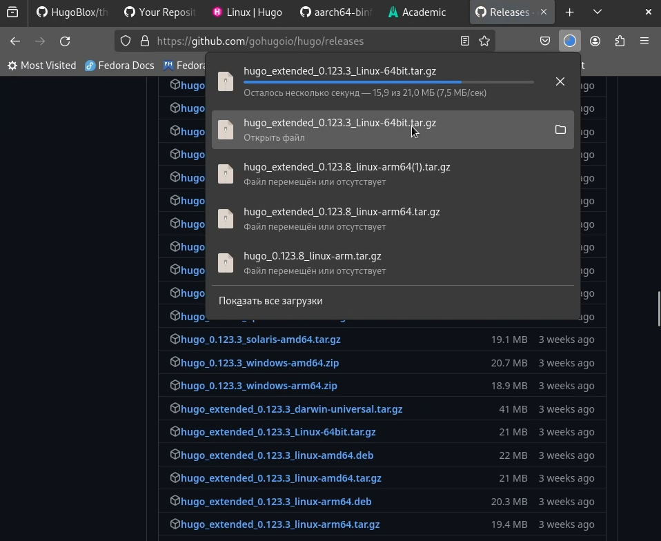

## Выполнение первого этапа индивидуальнго проекта. 

осле того, как разархивировал файл, переношу его в папку /bin, чтобы hugo можно было запустить через терминал. (рис. 2)

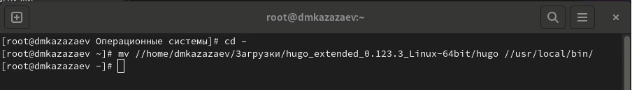

## Выполнение первого этапа индивидуальнго проекта. 

Создаю репозиторий на основе шаблона theme-academic-cv. (рис. 3-4)

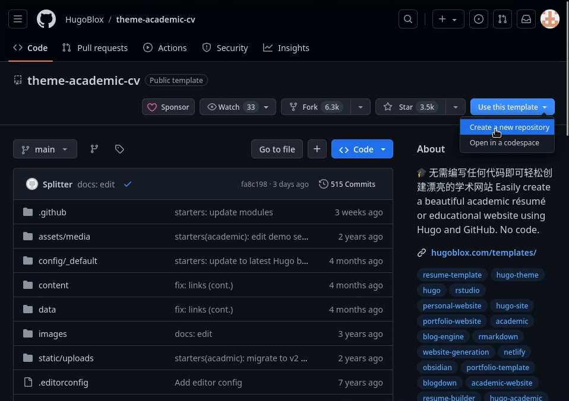

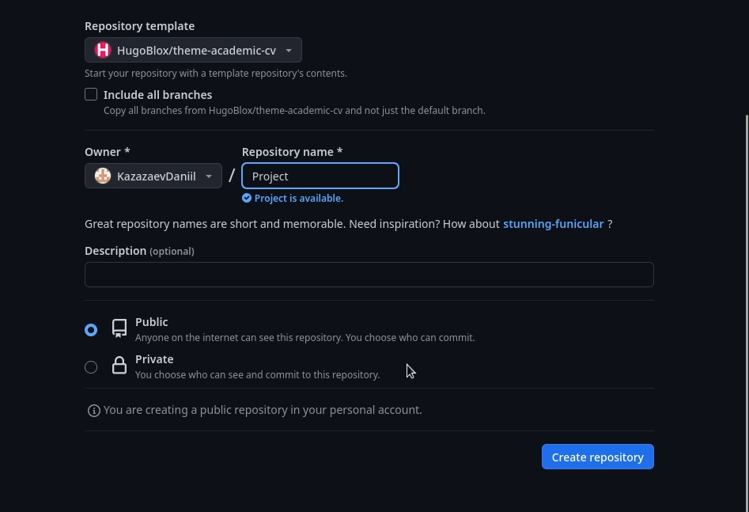

## Выполнение первого этапа индивидуальнго проекта. 

Клонирую репозиторий в рабочую дерикторию. (рис. 5)

{width=70%}

## Выполнение первого этапа индивидуальнго проекта. 

Перехожу в главный каталог репозитория и добавляю файлы на сервер, после чего комментирукю их. (рис. 5)

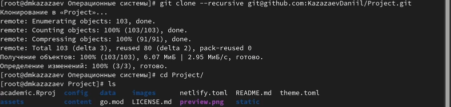

## Выполнение первого этапа индивидуальнго проекта. 

После клонирования репозитория, создаю новый репозиторий и называю его KazazaevDaniil.github.io. (рис. 6)

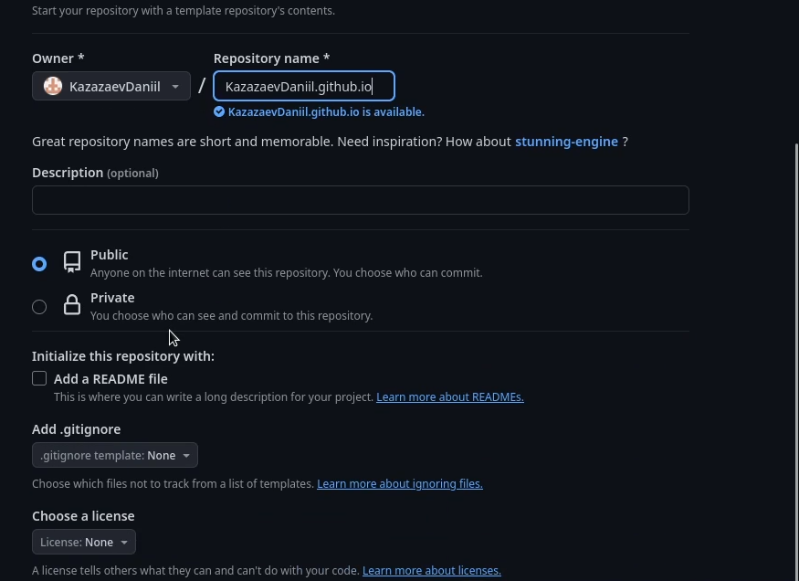

## Выполнение первого этапа индивидуальнго проекта. 

Клонирую второй репозиторий KazazaevDaniil.github.io. (рис. 7)

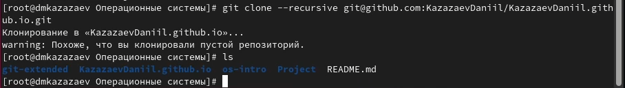

## Выполнение первого этапа индивидуальнго проекта. 

Перехожу в него и создаю ветку, так как репозиторий только создан и он пустой. (рис. 8)

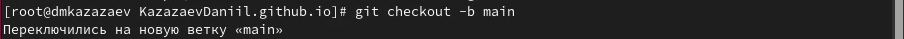

## Выполнение первого этапа индивидуальнго проекта. 

Создаю файл README.md, чтобы заполнить репозиторий, и отправляю его на github. (рис. 9)

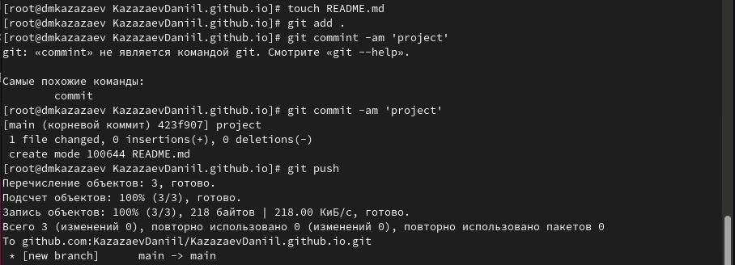

## Выполнение первого этапа индивидуальнго проекта. 

Делаю репозиторий KazazaevDaniil.github.io дополнительным модулем основного репозитория. (рис. 10)

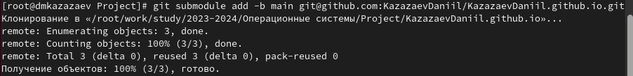

## Выполнение первого этапа индивидуальнго проекта. 

Переношу KazazaevDaniil.github.io в директорию /public. (рис. 11)

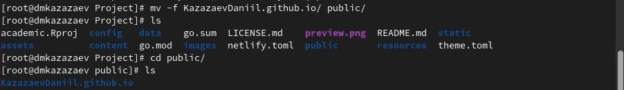

## Выполнение первого этапа индивидуальнго проекта. 

Редактирую файл .gitignore. (рис. 12)

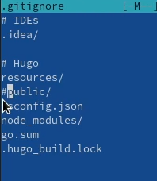

## Выполнение первого этапа индивидуальнго проекта. 

После редактирования добавляю все изменения и отправляю их на github.

После всех этих действий KazazaevDaniil.github.io стало адресом на страницу моего проекта. (рис. 13)

# Заключительная часть

## Результаты

Сайт успешно создан

## Вывод

Был выполнен первый этап индивидуального проекта
