---
## Front matter
title: "Отчёт по первой стадии проекта"
subtitle: "Дисциплина: операционные системы"
author: "Казаазев Даниил Михайлович"

## Generic otions
lang: ru-RU
toc-title: "Содержание"

## Bibliography
bibliography: bib/cite.bib
csl: pandoc/csl/gost-r-7-0-5-2008-numeric.csl

## Pdf output format
toc: true # Table of contents
toc-depth: 2
lof: true # List of figures
lot: true # List of tables
fontsize: 12pt
linestretch: 1.5
papersize: a4
documentclass: scrreprt
## I18n polyglossia
polyglossia-lang:
  name: russian
  options:
	- spelling=modern
	- babelshorthands=true
polyglossia-otherlangs:
  name: english
## I18n babel
babel-lang: russian
babel-otherlangs: english
## Fonts
mainfont: PT Serif
romanfont: PT Serif
sansfont: PT Sans
monofont: PT Mono
mainfontoptions: Ligatures=TeX
romanfontoptions: Ligatures=TeX
sansfontoptions: Ligatures=TeX,Scale=MatchLowercase
monofontoptions: Scale=MatchLowercase,Scale=0.9
## Biblatex
biblatex: true
biblio-style: "gost-numeric"
biblatexoptions:
  - parentracker=true
  - backend=biber
  - hyperref=auto
  - language=auto
  - autolang=other*
  - citestyle=gost-numeric
## Pandoc-crossref LaTeX customization
figureTitle: "Рис."
tableTitle: "Таблица"
listingTitle: "Листинг"
lofTitle: "Список иллюстраций"
lotTitle: "Список таблиц"
lolTitle: "Листинги"
## Misc options
indent: true
header-includes:
  - \usepackage{indentfirst}
  - \usepackage{float} # keep figures where there are in the text
  - \floatplacement{figure}{H} # keep figures where there are in the text
---

# Задание

1. Установить ПО.
2. Скачать шаблон.
3. Разместить на хостинге git.
4. Установить параметри для URLS сайта
5. Разместить заготовку сайта на Github pages

# Выполнение работы

Скачиваю hugo с сайта релизов (рис. [-@fig:001]).

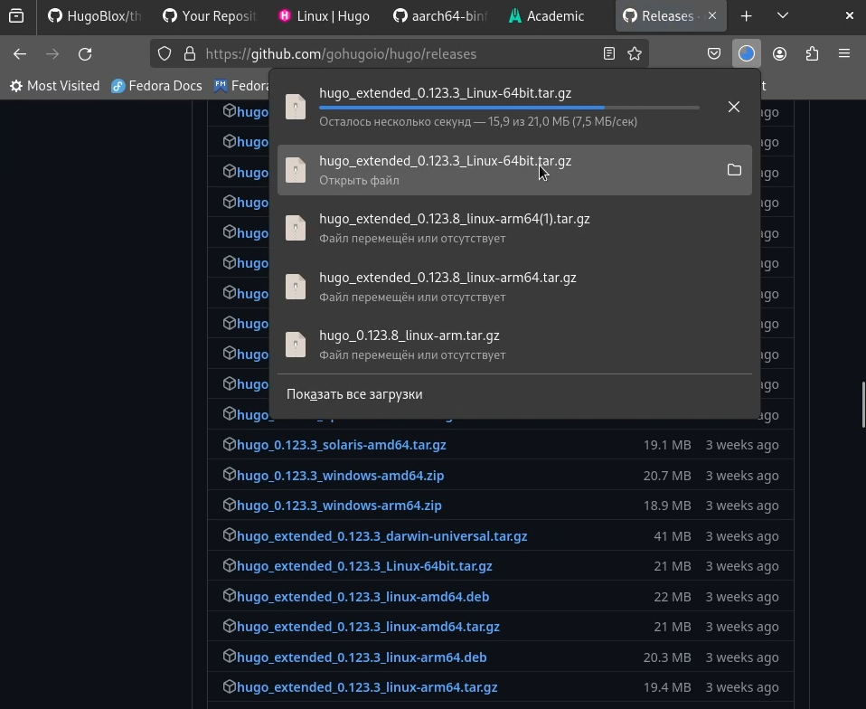{#fig:001 width=70%}

После того, как разархивировал файл, переношу его в папку /bin, чтобы hugo можно было запустить через терминал. (рис. [-@fig:002])

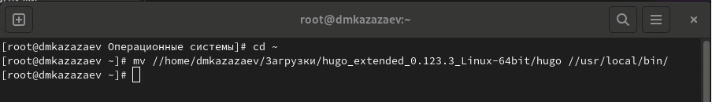{#fig:002 width=70%}

Создаю репозиторий на основе шаблона theme-academic-cv. (рис. [-@fig:003])

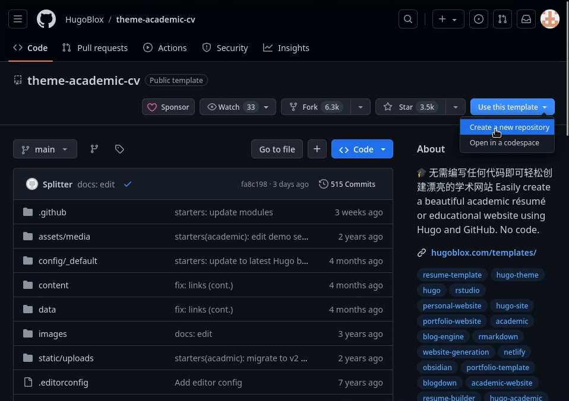{#fig:003 width=100%}

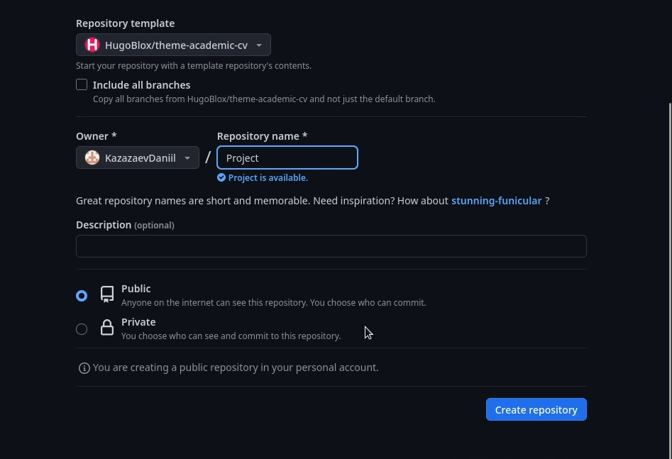{#fig:004 width=70%}

Клонирую репозиторий в рабочую дерикторию. (рис. [-@fig:005])

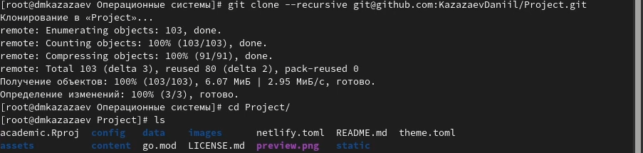{#fig:005 width=70%}

После клонирования репозитория, создаю новый репозиторий и называю его KazazaevDaniil.github.io. (рис. [-@fig:006])

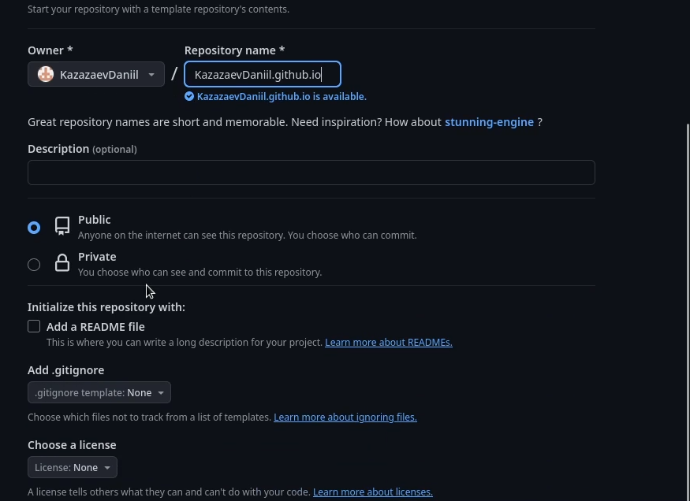{#fig:006 width=70%}

Клонирую второй репозиторий KazazaevDaniil.github.io. (рис. [-@fig:007])

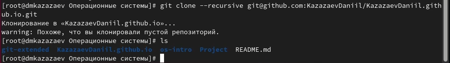{#fig:007 width=70%}

Перехожу в него и создаю ветку, так как репозиторий только создан и он пустой. (рис. [-@fig:008])

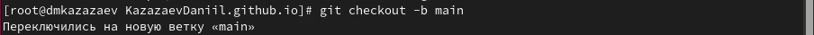{#fig:008 width=70%}

Создаю файл README.md, чтобы заполнить репозиторий, и отправляю его на github. (рис. [-@fig:009])

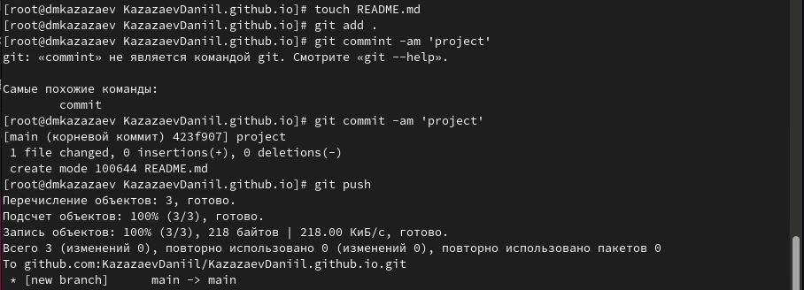{#fig:009 width=70%}

Делаю репозиторий KazazaevDaniil.github.io дополнительным модулем основного репозитория. (рис. [-@fig:010])

{#fig:010 width=70%}

Переношу KazazaevDaniil.github.io в директорию /public. (рис. [-@fig:011])

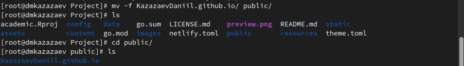{#fig:011 width=70%}

Редактирую файл .gitignore. (рис. [-@fig:012])

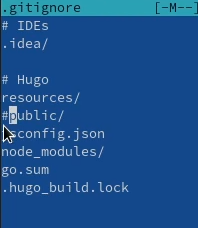{#fig:012 width=70%}

После редактирования добавляю все изменения и отправляю их на github.

После всех этих действий KazazaevDaniil.github.io стало адресом на страницу моего проекта. (рис. [-@fig:013])

{#fig:013 width=70%}

# Выводы

Был выполнен первый этап индивидуального проекта
