---
## Front matter
lang: ru-RU
title: Второй этап индивидуального проекта
subtitle: Операционные системы
author:
  - Казазаев Д. М.
institute:
  - Российский университет дружбы народов, Москва, Россия

## i18n babel
babel-lang: russian
babel-otherlangs: english

## Formatting pdf
toc: false
toc-title: Содержание
slide_level: 2
aspectratio: 169
section-titles: true
theme: metropolis
header-includes:
 - \metroset{progressbar=frametitle,sectionpage=progressbar,numbering=fraction}
 - '\makeatletter'
 - '\beamer@ignorenonframefalse'
 - '\makeatother'
---

# Информация

## Докладчик

:::::::::::::: {.columns align=center}
::: {.column width="70%"}

  * Казазаев Даниил Михайлович
  * Студент бакалавриата
  * Российский университет дружбы народов
  * [1132231427@rudn.ru]
  * <https://github.com/KazazaevDaniil/study_2023-2024_os-intro>

:::
::::::::::::::

# Вводная часть

## Задание

1. Разместить фотографию
2. Разместить краткое описание владельца
3. Добавить информацию о интересах
4. Добавить информацию об образовании
5. Добавить пост по прошедшей неделе
6. Добавить пост на тему Управление версиями. Git

# Основная часть

## Выполнение второго этапа индивидуальнго проекта. 

Перейдя в директорию content/authors/admin, меняю файл "avatar", чтобы добавить свою фотографию на сайт. (рис. 1).

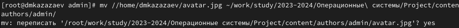{width=80%}

## Выполнение второго этапа индивидуальнго проекта. 

В этой же директории открываю файл _index.md и редактирую в нем информацию, которая будет отображаться на сайте. (рис. 2-5)

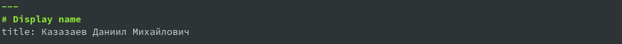{width=70%}

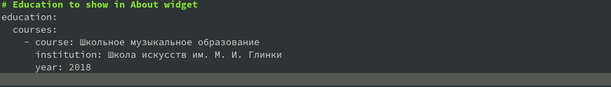{width=70%}

## Выполнение второго этапа индивидуальнго проекта. 

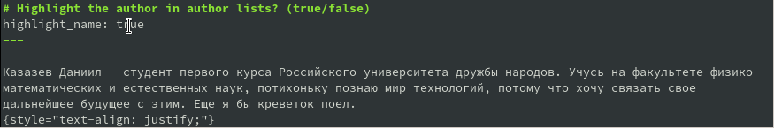{width=70%}

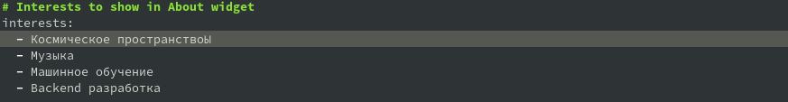{width=70%}

## Выполнение второго этапа индивидуальнго проекта. 

Перехожу в директорию content/post/getting-started, чтобы переделать его под пост о прошедшей неделе. (рис. 6)

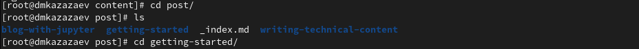{width=70%}

## Выполнение второго этапа индивидуальнго проекта. 

Как и в прошлый раз, открываю файл index.md, в котором описана страница поста, и редактирую его.(рис. 7)

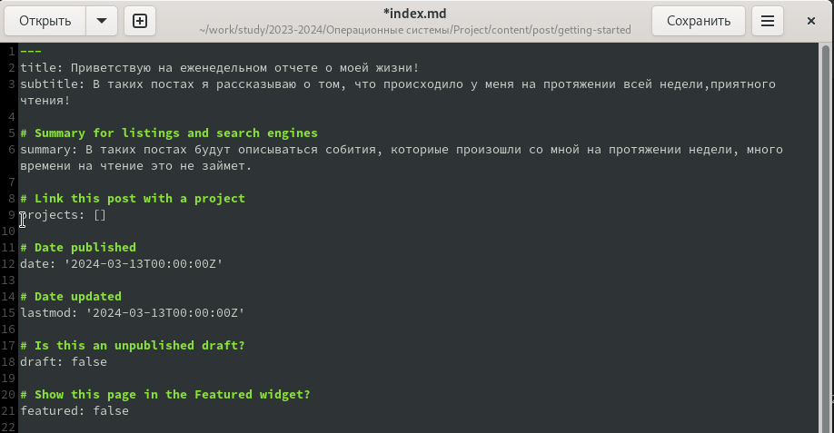{width=70%}

## Выполнение второго этапа индивидуальнго проекта. 

Возвращаюсь в content/post, создаю новую папку для поста о управлениях версиями и копирую файл index.md в эту папку. (рис. 8)

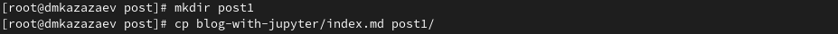{width=70%}

## Выполнение второго этапа индивидуальнго проекта. 

Открываю файл index.md, чтобы отредактировать пост. (рис. 9)

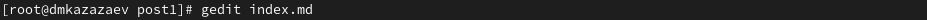{width=70%}

## Выполнение второго этапа индивидуальнго проекта. 

Редактирую файл. (рис. 10)

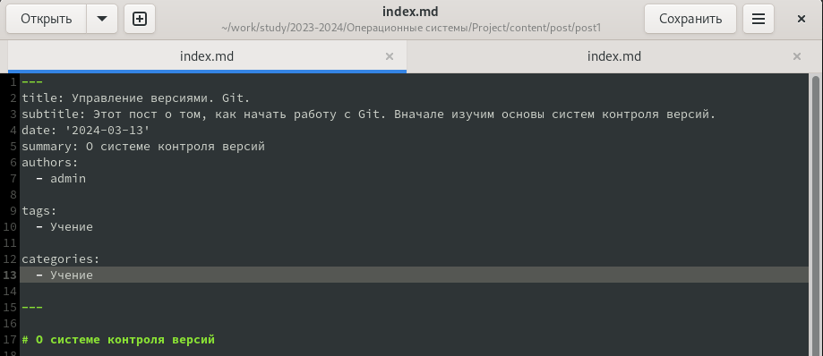{width=70%}

## Выполнение второго этапа индивидуальнго проекта. 

После окончания работы над постом, сохраняю все и выхожу в главную директорию репозитория. Все сохраняю и добавляю на github.

Через некоторо время захожу на сайт и смотрю результат. (рис. 11)

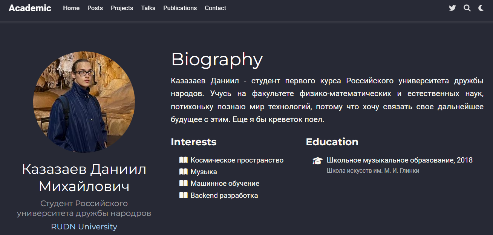{width=50%}

# Заключительная часть

## Результаты

Был выполнен второй этап индивидуального проекта
