---
## Front matter
title: "Отчёт по второй стадии проекта"
subtitle: "Дисциплина: операционные системы"
author: "Казаазев Даниил Михайлович"

## Generic otions
lang: ru-RU
toc-title: "Содержание"

## Bibliography
bibliography: bib/cite.bib
csl: pandoc/csl/gost-r-7-0-5-2008-numeric.csl

## Pdf output format
toc: true # Table of contents
toc-depth: 2
lof: true # List of figures
lot: false # List of tables
fontsize: 12pt
linestretch: 1.5
papersize: a4
documentclass: scrreprt
## I18n polyglossia
polyglossia-lang:
  name: russian
  options:
	- spelling=modern
	- babelshorthands=true
polyglossia-otherlangs:
  name: english
## I18n babel
babel-lang: russian
babel-otherlangs: english
## Fonts
mainfont: PT Serif
romanfont: PT Serif
sansfont: PT Sans
monofont: PT Mono
mainfontoptions: Ligatures=TeX
romanfontoptions: Ligatures=TeX
sansfontoptions: Ligatures=TeX,Scale=MatchLowercase
monofontoptions: Scale=MatchLowercase,Scale=0.9
## Biblatex
biblatex: true
biblio-style: "gost-numeric"
biblatexoptions:
  - parentracker=true
  - backend=biber
  - hyperref=auto
  - language=auto
  - autolang=other*
  - citestyle=gost-numeric
## Pandoc-crossref LaTeX customization
figureTitle: "Рис."
tableTitle: "Таблица"
listingTitle: "Листинг"
lofTitle: "Список иллюстраций"
lotTitle: "Список таблиц"
lolTitle: "Листинги"
## Misc options
indent: true
header-includes:
  - \usepackage{indentfirst}
  - \usepackage{float} # keep figures where there are in the text
  - \floatplacement{figure}{H} # keep figures where there are in the text
---

# Задание

1. Разместить фотографию
2. Разместить краткое описание владельца
3. Добавить информацию о интересах
4. Добавить информацию об образовании
5. Добавить пост по прошедшей неделе
6. Добавить пост на тему Управление версиями. Git.

# Выполнение работы

Перейдя в директорию content/authors/admin, меняю файл "avatar", чтобы добавить свою фотографию на сайт (рис. [-@fig:001]).

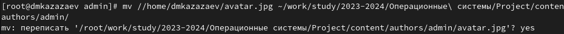{#fig:001 width=70%}

В этой же директории открываю файл _index.md и редактирую в нем информацию, которая будет отображаться на сайте. (рис. [-@fig:002])

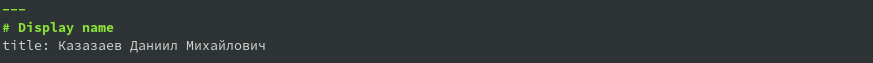{#fig:002 width=70%}

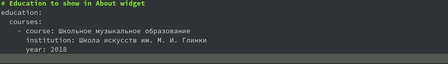{#fig:003 width=70%}

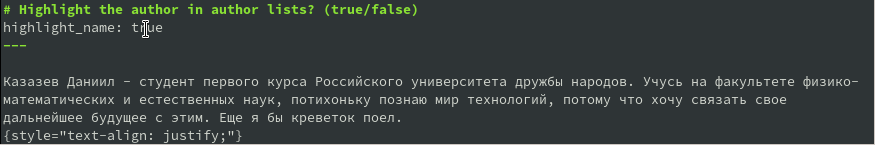{#fig:004 width=70%}

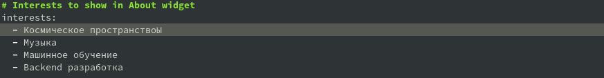{#fig:005 width=70%}

Перехожу в директорию content/post/getting-started, чтобы переделать его под пост о прошедшей неделе. (рис. [-@fig:006])

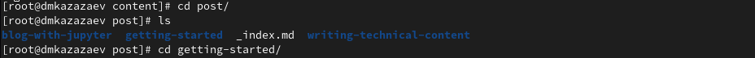{#fig:006 width=100%}

Как и в прошлый раз, открываю файл index.md, в котором описана страница поста, и редактирую его.(рис. [-@fig:007])

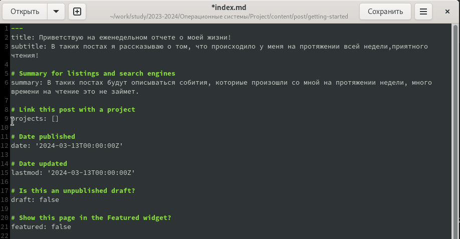{#fig:007 width=70%}

Возвращаюсь в content/post, создаю новую папку для поста о управлениях версиями и копирую файл index.md в эту папку. (рис. [-@fig:008])

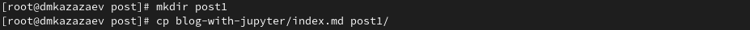{#fig:008 width=70%}

Открываю файл index.md, чтобы отредактировать пост. (рис. [-@fig:009])

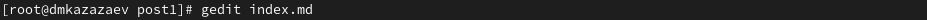{#fig:009 width=70%}

Редактирую файл. (рис. [-@fig:010])

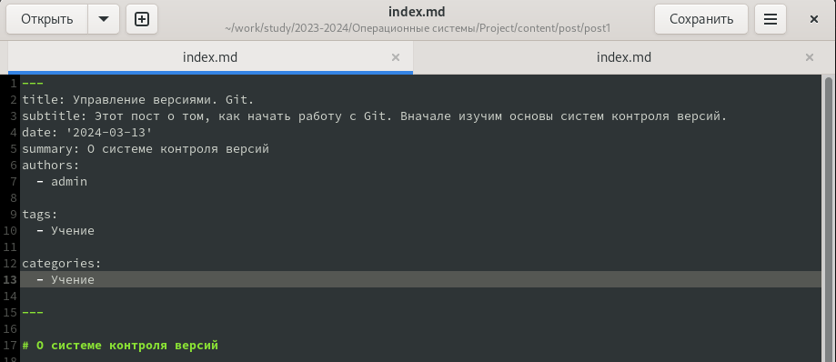{#fig:010 width=70%}

После окончания работы над постом, сохраняю все и выхожу в главную директорию репозитория. Все сохраняю и добавляю на github.

Через некоторо время захожу на сайт и смотрю результат. (рис. [-@fig:011])

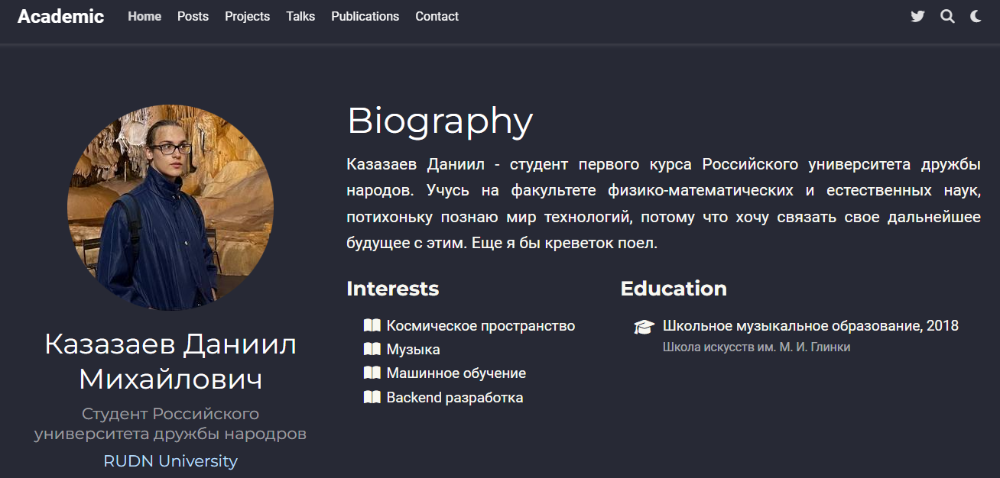{#fig:011 width=70%}

# Выводы

Был выполнен второй этап индивидуального проекта
