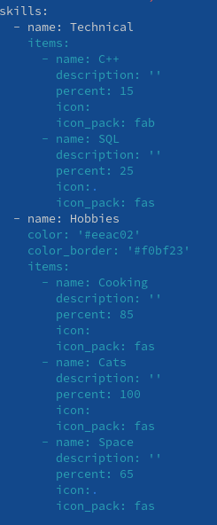
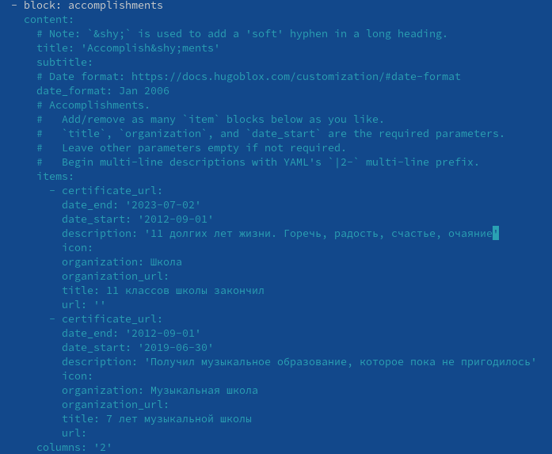
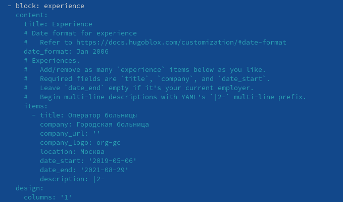
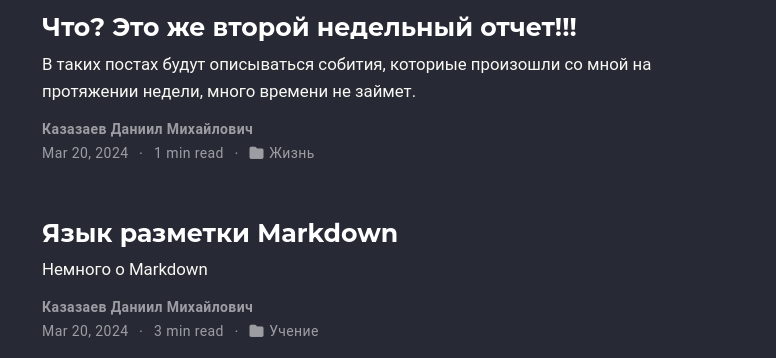

---
## Front matter
lang: ru-RU
title: Третий этап индивидуального проекта
subtitle: Операционные системы
author:
  - Казазаев Д. М.
institute:
  - Российский университет дружбы народов, Москва, Россия

## i18n babel
babel-lang: russian
babel-otherlangs: english

## Formatting pdf
toc: false
toc-title: Содержание
slide_level: 2
aspectratio: 169
section-titles: true
theme: metropolis
header-includes:
 - \metroset{progressbar=frametitle,sectionpage=progressbar,numbering=fraction}
 - '\makeatletter'
 - '\beamer@ignorenonframefalse'
 - '\makeatother'
---

# Информация

## Докладчик

:::::::::::::: {.columns align=center}
::: {.column width="70%"}

  * Казазаев Даниил Михайлович
  * Студент бакалавриата
  * Российский университет дружбы народов
  * [1132231427@rudn.ru]
  * <https://github.com/KazazaevDaniil/study_2023-2024_os-intro>

:::
::::::::::::::

# Вводная часть

## Задание

1. Изменить список умений
2. Изменить список достижений
3. Изменить список опыта
4. Сделать еженедельный пост и пост по одной из тем

# Основная часть

## Выполнение третьего этапа индивидуальнго проекта. 

Перейдя в директорию content/authors/admin, редактирую файл index.md, а точнее пункт skills (рис. 1).

{width=15%}

## Выполнение третьего этапа индивидуальнго проекта. 

Возвращаюсь в директорию content и меняю там файл индекс, а именно пунткт accomplishments. (рис. 2)

{width=30%}

## Выполнение третьего этапа индивидуальнго проекта. 

После чего меняю пункт experience. (рис. 3)

{width=30%}

## Выполнение третьего этапа индивидуальнго проекта. 

Переху в content/post и оздаю там два каталога: первый для поста на тему, второй для еженедельного отчета. Переношу в эти каталоги файл index.md из уже существующих постов и редактирую их. (рис. 4)

{width=70%}

# Заключительная часть

## Результаты

Был выполнен третий этап индивидуального проекта
