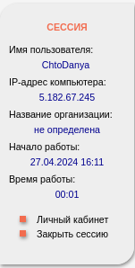
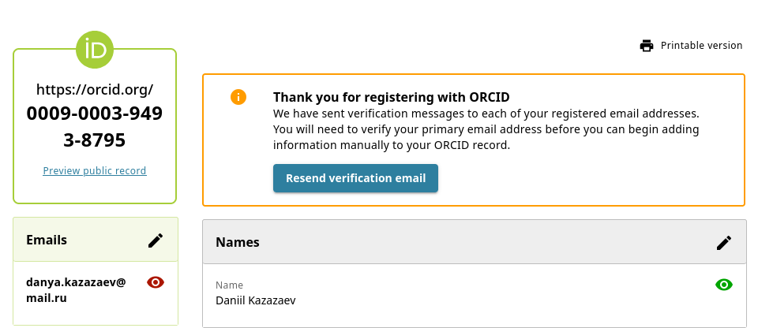
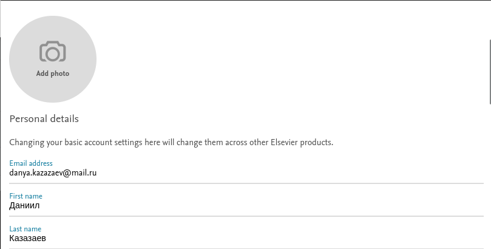
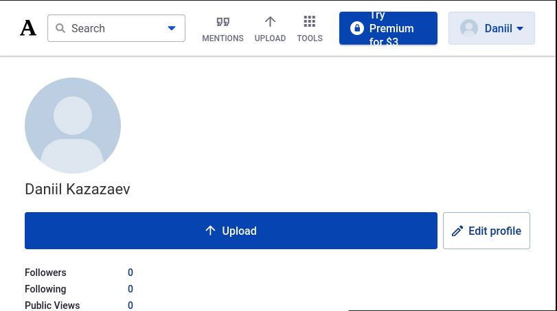
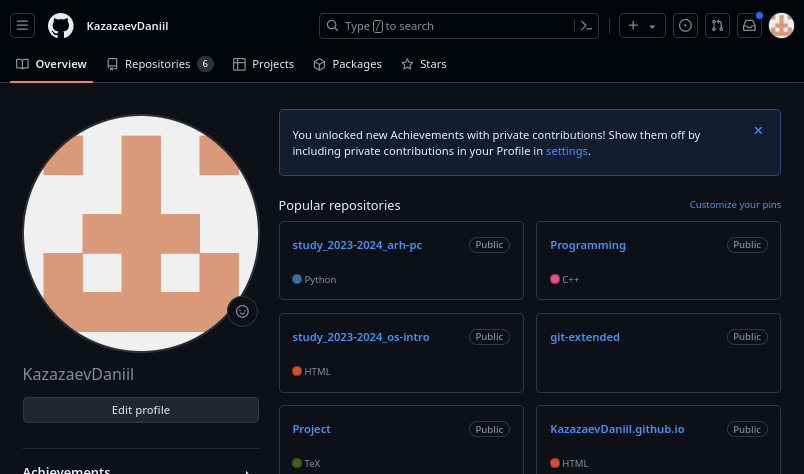
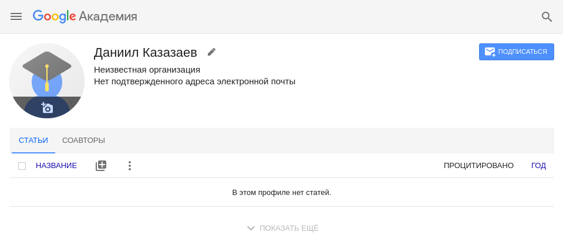
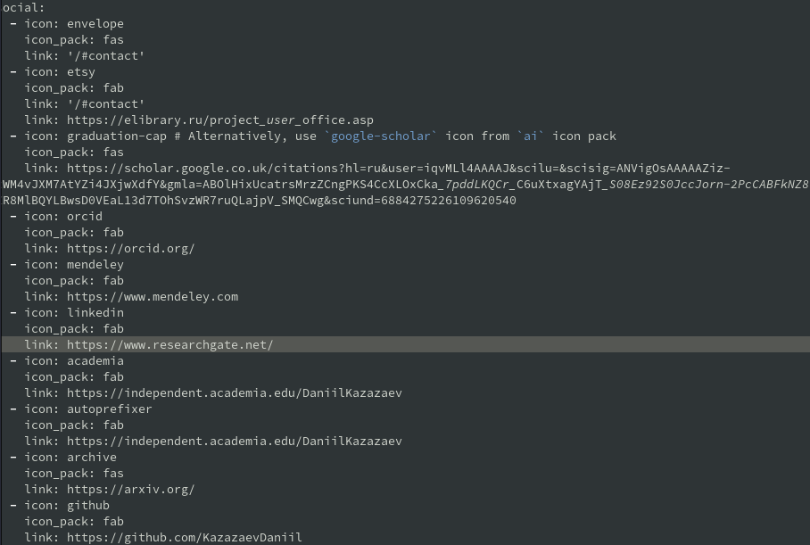
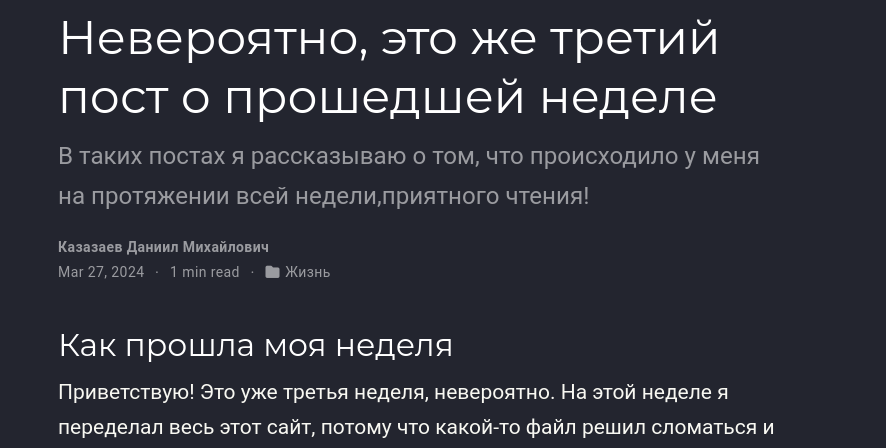
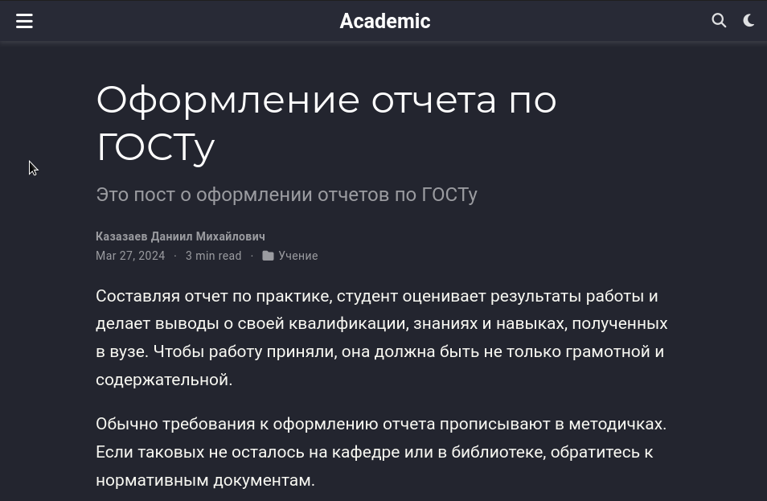

---
## Front matter
lang: ru-RU
title: Четвертый этап индивидуального проекта
subtitle: Операционные системы
author:
  - Казазаев Д. М.
institute:
  - Российский университет дружбы народов, Москва, Россия

## i18n babel
babel-lang: russian
babel-otherlangs: english

## Formatting pdf
toc: false
toc-title: Содержание
slide_level: 2
aspectratio: 169
section-titles: true
theme: metropolis
header-includes:
 - \metroset{progressbar=frametitle,sectionpage=progressbar,numbering=fraction}
 - '\makeatletter'
 - '\beamer@ignorenonframefalse'
 - '\makeatother'
---

# Информация

## Докладчик

:::::::::::::: {.columns align=center}
::: {.column width="70%"}

  * Казазаев Даниил Михайлович
  * Студент бакалавриата
  * Российский университет дружбы народов
  * [1132231427@rudn.ru]
  * <https://github.com/KazazaevDaniil/study_2023-2024_os-intro>

:::
::::::::::::::

# Вводная часть

## Задание

1. Зарегистрироваться на ресурсах и добавить их ссылки на сайт
2. Сделать пост о прошедшей неделе
3. Добавить пост на тему по выбору

# Основная часть

## Выполнение четвертого этапа индивидуальнго проекта. 

Для начала регистрируюсь на всех сайтах, приложэенных к этапу проекта. (рис. 1, 2, 3, 4, 5, 6)

## Выполнение четвертого этапа индивидуальнго проекта.

{width=10%}

## Выполнение четвертого этапа индивидуальнго проекта.

{width=70%}

## Выполнение четвертого этапа индивидуальнго проекта.

{width=70%}

## Выполнение четвертого этапа индивидуальнго проекта.

{width=70%}

## Выполнение четвертого этапа индивидуальнго проекта.

{width=70%}

## Выполнение четвертого этапа индивидуальнго проекта.

{width=70%}

## Выполнение четвертого этапа индивидуальнго проекта.

Перейдя в директорию content/authors/admin, редактирую файл index.md, а точнее пункт social (рис. 7).

{width=50%}

## Выполнение четвертого этапа индивидуальнго проекта.

Перейдя в директорию content/post и, после создания папок для нового поста и еженедельного отчета, перехожу в папку нового еженельного отчета и начинаю редактировать файл index.md. (рис. 8)

{width=50%}

## Выполнение третьего этапа индивидуальнго проекта. 

Перехожу в content/post/post3 и делаю пост про создание отчетов по ГОСТу. (рис. 9)

{width=50%}

# Заключительная часть

## Результаты

Был выполнен четвертый этап индивидуального проекта
