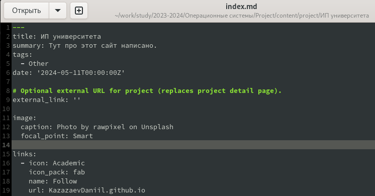
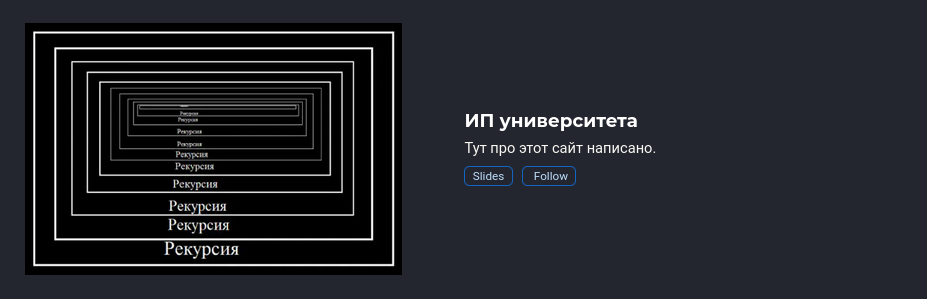
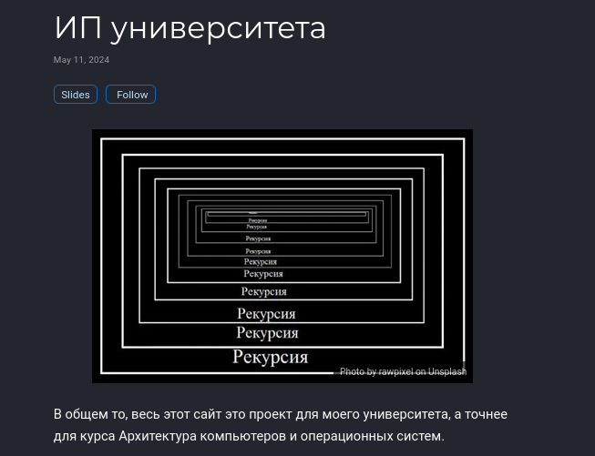
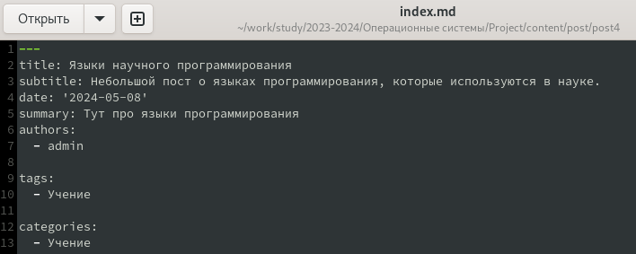
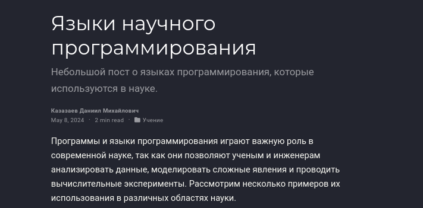
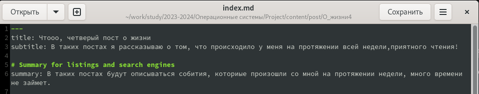
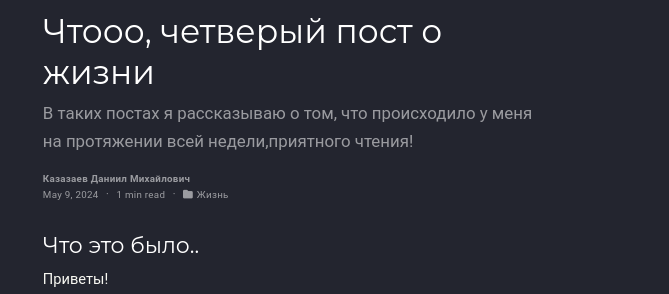
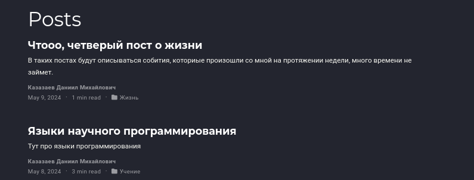

---
## Front matter
lang: ru-RU
title: Пятый этап индивидуального проекта
subtitle: Операционные системы
author:
  - Казазаев Д. М.
institute:
  - Российский университет дружбы народов, Москва, Россия

## i18n babel
babel-lang: russian
babel-otherlangs: english

## Formatting pdf
toc: false
toc-title: Содержание
slide_level: 2
aspectratio: 169
section-titles: true
theme: metropolis
header-includes:
 - \metroset{progressbar=frametitle,sectionpage=progressbar,numbering=fraction}
 - '\makeatletter'
 - '\beamer@ignorenonframefalse'
 - '\makeatother'
---

# Информация

## Докладчик

:::::::::::::: {.columns align=center}
::: {.column width="70%"}

  * Казазаев Даниил Михайлович
  * Студент бакалавриата
  * Российский университет дружбы народов
  * [1132231427@rudn.ru]
  * <https://github.com/KazazaevDaniil/study_2023-2024_os-intro>

:::
::::::::::::::

# Вводная часть

## Задание

1. Добавить записи о персональных проектах
2. Сделать пост о прошедшей неделе
3. Добавить пост на тему по выбору

# Основная часть

## Выполнение пятого этапа индивидуальнго проекта. 

Перехожу в каталог /content/project/ и создаю там новый каталог, в котором пишу информацию о проетк. (рис. 1)

{width=60%}

## Выполнение пятого этапа индивидуальнго проекта. 

Сохранаяю его и смотрю результат на сайте. (рис. 2, 3)

{width=60%}

## Выполнение пятого этапа индивидуальнго проекта. 

{width=60%}

## Выполнение пятого этапа индивидуальнго проекта. 

Перехрожу в /content/post/ и создаю каталог для четвертого поста, после чего пишу пост на тему "Языки научного программирования". (рис. 4)

{width=60%}

## Выполнение пятого этапа индивидуальнго проекта. 

После чего проверяю результат. (рис. 5)

{width=60%}

## Выполнение пятого этапа индивидуальнго проекта. 

Возвращаюсь в /content/post/ и создаю каталог для четвертого "еженедельного" поста, после чего пишу в файле index.md о том, как прошшла неделя. (рис. 6)

{width=60%}

## Выполнение пятого этапа индивидуальнго проекта. 

Проверяю резуьтат. (рис. 7)

{width=60%}

## Выполнение пятого этапа индивидуальнго проекта. 

Выхожу на главную страницу и проверяю, правильно ли создались посты. (рис. 8)

{width=60%}

# Заключительная часть

## Результаты

Был выполнен пятый этап индивидуального проекта
