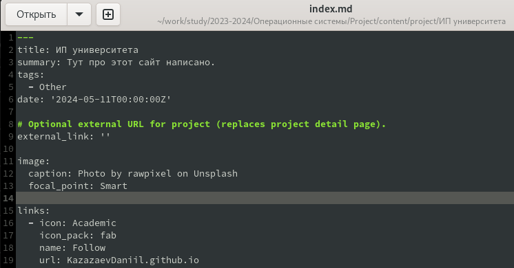
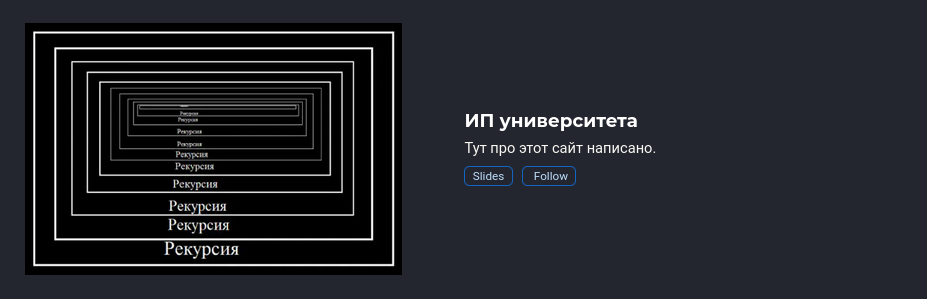
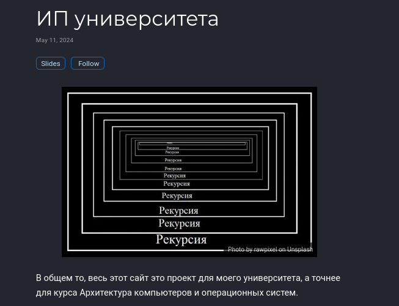
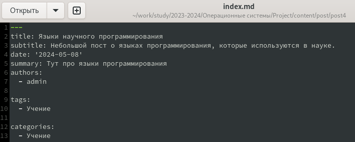
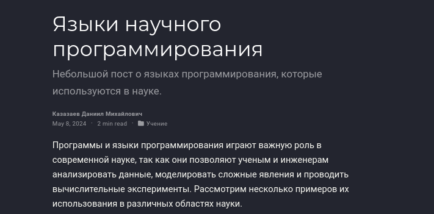
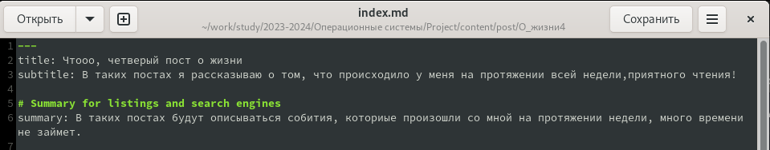
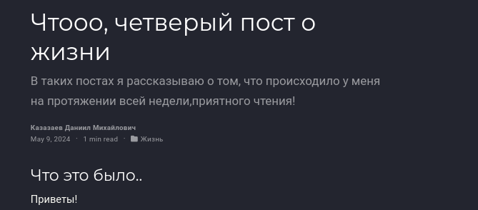
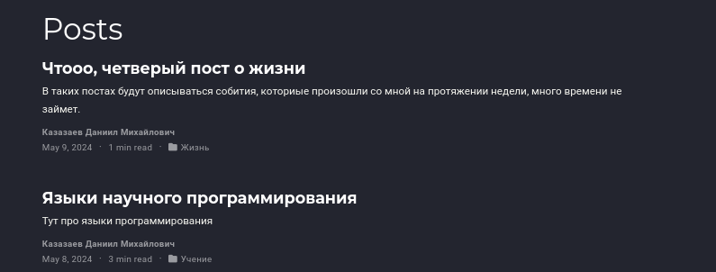

---
## Front matter
title: "Отчёт по пятой стадии проекта"
subtitle: "Дисциплина: операционные системы"
author: "Казаазев Даниил Михайлович"

## Generic otions
lang: ru-RU
toc-title: "Содержание"

## Bibliography
bibliography: bib/cite.bib
csl: pandoc/csl/gost-r-7-0-5-2008-numeric.csl

## Pdf output format
toc: true # Table of contents
toc-depth: 2
lof: true # List of figures
lot: false # List of tables
fontsize: 12pt
linestretch: 1.5
papersize: a4
documentclass: scrreprt
## I18n polyglossia
polyglossia-lang:
  name: russian
  options:
	- spelling=modern
	- babelshorthands=true
polyglossia-otherlangs:
  name: english
## I18n babel
babel-lang: russian
babel-otherlangs: english
## Fonts
mainfont: PT Serif
romanfont: PT Serif
sansfont: PT Sans
monofont: PT Mono
mainfontoptions: Ligatures=TeX
romanfontoptions: Ligatures=TeX
sansfontoptions: Ligatures=TeX,Scale=MatchLowercase
monofontoptions: Scale=MatchLowercase,Scale=0.9
## Biblatex
biblatex: true
biblio-style: "gost-numeric"
biblatexoptions:
  - parentracker=true
  - backend=biber
  - hyperref=auto
  - language=auto
  - autolang=other*
  - citestyle=gost-numeric
## Pandoc-crossref LaTeX customization
figureTitle: "Рис."
tableTitle: "Таблица"
listingTitle: "Листинг"
lofTitle: "Список иллюстраций"
lotTitle: "Список таблиц"
lolTitle: "Листинги"
## Misc options
indent: true
header-includes:
  - \usepackage{indentfirst}
  - \usepackage{float} # keep figures where there are in the text
  - \floatplacement{figure}{H} # keep figures where there are in the text
---

# Задание

1. Добавить записи о персональных проектах
2. Сделать пост о прошедшей неделе
3. Добавить пост на тему по выбору

# Выполнение работы

Перехожу в каталог /content/project/ и создаю там новый каталог, в котором пишу информацию о проетк. (рис. [-@fig:001])

{#fig:001 width=60%}

Сохранаяю его и смотрю результат на сайте. (рис. [-@fig:002], [-@fig:003])

{#fig:002 width=60%}

{#fig:003 width=60%}

Перехрожу в /content/post/ и создаю каталог для четвертого поста, после чего пишу пост на тему "Языки научного программирования". (рис. [-@fig:004])

{#fig:004 width=60%}

После чего проверяю результат. (рис. [-@fig:005])

{#fig:005 width=60%}

Возвращаюсь в /content/post/ и создаю каталог для четвертого "еженедельного" поста, после чего пишу в файле index.md о том, как прошшла неделя. (рис. [-@fig:006], [-@fig:007])

{#fig:006 width=60%}

Проверяю результат. (рис. [-@fig:007])

{#fig:007 width=60%}

Выхожу на главную страницу и проверяю, правильно ли создались посты. (рис. [-@fig:008])

{#fig:008 width=60%}

# Выводы

Был выполнен пятый этап индивидуального проекта
