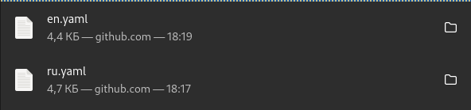
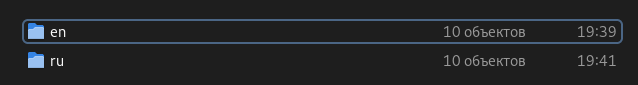
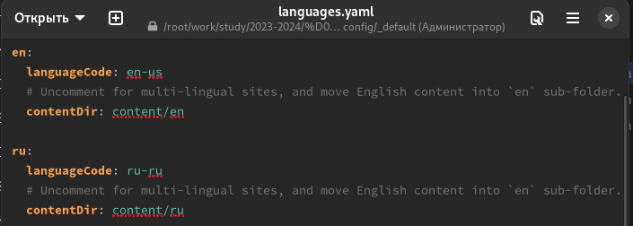
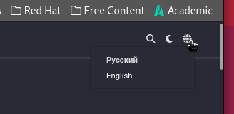
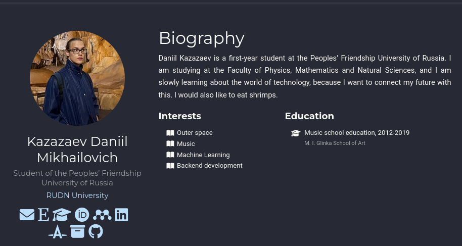
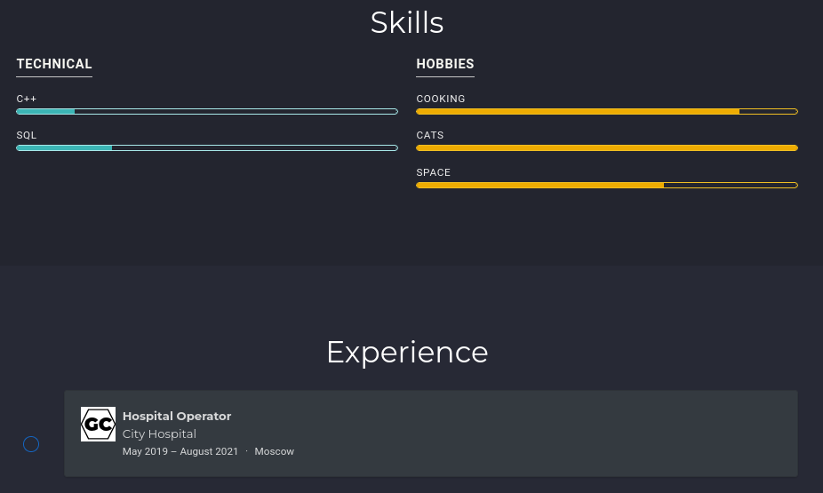
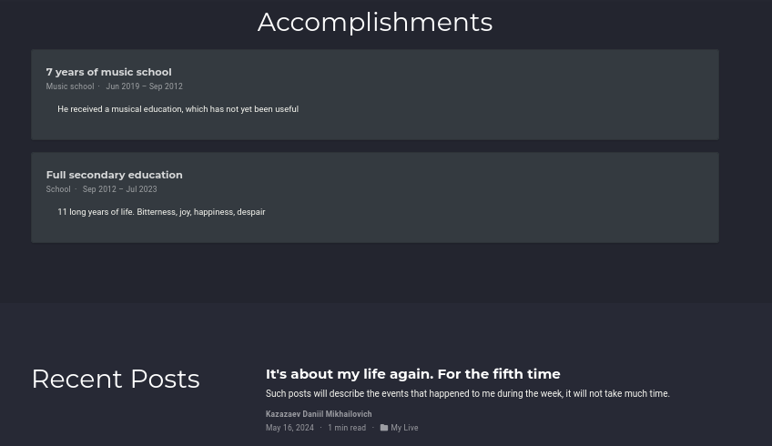
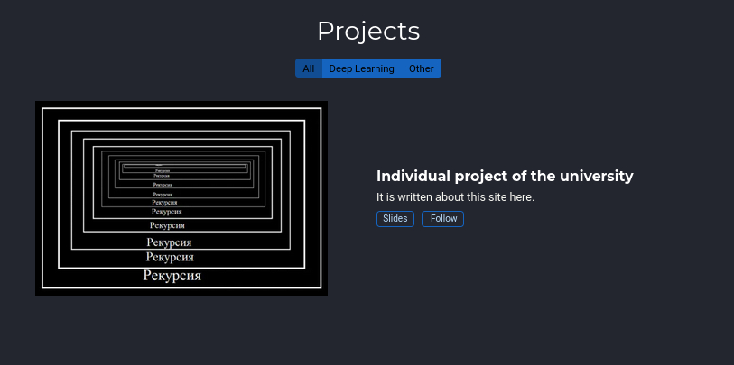

---
## Front matter
lang: ru-RU
title: Шестой этап индивидуального проекта
subtitle: Операционные системы
author:
  - Казазаев Д. М.
institute:
  - Российский университет дружбы народов, Москва, Россия

## i18n babel
babel-lang: russian
babel-otherlangs: english

## Formatting pdf
toc: false
toc-title: Содержание
slide_level: 2
aspectratio: 169
section-titles: true
theme: metropolis
header-includes:
 - \metroset{progressbar=frametitle,sectionpage=progressbar,numbering=fraction}
 - '\makeatletter'
 - '\beamer@ignorenonframefalse'
 - '\makeatother'
---

# Информация

## Докладчик

:::::::::::::: {.columns align=center}
::: {.column width="70%"}

  * Казазаев Даниил Михайлович
  * Студент бакалавриата
  * Российский университет дружбы народов
  * [1132231427@rudn.ru]
  * <https://github.com/KazazaevDaniil/study_2023-2024_os-intro>

:::
::::::::::::::

# Вводная часть

## Задание

1. Добавить поддержку английского и русского языков
2. Разместить элементы сайта на русском и на английском.
3. Добавить пост о прошедшей неделе.
4. Сделать пост на тему на двух языках

# Основная часть

## Выполнение шестого этапа индивидуальнго проекта. 

Скачиваю с сайта hugo два файла, которые отвечают за язык на сайте. (рис. 1)

{width=60%}

## Выполнение шестого этапа индивидуальнго проекта. 

Перехожу в директорию content/ и создаю два каталога, чтобы разделить сайт на русскоязычную версию и англоязычную версию. (рис. 2)

{width=60%}

## Выполнение шестого этапа индивидуальнго проекта. 

После чего переношу все файлы из каталога content/ в новые каталоги en и ru. Перехожу в каталог confit/_default и открываю там файл languages.yaml, чтобы добавить настройку, коорая отвечает за поддержку русского языка.

{width=60%}

## Выполнение шестого этапа индивидуальнго проекта. 

Проверяю на сайте. (рис. 4)

{width=60%}

## Выполнение шестого этапа индивидуальнго проекта. 

После проверки начинаю редактировать файлы. Для перевода русских надписей на английский заходу в content/en, а для перевода англйских надписей в content/ru. (рис. 5, рис. 6, рис. 7, рис. 8)

{width=60%}

## Выполнение шестого этапа индивидуальнго проекта. 

{width=60%}

## Выполнение шестого этапа индивидуальнго проекта. 

{width=60%}

## Выполнение шестого этапа индивидуальнго проекта. 

{цidth=60%}

# Заключительная часть

## Результаты

Был выполнен шестой этап индивидуального проекта
